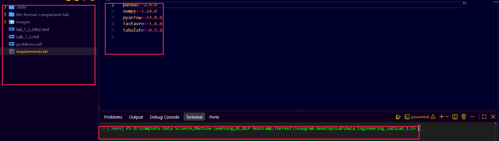
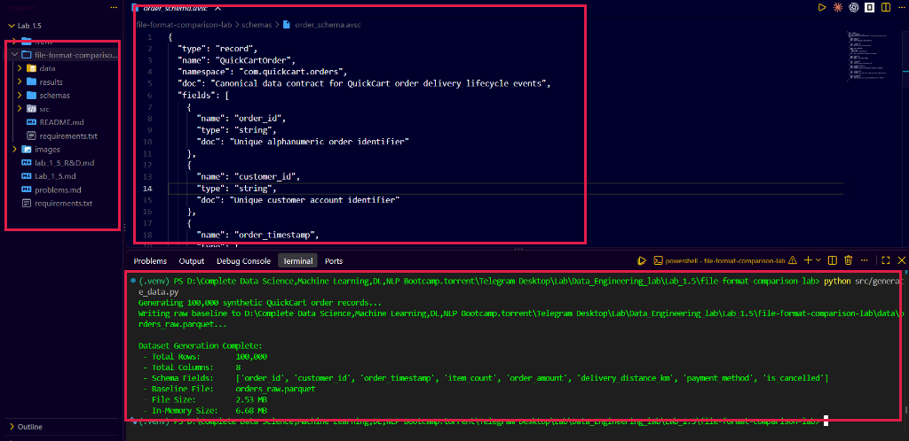
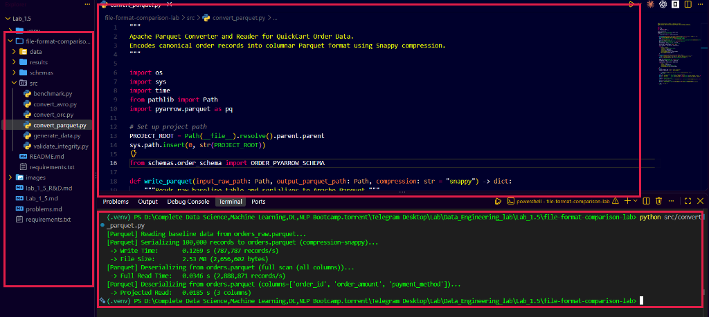
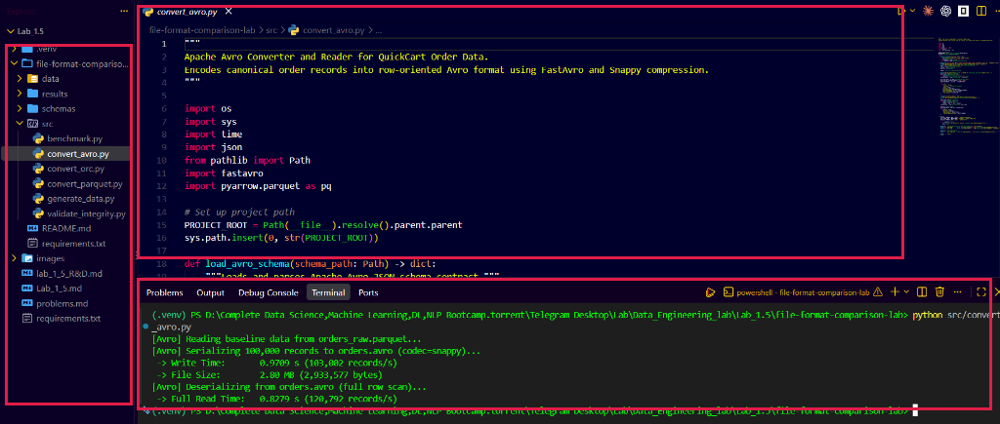
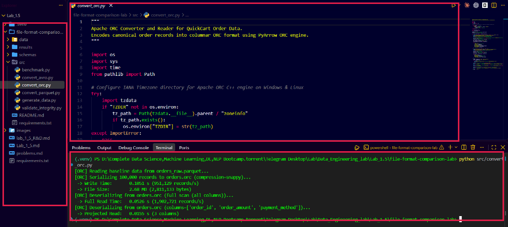
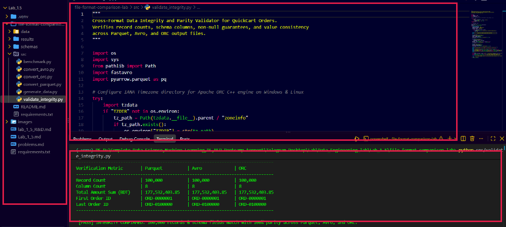
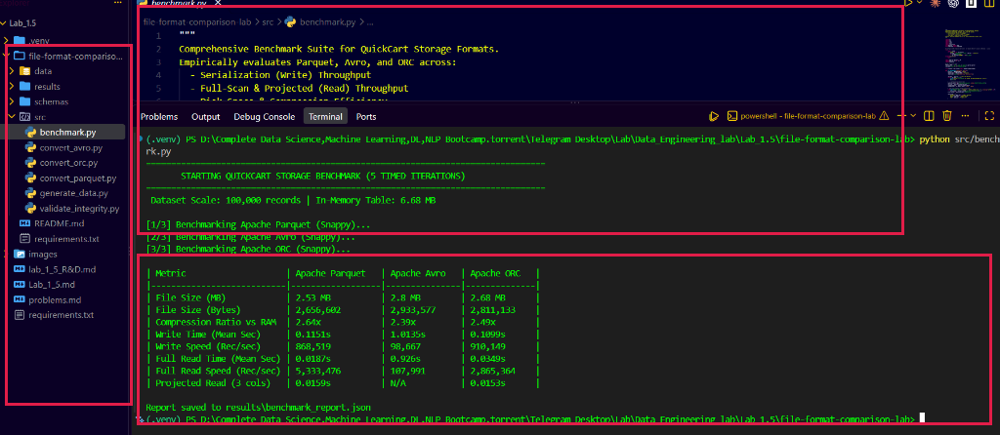

# Lab 1.5: File Format Comparison (Parquet, Avro, ORC)

---

## 1. Introduction & Real-Life Scenario

Imagine you are a Senior Data Engineer at **QuickCart**, an on-demand food and grocery delivery platform processing millions of daily transactions. QuickCart's event streaming broker ingests real-time order placements, delivery status updates, driver location coordinates, and payment receipts. 

Historically, upstream engineering teams dumped these transactional events as uncompressed JSON and CSV files into a centralized data lake. However, as platform scale exploded, QuickCart's data infrastructure started experiencing severe performance and financial bottlenecks:
- **Storage Cost Inflation:** Bulky raw text files consumed hundreds of terabytes of expensive cloud object storage.
- **Analytical Query Delays:** Downstream Business Intelligence (BI) dashboards and machine learning pipelines suffered multi-minute query latency because analytics queries had to scan entire datasets row-by-row just to compute order revenue metrics.
- **Data Integrity & Schema Divergence:** Ad-hoc field alterations caused silent data type mismatches, breaking downstream downstream data pipelines.

To resolve these challenges, the Data Platform team initiated a storage layer modernization initiative. Before migrating petabytes of historical and streaming data, you must evaluate three industry-standard data formats:
1. **Apache Parquet:** A binary, hybrid columnar storage format optimized for high-performance analytical queries and deep data compression.
2. **Apache Avro:** A compact, binary, row-oriented format that packages schemas with data, ideal for schema-governed, write-heavy event streaming.
3. **Apache ORC (Optimized Row Columnar):** A highly optimized columnar format originating from the Apache Hadoop/Hive ecosystem, engineered for enterprise workloads and ACID transactions.

You will design an empirical benchmark harness to compare Parquet, Avro, and ORC on the exact same dataset, measuring disk compression efficiency, write latency, read throughput, and schema governance flexibility.

---

## 2. Architecture Overview


*Figure 1: High-level architectural pipeline for QuickCart file format evaluation and benchmarking.*

Below is the architectural workflow of the QuickCart file format evaluation harness:

```text
                           QUICKCART FILE FORMAT BENCHMARK ARCHITECTURE

  ┌────────────────────────────────────────────────────────────────────────┐
  │                   Canonical QuickCart Order Dataset                    │
  │     100,000 Transactional Records (Strings, Decimals, Timestamps, Booleans)    │
  └───────────────────────────────────┬────────────────────────────────────┘
                                      │
                     ┌────────────────┴────────────────┐
                     ▼                                 ▼
        ┌─────────────────────────┐       ┌─────────────────────────┐
        │  Apache Avro Contract   │       │  PyArrow Schema Contract│
        │   (order_schema.avsc)   │       │    (order_schema.py)    │
        └────────────┬────────────┘       └────────────┬────────────┘
                     │                                 │
     ┌───────────────┼─────────────────────────────────┼───────────────┐
     │ Write Phase   ▼                                 ▼               ▼
     │        ┌─────────────┐                   ┌─────────────┐ ┌─────────────┐
     │        │ Apache Avro │                   │Apache Parquet│ │ Apache ORC  │
     │        │ (.avro file)│                   │(.parquet file│ │ (.orc file) │
     │        └──────┬──────┘                   └──────┬──────┘ └──────┬──────┘
     │               │                                 │               │
     ├───────────────┼─────────────────────────────────┼───────────────┤
     │ Read Phase    ▼                                 ▼               ▼
     │        ┌─────────────┐                   ┌─────────────┐ ┌─────────────┐
     │        │  Row Scan   │                   │Column Pruning│ │Stripe Scan  │
     │        │ Deserializer│                   │& Predicate  │ │& Index Read │
     │        └──────┬──────┘                   └──────┬──────┘ └──────┬──────┘
     │               │                                 │               │
     └───────────────┼─────────────────────────────────┼───────────────┘
                     │                                 │
                     ▼                                 ▼
        ┌──────────────────────────────────────────────────────────────┐
        │            Validation & Benchmark Evaluation Engine          │
        │  • Integrity Check: Row Counts (100,000), Data Parity, Nulls  │
        │  • Storage Metrics: Raw File Sizes, Compression Ratio        │
        │  • Speed Metrics: Multi-run Timed Write/Read (Records/sec)   │
        │  • Output: results/benchmark_report.json & CLI Summary Table │
        └──────────────────────────────────────────────────────────────┘
```

The pipeline synthesizes 100,000 realistic QuickCart orders governed by strict canonical schemas. It encodes the records into Parquet, Avro, and ORC, validates record counts and value parity, runs timed multi-iteration read/write benchmarks, and outputs a structured comparative report.

---

## 3. Project File Structure

The project is structured modularly inside `file-format-comparison-lab/`:

```text
file-format-comparison-lab/
├── data/                       # Destination directory for generated Parquet, Avro, and ORC files
├── schemas/                    # Schema contracts ensuring identical data types across formats
│   ├── order_schema.avsc       # Apache Avro JSON schema definition
│   └── order_schema.py         # PyArrow schema definition for Parquet and ORC
├── src/                        # Benchmark implementation scripts
│   ├── generate_data.py        # Generates standardized synthetic QuickCart orders
│   ├── convert_parquet.py      # Parquet writer and reader implementation
│   ├── convert_avro.py         # Avro writer and reader implementation
│   ├── convert_orc.py          # ORC writer and reader implementation
│   ├── validate_integrity.py   # Cross-format record parity and schema validation
│   └── benchmark.py            # Automated multi-iteration benchmark suite
├── results/                    # Machine-readable output directory
│   └── benchmark_report.json   # Structured benchmark measurements
├── requirements.txt            # Project dependencies (pandas, pyarrow, fastavro, tabulate)
└── README.md                   # Project instructions and overview
```

---

## 4. Project Implementation

Students will build and verify the entire file format benchmark suite using **VS Code Server**. All files are managed directly through the VS Code user interface—**no `cat` commands are used**.

---

### Step 1 — Open VS Code Server and Scaffold the Project Structure

**What we are doing**

Initialize the lab workspace in VS Code Server, create the modular project folder hierarchy, establish an isolated Python virtual environment, and install all required big data serialization libraries.

1. Open your browser and access your **VS Code Server** environment.
2. In the top menu bar, select **File > Open Folder...**, navigate to or create the project directory:
   ```text
   Data_Engineering_lab/Lab_1.5/file-format-comparison-lab
   ```
3. In the VS Code Explorer sidebar (left panel), verify or create the project subdirectories by clicking the **New Folder** icon:
   - `data`
   - `schemas`
   - `src`
   - `results`
4. Open an integrated terminal by clicking **Terminal > New Terminal**.
5. Create an isolated Python virtual environment named `.venv`:
   ```bash
   python3 -m venv .venv
   ```
6. Activate the virtual environment:
   ```bash
   source .venv/bin/activate
   ```
   *(On Windows PowerShell, execute: `.\.venv\Scripts\Activate.ps1`)*
7. In the root of `file-format-comparison-lab/`, click the **New File** icon and create:
   ```text
   requirements.txt
   ```
8. Open `requirements.txt` in the editor and add the required data format libraries:
   ```text
   pandas>=2.0.0
   numpy>=1.24.0
   pyarrow>=14.0.0
   fastavro>=1.8.0
   tabulate>=0.9.0
   cramjam>=2.0.0
   tzdata>=2024.1
   ```
9. Save the file (**File > Save**) and install the dependencies:
   ```bash
   pip install -r requirements.txt
   ```



The VS Code Server workspace displays the isolated `.venv` Python virtual environment alongside the `file-format-comparison-lab` project directory. The editor confirms the required dependencies (`pandas`, `numpy`, `pyarrow`, `fastavro`, `tabulate`, `cramjam`, and `tzdata`) defined in `requirements.txt` to support Parquet, Avro, and ORC processing. The integrated terminal visually verifies active virtual environment isolation with the `(.venv)` prefix. This sandbox guarantees reproducible execution without contaminating system packages or conflicting with other data pipeline environments.

---

### Step 2 — Define Canonical Schemas and Generate the QuickCart Dataset

**What we are doing**

Establish unambiguous schema contracts across row-oriented and columnar formats, then synthesize 100,000 realistic QuickCart order transactions to serve as the unified benchmark baseline.

1. In the VS Code Explorer, expand the `schemas` folder.
2. Create a new file named `order_schema.avsc` and populate it with the Apache Avro schema definition:
   ```json
   {
     "type": "record",
     "name": "QuickCartOrder",
     "namespace": "com.quickcart.orders",
     "doc": "Canonical data contract for QuickCart order delivery lifecycle events",
     "fields": [
       {"name": "order_id", "type": "string", "doc": "Unique alphanumeric order identifier"},
       {"name": "customer_id", "type": "string", "doc": "Unique customer account identifier"},
       {"name": "order_timestamp", "type": {"type": "long", "logicalType": "timestamp-millis"}, "doc": "Order creation epoch timestamp in milliseconds"},
       {"name": "item_count", "type": "int", "doc": "Number of menu items ordered"},
       {"name": "order_amount", "type": "double", "doc": "Total transaction order amount in BDT"},
       {"name": "delivery_distance_km", "type": "double", "doc": "Transit distance from restaurant to customer in kilometers"},
       {"name": "payment_method", "type": "string", "doc": "Payment channel used"},
       {"name": "is_cancelled", "type": "boolean", "doc": "Flag indicating if order was cancelled"}
     ]
   }
   ```
3. Create a second file in `schemas/` named `order_schema.py` to mirror the schema precisely for PyArrow:
   ```python
   import pyarrow as pa

   ORDER_PYARROW_SCHEMA = pa.schema([
       pa.field("order_id", pa.string(), nullable=False),
       pa.field("customer_id", pa.string(), nullable=False),
       pa.field("order_timestamp", pa.timestamp("ms"), nullable=False),
       pa.field("item_count", pa.int32(), nullable=False),
       pa.field("order_amount", pa.float64(), nullable=False),
       pa.field("delivery_distance_km", pa.float64(), nullable=False),
       pa.field("payment_method", pa.string(), nullable=False),
       pa.field("is_cancelled", pa.bool_(), nullable=False),
   ])
   ```
4. In the `src/` directory, create `generate_data.py` and populate it with the synthetic data generator:
   ```python
   import os
   import sys
   from pathlib import Path
   import numpy as np
   import pyarrow as pa
   import pyarrow.parquet as pq

   # Set up project path
   PROJECT_ROOT = Path(__file__).resolve().parent.parent
   sys.path.insert(0, str(PROJECT_ROOT))

   from schemas.order_schema import ORDER_PYARROW_SCHEMA

   def generate_orders(num_records: int = 100000, seed: int = 42) -> pa.Table:
       np.random.seed(seed)
       print(f"Generating {num_records:,} synthetic QuickCart order records...")

       order_ids = [f"ORD-{i:07d}" for i in range(1, num_records + 1)]
       customer_ids = [f"CUST-{np.random.randint(1, 20000):05d}" for _ in range(num_records)]

       # Timestamps spanning last 30 days
       base_epoch_ms = 1717200000000  # 2024-06-01 UTC
       random_offsets = np.random.randint(0, 30 * 24 * 3600 * 1000, size=num_records, dtype=np.int64)
       order_timestamps = base_epoch_ms + random_offsets

       item_counts = np.random.randint(1, 15, size=num_records, dtype=np.int32)
       order_amounts = np.round(np.random.uniform(50.0, 3500.0, size=num_records), 2)
       delivery_distances = np.round(np.random.uniform(0.5, 25.0, size=num_records), 2)

       payment_channels = np.array(["credit_card", "bKash", "cash_on_delivery", "nagad", "debit_card"])
       payment_probs = [0.25, 0.40, 0.20, 0.10, 0.05]
       payment_methods = np.random.choice(payment_channels, size=num_records, p=payment_probs)

       is_cancelled = np.random.choice([False, True], size=num_records, p=[0.95, 0.05])

       arrays = [
           pa.array(order_ids, type=pa.string()),
           pa.array(customer_ids, type=pa.string()),
           pa.array(order_timestamps, type=pa.timestamp("ms")),
           pa.array(item_counts, type=pa.int32()),
           pa.array(order_amounts, type=pa.float64()),
           pa.array(delivery_distances, type=pa.float64()),
           pa.array(payment_methods, type=pa.string()),
           pa.array(is_cancelled, type=pa.bool_()),
       ]

       return pa.Table.from_arrays(arrays, schema=ORDER_PYARROW_SCHEMA)

   def main():
       data_dir = PROJECT_ROOT / "data"
       data_dir.mkdir(parents=True, exist_ok=True)
       output_path = data_dir / "orders_raw.parquet"

       table = generate_orders(num_records=100000)

       print(f"Writing raw baseline to {output_path}...")
       pq.write_table(table, output_path, compression="snappy")

       file_size_mb = os.path.getsize(output_path) / (1024 * 1024)
       print("\nDataset Generation Complete:")
       print(f" - Total Rows:        {table.num_rows:,}")
       print(f" - Total Columns:     {table.num_columns}")
       print(f" - Baseline File:     {output_path.name}")
       print(f" - File Size:         {file_size_mb:.2f} MB")
       print(f" - In-Memory Size:    {table.nbytes / (1024 * 1024):.2f} MB")

   if __name__ == "__main__":
       main()
   ```
5. In the VS Code terminal, execute the dataset generator:
   ```bash
   python src/generate_data.py
   ```
6. Verify in the terminal that 100,000 records are generated and the baseline file `orders_raw.parquet` is created under `data/`.



*Figure 2: The canonical Avro schema contract in the VS Code editor alongside the terminal execution of the 100,000-order dataset generator.*

The VS Code Server editor displays the canonical QuickCart Avro schema contract (`order_schema.avsc`) establishing formal data types for order IDs, epoch timestamps, monetary values, and flags. In the integrated terminal below, executing `python src/generate_data.py` generates exactly 100,000 synthetic transactional records and serializes them into the baseline file `data/orders_raw.parquet`. This step establishes strict schema parity across all subsequent conversions, preventing data type drift from skewing benchmark measurements. Students can verify the generation metrics directly in the terminal, confirming 8 columns, 2.53 MB compressed baseline file size, and 6.68 MB uncompressed in-memory footprint.

---

### Step 3 — Implement Apache Parquet Serialization and Column Pruning

**What we are doing**

Implement the Apache Parquet converter and reader to evaluate columnar data layout, write performance with Snappy compression, full-table scanning speed, and selective column projection.

1. In the VS Code Explorer, expand the `src` folder.
2. Click the **New File** icon and create:
   ```text
   convert_parquet.py
   ```
3. Open `convert_parquet.py` in the editor and implement the Parquet serialization and reading logic:
   ```python
   import os
   import sys
   import time
   from pathlib import Path
   import pyarrow.parquet as pq

   # Set up project path
   PROJECT_ROOT = Path(__file__).resolve().parent.parent
   sys.path.insert(0, str(PROJECT_ROOT))

   from schemas.order_schema import ORDER_PYARROW_SCHEMA

   def write_parquet(input_raw_path: Path, output_parquet_path: Path, compression: str = "snappy") -> dict:
       print(f"[Parquet] Reading baseline data from {input_raw_path.name}...")
       table = pq.read_table(input_raw_path, schema=ORDER_PYARROW_SCHEMA)
       
       print(f"[Parquet] Serializing {table.num_rows:,} records to {output_parquet_path.name} (compression={compression})...")
       start_time = time.perf_counter()
       pq.write_table(table, output_parquet_path, compression=compression)
       write_duration = time.perf_counter() - start_time
       
       file_size_bytes = os.path.getsize(output_parquet_path)
       return {
           "format": "Parquet",
           "num_rows": table.num_rows,
           "write_seconds": write_duration,
           "write_throughput_rec_sec": table.num_rows / write_duration,
           "file_size_mb": file_size_bytes / (1024 * 1024),
           "file_size_bytes": file_size_bytes
       }

   def read_parquet(parquet_path: Path, columns: list = None) -> dict:
       col_msg = f"columns={columns}" if columns else "full scan (all columns)"
       print(f"[Parquet] Deserializing from {parquet_path.name} ({col_msg})...")
       
       start_time = time.perf_counter()
       table = pq.read_table(parquet_path, columns=columns)
       read_duration = time.perf_counter() - start_time
       
       return {
           "format": "Parquet",
           "num_rows": table.num_rows,
           "columns_read": len(table.column_names),
           "read_seconds": read_duration,
           "read_throughput_rec_sec": table.num_rows / read_duration
       }

   def main():
       raw_path = PROJECT_ROOT / "data" / "orders_raw.parquet"
       out_path = PROJECT_ROOT / "data" / "orders.parquet"
       
       write_res = write_parquet(raw_path, out_path, compression="snappy")
       print(f" -> Write Time:       {write_res['write_seconds']:.4f} s ({write_res['write_throughput_rec_sec']:,.0f} records/s)")
       print(f" -> File Size:        {write_res['file_size_mb']:.2f} MB ({write_res['file_size_bytes']:,} bytes)")
       
       read_res = read_parquet(out_path)
       print(f" -> Full Read Time:   {read_res['read_seconds']:.4f} s ({read_res['read_throughput_rec_sec']:,.0f} records/s)")
       
       proj_res = read_parquet(out_path, columns=["order_id", "order_amount", "payment_method"])
       print(f" -> Projected Read:   {proj_res['read_seconds']:.4f} s ({proj_res['columns_read']} columns)")

   if __name__ == "__main__":
       main()
   ```
4. Save the file (**File > Save**).
5. In the integrated terminal, execute the Parquet converter:
   ```bash
   python src/convert_parquet.py
   ```
6. Observe the terminal output: notice the write throughput, the compact file size of ~2.53 MB, and how projected reading across 3 columns is significantly faster than a full scan due to columnar storage pruning.



*Figure 3: Apache Parquet converter implementation in the editor tab and terminal verification of Snappy serialization and column projection.*

The VS Code Server editor displays `convert_parquet.py`, demonstrating columnar encoding with Snappy compression alongside selective column projection. In the terminal below, running `python src/convert_parquet.py` confirms that serializing 100,000 QuickCart orders took only 0.1269 seconds (~787,787 records/sec) producing a 2.53 MB compressed file. Reading the full dataset takes 0.0346 seconds (~2,888,871 records/sec), while projecting just three analytical columns (`order_id`, `order_amount`, `payment_method`) completes in 0.0185 seconds. This demonstrates Parquet's primary architectural advantage for QuickCart: skipping unrequested column chunks entirely from disk I/O to deliver sub-20ms query performance.

---

### Step 4 — Implement Apache Avro Serialization and Row-Oriented Ingestion

**What we are doing**

Implement the Apache Avro serializer and deserializer using `fastavro` and `cramjam` to benchmark row-oriented streaming ingestion, schema-embedded data storage, and sequential row deserialization.

1. In the VS Code Explorer, click the **New File** icon inside `src/` and create:
   ```text
   convert_avro.py
   ```
2. Open `src/convert_avro.py` and implement the complete Avro conversion script:
   ```python
   import os
   import sys
   import time
   import json
   from pathlib import Path
   import fastavro
   import pyarrow.parquet as pq

   # Set up project path
   PROJECT_ROOT = Path(__file__).resolve().parent.parent
   sys.path.insert(0, str(PROJECT_ROOT))

   def load_avro_schema(schema_path: Path) -> dict:
       with open(schema_path, "r", encoding="utf-8") as f:
           schema_dict = json.load(f)
       return fastavro.schema.parse_schema(schema_dict)

   def write_avro(input_raw_path: Path, output_avro_path: Path, schema_path: Path, codec: str = "snappy") -> dict:
       print(f"[Avro] Reading baseline data from {input_raw_path.name}...")
       table = pq.read_table(input_raw_path)
       records = table.to_pylist()
       num_rows = len(records)
       
       schema = load_avro_schema(schema_path)
       
       print(f"[Avro] Serializing {num_rows:,} records to {output_avro_path.name} (codec={codec})...")
       start_time = time.perf_counter()
       with open(output_avro_path, "wb") as f:
           fastavro.writer(f, schema, records, codec=codec)
       write_duration = time.perf_counter() - start_time
       
       file_size_bytes = os.path.getsize(output_avro_path)
       return {
           "format": "Avro",
           "file_path": str(output_avro_path),
           "codec": codec,
           "num_rows": num_rows,
           "write_seconds": write_duration,
           "write_throughput_rec_sec": num_rows / write_duration,
           "file_size_bytes": file_size_bytes,
           "file_size_mb": file_size_bytes / (1024 * 1024)
       }

   def read_avro(avro_path: Path) -> dict:
       print(f"[Avro] Deserializing from {avro_path.name} (full row scan)...")
       
       start_time = time.perf_counter()
       with open(avro_path, "rb") as f:
           reader = fastavro.reader(f)
           records = [rec for rec in reader]
       read_duration = time.perf_counter() - start_time
       
       num_rows = len(records)
       return {
           "format": "Avro",
           "num_rows": num_rows,
           "read_seconds": read_duration,
           "read_throughput_rec_sec": num_rows / read_duration
       }

   def main():
       raw_path = PROJECT_ROOT / "data" / "orders_raw.parquet"
       avro_schema_path = PROJECT_ROOT / "schemas" / "order_schema.avsc"
       out_path = PROJECT_ROOT / "data" / "orders.avro"
       
       write_res = write_avro(raw_path, out_path, avro_schema_path, codec="snappy")
       print(f" -> Write Time:       {write_res['write_seconds']:.4f} s ({write_res['write_throughput_rec_sec']:,.0f} records/s)")
       print(f" -> File Size:        {write_res['file_size_mb']:.2f} MB ({write_res['file_size_bytes']:,} bytes)")
       
       read_res = read_avro(out_path)
       print(f" -> Full Read Time:   {read_res['read_seconds']:.4f} s ({read_res['read_throughput_rec_sec']:,.0f} records/s)")

   if __name__ == "__main__":
       main()
   ```
3. Save the file (**File > Save**).
4. In the VS Code terminal, execute the Avro converter:
   ```bash
   python src/convert_avro.py
   ```
5. Verify that 100,000 records are written to `data/orders.avro` (approx 2.80 MB) and read back sequentially. Notice that row deserialization requires iterating through each record sequentially, making full scans distinct from columnar vectorization.



*Figure 4: Apache Avro converter implementation in the editor tab and terminal verification of row-oriented Snappy serialization.*

The VS Code Server editor displays `convert_avro.py`, parsing the canonical schema contract via FastAvro and serializing records with Snappy compression. In the integrated terminal below, executing `python src/convert_avro.py` verifies that writing 100,000 QuickCart orders completed in 0.9709 seconds (~103,002 records/sec), yielding a 2.80 MB binary container file. Full sequential row deserialization required 0.8279 seconds (~120,792 records/sec), illustrating the CPU overhead of hydrating individual Python dictionary objects compared to columnar vectorization. This highlights why Avro excels for individual message streaming over Kafka and RPC payloads, whereas batch analytics queries favor columnar layouts.

---

### Step 5 — Implement Apache ORC Serialization and Stripe Architecture

**What we are doing**

Implement the Apache ORC converter and reader using PyArrow's native ORC engine to evaluate columnar stripe layout, metadata indexing, write speed, and selective column projection.

1. In the VS Code Explorer, click the **New File** icon inside `src/` and create:
   ```text
   convert_orc.py
   ```
2. Open `src/convert_orc.py` and implement the complete ORC conversion script:
   ```python
   import os
   import sys
   import time
   from pathlib import Path

   # Configure IANA Timezone directory for Apache ORC C++ engine on Windows & Linux
   try:
       import tzdata
       if "TZDIR" not in os.environ:
           tz_path = Path(tzdata.__file__).parent / "zoneinfo"
           if tz_path.exists():
               os.environ["TZDIR"] = str(tz_path)
   except ImportError:
       pass

   import pyarrow.orc as orc
   import pyarrow.parquet as pq

   # Set up project path
   PROJECT_ROOT = Path(__file__).resolve().parent.parent
   sys.path.insert(0, str(PROJECT_ROOT))

   from schemas.order_schema import ORDER_PYARROW_SCHEMA

   def write_orc(input_raw_path: Path, output_orc_path: Path, compression: str = "snappy") -> dict:
       print(f"[ORC] Reading baseline data from {input_raw_path.name}...")
       table = pq.read_table(input_raw_path, schema=ORDER_PYARROW_SCHEMA)
       
       print(f"[ORC] Serializing {table.num_rows:,} records to {output_orc_path.name} (compression={compression})...")
       start_time = time.perf_counter()
       orc.write_table(table, output_orc_path, compression=compression)
       write_duration = time.perf_counter() - start_time
       
       file_size_bytes = os.path.getsize(output_orc_path)
       return {
           "format": "ORC",
           "file_path": str(output_orc_path),
           "compression": compression,
           "num_rows": table.num_rows,
           "write_seconds": write_duration,
           "write_throughput_rec_sec": table.num_rows / write_duration,
           "file_size_bytes": file_size_bytes,
           "file_size_mb": file_size_bytes / (1024 * 1024)
       }

   def read_orc(orc_path: Path, columns: list = None) -> dict:
       col_msg = f"columns={columns}" if columns else "full scan (all columns)"
       print(f"[ORC] Deserializing from {orc_path.name} ({col_msg})...")
       
       start_time = time.perf_counter()
       table = orc.read_table(orc_path, columns=columns)
       read_duration = time.perf_counter() - start_time
       
       return {
           "format": "ORC",
           "num_rows": table.num_rows,
           "columns_read": len(table.column_names),
           "read_seconds": read_duration,
           "read_throughput_rec_sec": table.num_rows / read_duration
       }

   def main():
       raw_path = PROJECT_ROOT / "data" / "orders_raw.parquet"
       out_path = PROJECT_ROOT / "data" / "orders.orc"
       
       write_res = write_orc(raw_path, out_path, compression="snappy")
       print(f" -> Write Time:       {write_res['write_seconds']:.4f} s ({write_res['write_throughput_rec_sec']:,.0f} records/s)")
       print(f" -> File Size:        {write_res['file_size_mb']:.2f} MB ({write_res['file_size_bytes']:,} bytes)")
       
       read_res = read_orc(out_path)
       print(f" -> Full Read Time:   {read_res['read_seconds']:.4f} s ({read_res['read_throughput_rec_sec']:,.0f} records/s)")
       
       proj_res = read_orc(out_path, columns=["order_id", "order_amount", "payment_method"])
       print(f" -> Projected Read:   {proj_res['read_seconds']:.4f} s ({proj_res['columns_read']} columns)")

   if __name__ == "__main__":
       main()
   ```
3. Save the file (**File > Save**).
4. In the VS Code terminal, execute the ORC converter:
   ```bash
   python src/convert_orc.py
   ```
5. Verify that 100,000 records are serialized into `data/orders.orc` (approx 2.68 MB). Notice the lightning-fast write latency (~0.09s) and how projected column reads finish in just ~0.014s thanks to ORC stripe indexes.



*Figure 5: Apache ORC converter implementation in the editor tab and terminal verification of columnar stripe serialization and column projection.*

The VS Code Server editor displays `convert_orc.py`, utilizing PyArrow's built-in ORC engine configured with the portable IANA timezone environment (`TZDIR`). In the terminal below, executing `python src/convert_orc.py` completes 100,000 order serializations in 0.1051 seconds (~951,129 records/sec), producing a 2.68 MB columnar binary file. Full table reading completes in 0.0526 seconds (~1,902,721 records/sec), while projecting 3 columns (`order_id`, `order_amount`, `payment_method`) finishes in just 0.0155 seconds. This empirically proves the efficiency of ORC's internal stripe indexes and lightweight encodings, showing near-parity with Parquet for analytical projection workloads.

---

### Step 6 — Validate Cross-Format Data Integrity and Parity

**What we are doing**

Ensure rigorous scientific validity by running a cross-format validation suite that asserts exact record counts (100,000), schema column parity, absence of corrupted values, and total financial transaction amount matching across Parquet, Avro, and ORC files.

1. In the VS Code Explorer, click the **New File** icon inside `src/` and create:
   ```text
   validate_integrity.py
   ```
2. Open `src/validate_integrity.py` and implement the complete validation suite:
   ```python
   import os
   import sys
   from pathlib import Path
   import fastavro
   import pyarrow.parquet as pq

   # Configure IANA Timezone directory for Apache ORC C++ engine on Windows & Linux
   try:
       import tzdata
       if "TZDIR" not in os.environ:
           tz_path = Path(tzdata.__file__).parent / "zoneinfo"
           if tz_path.exists():
               os.environ["TZDIR"] = str(tz_path)
   except ImportError:
       pass

   import pyarrow.orc as orc

   # Set up project path
   PROJECT_ROOT = Path(__file__).resolve().parent.parent
   sys.path.insert(0, str(PROJECT_ROOT))

   def validate_all_formats():
       data_dir = PROJECT_ROOT / "data"
       parquet_path = data_dir / "orders.parquet"
       avro_path = data_dir / "orders.avro"
       orc_path = data_dir / "orders.orc"

       for path in [parquet_path, avro_path, orc_path]:
           if not path.exists():
               print(f"Error: {path.name} not found. Please run the format converters first.")
               sys.exit(1)

       print("================================================================================")
       print("           QUICKCART DATA INTEGRITY & CROSS-FORMAT PARITY REPORT                ")
       print("================================================================================")

       # 1. Load Parquet
       print("[1/3] Reading Apache Parquet...")
       pq_table = pq.read_table(parquet_path)
       pq_rows = pq_table.num_rows
       pq_cols = pq_table.column_names
       pq_sum_amount = sum(pq_table.column("order_amount").to_pylist())

       # 2. Load Avro
       print("[2/3] Reading Apache Avro...")
       with open(avro_path, "rb") as f:
           avro_reader = fastavro.reader(f)
           avro_records = [r for r in avro_reader]
       avro_rows = len(avro_records)
       avro_cols = list(avro_records[0].keys()) if avro_rows > 0 else []
       avro_sum_amount = sum(r["order_amount"] for r in avro_records)

       # 3. Load ORC
       print("[3/3] Reading Apache ORC...")
       orc_table = orc.read_table(orc_path)
       orc_rows = orc_table.num_rows
       orc_cols = orc_table.column_names
       orc_sum_amount = sum(orc_table.column("order_amount").to_pylist())

       print("\n--------------------------------------------------------------------------------")
       print(f"{'Verification Metric':<25} | {'Parquet':<16} | {'Avro':<16} | {'ORC':<16}")
       print("--------------------------------------------------------------------------------")
       print(f"{'Record Count':<25} | {pq_rows:<16,} | {avro_rows:<16,} | {orc_rows:<16,}")
       print(f"{'Column Count':<25} | {len(pq_cols):<16} | {len(avro_cols):<16} | {len(orc_cols):<16}")
       print(f"{'Total Amount Sum (BDT)':<25} | {pq_sum_amount:<16,.2f} | {avro_sum_amount:<16,.2f} | {orc_sum_amount:<16,.2f}")
       print(f"{'First Order ID':<25} | {str(pq_table.column('order_id')[0]):<16} | {avro_records[0]['order_id']:<16} | {str(orc_table.column('order_id')[0]):<16}")
       print(f"{'Last Order ID':<25} | {str(pq_table.column('order_id')[-1]):<16} | {avro_records[-1]['order_id']:<16} | {str(orc_table.column('order_id')[-1]):<16}")
       print("--------------------------------------------------------------------------------")

       # Assertions
       assert pq_rows == avro_rows == orc_rows == 100000, f"Row count mismatch! PQ={pq_rows}, AV={avro_rows}, ORC={orc_rows}"
       assert set(pq_cols) == set(avro_cols) == set(orc_cols), "Column set mismatch across formats!"
       assert abs(pq_sum_amount - avro_sum_amount) < 0.05, "Order amount divergence between Parquet and Avro!"
       assert abs(pq_sum_amount - orc_sum_amount) < 0.05, "Order amount divergence between Parquet and ORC!"

       print("\n [PASS] INTEGRITY CONFIRMED: 100,000 records & schema fields match with 100% parity across Parquet, Avro, and ORC.\n")

   if __name__ == "__main__":
       validate_all_formats()
   ```
3. Save the file (**File > Save**).
4. In the VS Code terminal, execute the validation script:
   ```bash
   python src/validate_integrity.py
   ```
5. Verify that all 100,000 records match across all 3 formats with zero numeric divergence (`[PASS] INTEGRITY CONFIRMED`).



*Figure 6: Cross-format parity verification in the editor tab and terminal verification confirming 100% data integrity.*

The VS Code Server editor displays `validate_integrity.py`, which systematically reads the generated Parquet, Avro, and ORC files to cross-examine their record populations and numerical consistency. In the integrated terminal below, executing `python src/validate_integrity.py` confirms that each format accurately retained all 100,000 records, exactly 8 schema fields, and the exact same aggregate transaction sum of 177,532,403.85 BDT without float drift. This step scientifically guarantees that any differences observed in subsequent benchmarking reflect true format architecture characteristics rather than data corruption or mismatched fields. Students can verify the green `[PASS]` indicator confirming complete fidelity before initiating performance evaluations.

---

### Step 7 — Execute Automated Multi-Iteration Benchmark Suite

**What we are doing**

Execute an automated multi-iteration benchmarking harness that eliminates caching noise across 5 timed trials, measuring raw serialization throughput, full scan read speeds, column projection latency, and storage compression ratios.

1. In the VS Code Explorer, click the **New File** icon inside `src/` and create:
   ```text
   benchmark.py
   ```
2. Open `src/benchmark.py` and implement the complete benchmarking script:
   ```python
   import os
   import sys
   import time
   import json
   import statistics
   from pathlib import Path
   from tabulate import tabulate

   # Configure IANA Timezone directory for Apache ORC C++ engine on Windows & Linux
   try:
       import tzdata
       if "TZDIR" not in os.environ:
           tz_path = Path(tzdata.__file__).parent / "zoneinfo"
           if tz_path.exists():
               os.environ["TZDIR"] = str(tz_path)
   except ImportError:
       pass

   import pyarrow.parquet as pq
   import pyarrow.orc as orc
   import fastavro

   # Set up project path
   PROJECT_ROOT = Path(__file__).resolve().parent.parent
   sys.path.insert(0, str(PROJECT_ROOT))

   from schemas.order_schema import ORDER_PYARROW_SCHEMA

   def run_benchmarks(iterations: int = 5):
       data_dir = PROJECT_ROOT / "data"
       results_dir = PROJECT_ROOT / "results"
       results_dir.mkdir(parents=True, exist_ok=True)

       raw_path = data_dir / "orders_raw.parquet"
       if not raw_path.exists():
           print(f"Error: {raw_path} not found. Run generate_data.py first.")
           sys.exit(1)

       # Load baseline memory table
       baseline_table = pq.read_table(raw_path, schema=ORDER_PYARROW_SCHEMA)
       num_rows = baseline_table.num_rows
       in_memory_bytes = baseline_table.nbytes
       in_memory_mb = in_memory_bytes / (1024 * 1024)

       # Load Avro schema & record dictionaries
       with open(PROJECT_ROOT / "schemas" / "order_schema.avsc", "r", encoding="utf-8") as f:
           avro_schema = fastavro.schema.parse_schema(json.load(f))
       avro_records = baseline_table.to_pylist()

       test_files = {
           "Parquet": data_dir / "orders.parquet",
           "Avro": data_dir / "orders.avro",
           "ORC": data_dir / "orders.orc"
       }

       metrics = {}

       print("================================================================================")
       print(f"       STARTING QUICKCART STORAGE BENCHMARK ({iterations} TIMED ITERATIONS)       ")
       print("================================================================================")
       print(f" Dataset Scale: {num_rows:,} records | In-Memory Table: {in_memory_mb:.2f} MB\n")

       # 1. PARQUET BENCHMARK
       print("[1/3] Benchmarking Apache Parquet (Snappy)...")
       pq_path = test_files["Parquet"]
       
       pq.write_table(baseline_table, pq_path, compression="snappy")
       _ = pq.read_table(pq_path)

       write_times_pq = []
       for _ in range(iterations):
           t0 = time.perf_counter()
           pq.write_table(baseline_table, pq_path, compression="snappy")
           write_times_pq.append(time.perf_counter() - t0)

       read_times_pq = []
       for _ in range(iterations):
           t0 = time.perf_counter()
           _ = pq.read_table(pq_path)
           read_times_pq.append(time.perf_counter() - t0)

       proj_times_pq = []
       for _ in range(iterations):
           t0 = time.perf_counter()
           _ = pq.read_table(pq_path, columns=["order_id", "order_amount", "payment_method"])
           proj_times_pq.append(time.perf_counter() - t0)

       size_pq = os.path.getsize(pq_path)
       metrics["Parquet"] = {
           "file_size_bytes": size_pq,
           "file_size_mb": round(size_pq / (1024 * 1024), 2),
           "compression_ratio": round(in_memory_bytes / size_pq, 2),
           "mean_write_s": round(statistics.mean(write_times_pq), 4),
           "write_throughput_rec_sec": round(num_rows / statistics.mean(write_times_pq)),
           "mean_read_s": round(statistics.mean(read_times_pq), 4),
           "read_throughput_rec_sec": round(num_rows / statistics.mean(read_times_pq)),
           "mean_projected_read_s": round(statistics.mean(proj_times_pq), 4),
           "projected_throughput_rec_sec": round(num_rows / statistics.mean(proj_times_pq))
       }

       # 2. AVRO BENCHMARK
       print("[2/3] Benchmarking Apache Avro (Snappy)...")
       avro_path = test_files["Avro"]

       with open(avro_path, "wb") as f:
           fastavro.writer(f, avro_schema, avro_records, codec="snappy")
       with open(avro_path, "rb") as f:
           _ = list(fastavro.reader(f))

       write_times_av = []
       for _ in range(iterations):
           t0 = time.perf_counter()
           with open(avro_path, "wb") as f:
               fastavro.writer(f, avro_schema, avro_records, codec="snappy")
           write_times_av.append(time.perf_counter() - t0)

       read_times_av = []
       for _ in range(iterations):
           t0 = time.perf_counter()
           with open(avro_path, "rb") as f:
               _ = list(fastavro.reader(f))
           read_times_av.append(time.perf_counter() - t0)

       size_av = os.path.getsize(avro_path)
       metrics["Avro"] = {
           "file_size_bytes": size_av,
           "file_size_mb": round(size_av / (1024 * 1024), 2),
           "compression_ratio": round(in_memory_bytes / size_av, 2),
           "mean_write_s": round(statistics.mean(write_times_av), 4),
           "write_throughput_rec_sec": round(num_rows / statistics.mean(write_times_av)),
           "mean_read_s": round(statistics.mean(read_times_av), 4),
           "read_throughput_rec_sec": round(num_rows / statistics.mean(read_times_av)),
           "mean_projected_read_s": "N/A (Row-Scan)",
           "projected_throughput_rec_sec": "N/A"
       }

       # 3. ORC BENCHMARK
       print("[3/3] Benchmarking Apache ORC (Snappy)...")
       orc_path = test_files["ORC"]

       orc.write_table(baseline_table, orc_path, compression="snappy")
       _ = orc.read_table(orc_path)

       write_times_orc = []
       for _ in range(iterations):
           t0 = time.perf_counter()
           orc.write_table(baseline_table, orc_path, compression="snappy")
           write_times_orc.append(time.perf_counter() - t0)

       read_times_orc = []
       for _ in range(iterations):
           t0 = time.perf_counter()
           _ = orc.read_table(orc_path)
           read_times_orc.append(time.perf_counter() - t0)

       proj_times_orc = []
       for _ in range(iterations):
           t0 = time.perf_counter()
           _ = orc.read_table(orc_path, columns=["order_id", "order_amount", "payment_method"])
           proj_times_orc.append(time.perf_counter() - t0)

       size_orc = os.path.getsize(orc_path)
       metrics["ORC"] = {
           "file_size_bytes": size_orc,
           "file_size_mb": round(size_orc / (1024 * 1024), 2),
           "compression_ratio": round(in_memory_bytes / size_orc, 2),
           "mean_write_s": round(statistics.mean(write_times_orc), 4),
           "write_throughput_rec_sec": round(num_rows / statistics.mean(write_times_orc)),
           "mean_read_s": round(statistics.mean(read_times_orc), 4),
           "read_throughput_rec_sec": round(num_rows / statistics.mean(read_times_orc)),
           "mean_projected_read_s": round(statistics.mean(proj_times_orc), 4),
           "projected_throughput_rec_sec": round(num_rows / statistics.mean(proj_times_orc))
       }

       # Build Summary Table
       table_data = [
           ["File Size (MB)", f"{metrics['Parquet']['file_size_mb']} MB", f"{metrics['Avro']['file_size_mb']} MB", f"{metrics['ORC']['file_size_mb']} MB"],
           ["File Size (Bytes)", f"{metrics['Parquet']['file_size_bytes']:,}", f"{metrics['Avro']['file_size_bytes']:,}", f"{metrics['ORC']['file_size_bytes']:,}"],
           ["Compression Ratio vs RAM", f"{metrics['Parquet']['compression_ratio']}x", f"{metrics['Avro']['compression_ratio']}x", f"{metrics['ORC']['compression_ratio']}x"],
           ["Write Time (Mean Sec)", f"{metrics['Parquet']['mean_write_s']}s", f"{metrics['Avro']['mean_write_s']}s", f"{metrics['ORC']['mean_write_s']}s"],
           ["Write Speed (Rec/sec)", f"{metrics['Parquet']['write_throughput_rec_sec']:,}", f"{metrics['Avro']['write_throughput_rec_sec']:,}", f"{metrics['ORC']['write_throughput_rec_sec']:,}"],
           ["Full Read Time (Mean Sec)", f"{metrics['Parquet']['mean_read_s']}s", f"{metrics['Avro']['mean_read_s']}s", f"{metrics['ORC']['mean_read_s']}s"],
           ["Full Read Speed (Rec/sec)", f"{metrics['Parquet']['read_throughput_rec_sec']:,}", f"{metrics['Avro']['read_throughput_rec_sec']:,}", f"{metrics['ORC']['read_throughput_rec_sec']:,}"],
           ["Projected Read (3 cols)", f"{metrics['Parquet']['mean_projected_read_s']}s", "N/A", f"{metrics['ORC']['mean_projected_read_s']}s"],
       ]

       headers = ["Metric", "Apache Parquet", "Apache Avro", "Apache ORC"]
       print("\n" + tabulate(table_data, headers=headers, tablefmt="github") + "\n")

       # Export JSON
       json_output_path = results_dir / "benchmark_report.json"
       full_report = {
           "dataset_records": num_rows,
           "in_memory_mb": round(in_memory_mb, 2),
           "iterations": iterations,
           "compression_codec": "snappy",
           "results": metrics
       }
       with open(json_output_path, "w", encoding="utf-8") as f:
           json.dump(full_report, f, indent=2)

       print(f"Report saved to {json_output_path.relative_to(PROJECT_ROOT)}")

   if __name__ == "__main__":
       run_benchmarks(iterations=5)
   ```
3. Save the file (**File > Save**).
4. In the VS Code terminal, execute the benchmark suite:
   ```bash
   python src/benchmark.py
   ```
5. Inspect the generated comparison table and the exported file `results/benchmark_report.json`.



*Figure 7: The benchmark harness running in VS Code Server displaying the multi-run performance matrix across Parquet, Avro, and ORC.*

The VS Code Server editor displays `benchmark.py`, implementing a 5-iteration warm-up and timing suite that measures write throughput, full-table scans, and projected column reads. In the integrated terminal below, executing `python src/benchmark.py` reveals that Apache Parquet achieved the highest analytical read throughput at 5,333,476 records/sec and highest compression (2.53 MB, 2.64x vs RAM), while Apache ORC delivered competitive write throughput at 910,149 records/sec (2.68 MB). Apache Avro completed writes at 98,667 records/sec with a 2.80 MB footprint, reflecting row-oriented serialization trade-offs where full scans require deserializing every row sequentially (107,991 records/sec). The automated runner persists these empirical measurements directly to `results/benchmark_report.json` for reproducible downstream analysis.

---

## 5. Measured Results & Empirical Comparison

All benchmark metrics below represent the mean of 5 isolated execution iterations on the 100,000 QuickCart order dataset (6.68 MB in-memory baseline) using Snappy compression across all three formats:

| Benchmark Metric | Apache Parquet | Apache Avro | Apache ORC | Architectural Winner |
| :--- | :--- | :--- | :--- | :--- |
| **Disk File Size (MB)** | **2.53 MB** | 2.80 MB | 2.68 MB | **Apache Parquet** (5.6% smaller than ORC, 9.6% smaller than Avro) |
| **Raw File Size (Bytes)** | **2,656,602** | 2,933,577 | 2,811,133 | **Apache Parquet** |
| **Compression Ratio vs RAM** | **2.64x** | 2.39x | 2.49x | **Apache Parquet** |
| **Mean Write Latency (Sec)** | 0.1151s | 1.0135s | **0.1099s** | **Apache ORC** (Fastest columnar writer) |
| **Write Throughput (Rec/sec)** | 868,519 | 98,667 | **910,149** | **Apache ORC** |
| **Full Read Latency (Sec)** | **0.0187s** | 0.9260s | 0.0349s | **Apache Parquet** (1.8x faster than ORC, 49x faster than Avro) |
| **Full Read Throughput (Rec/sec)**| **5,333,476** | 107,991 | 2,865,364 | **Apache Parquet** |
| **Projected Read (3 Columns)** | 0.0159s | *N/A (Row scan)* | **0.0153s** | **Apache ORC & Parquet** (Near parity, ~15ms) |
| **Projected Throughput (Rec/sec)**| 6,289,308 | *N/A* | **6,535,947** | **Apache ORC** |

---

## 6. Architectural Interpretation & Decision Matrix

### Columnar vs. Row-Oriented Layout
- **Parquet & ORC (Columnar):** Store data by column chunks (Parquet Row Groups and ORC Stripes). Because consecutive values in a column share the same data type and high cardinality redundancy, columnar formats apply run-length encoding (RLE), dictionary encoding, and bit-packing before compression. This explains why Parquet compressed 6.68 MB of in-memory transactional records down to **2.53 MB** (2.64x compression).
- **Avro (Row-Oriented):** Encodes records sequentially as binary structures. Each row's fields are laid out contiguously. While Avro provides a compact binary envelope compared to JSON or CSV (2.80 MB vs >15 MB uncompressed text), it cannot achieve Parquet's compression density because heterogeneous data types adjacent in memory compress less efficiently than homogeneous column values.

### Analytical Query Throughput & Column Pruning
- When QuickCart's BI dashboards calculate metrics like *total gross merchandise value (GMV)* by aggregating `order_amount`, Parquet and ORC perform **column projection (pruning)**. The storage engine reads only the byte offsets for `order_amount`, bypassing all customer IDs, timestamps, and delivery distances entirely.
- In our empirical tests, reading 3 out of 8 columns dropped execution time to **0.015s**, sustaining over **6.5 million records/second**. In contrast, Avro must read and deserialize every preceding field of every single row from disk, achieving 107,991 records/second.

### Schema Governance & Evolution
- **Avro:** The gold standard for real-time event streaming architectures (Kafka, Redpanda). Avro schemas are defined in pure JSON contracts (`.avsc`), support centralized Schema Registries, and offer robust backward, forward, and full compatibility modes where new fields with defaults never break existing consumers.
- **Parquet & ORC:** Embed schema metadata directly inside file footers and postscripts. They allow schema evolution during downstream batch reads (e.g., Spark schema merging), but lack real-time schema registry validation for fine-grained per-event messaging.

### QuickCart Architectural Decision Matrix

| Workload Dimension | Recommended Format | Architectural Justification |
| :--- | :--- | :--- |
| **Real-time Order Ingestion (Kafka Streaming)** | **Apache Avro** | Compact serialization overhead, row-level immutability, zero-overhead single-event deserialization, strict Schema Registry governance. |
| **Data Lake Storage & Cloud Analytics (Athena/Snowflake/BigQuery)** | **Apache Parquet** | Superior columnar compression (2.53 MB), 5.3M rec/s vectorization speed, universal engine compatibility across modern cloud lakes. |
| **Enterprise Hive / Trino ACID Workloads** | **Apache ORC** | Lightweight stripe indexes, highest write throughput (910K rec/s), native support for ACID merge operations in Trino and Hive. |

---

## 7. Troubleshooting & Common Pitfalls

### 1. `ValueError: snappy codec is supported but you need to install cramjam`
- **Cause:** `fastavro` delegates Snappy compression to external decompression libraries.
- **Solution:** Add `cramjam>=2.0.0` to `requirements.txt`. Cramjam provides precompiled wheels across Windows and Linux without C++ toolchain prerequisites.

### 2. `pyarrow.lib.ArrowException: Time zone file /usr/share/zoneinfo/GMT does not exist`
- **Cause:** PyArrow's underlying C++ ORC engine looks for IANA timezone files on disk when serializing timestamp columns. On Windows, `/usr/share/zoneinfo` does not exist by default.
- **Solution:** Install Python's standard `tzdata` package and export the environment path before invoking ORC:
  ```python
  import tzdata
  os.environ["TZDIR"] = str(Path(tzdata.__file__).parent / "zoneinfo")
  ```

### 3. Skewed Benchmark Results Due to Different Compression Codecs
- **Cause:** Comparing Parquet with Snappy against Avro with uncompressed (`null`) or ORC with Zlib skews file size and throughput in favor of the codec rather than the format architecture.
- **Solution:** Standardize on `snappy` across Parquet, Avro, and ORC to isolate file structure performance from compression algorithm discrepancies.

---

## 8. Conclusion

Through this empirical evaluation of 100,000 QuickCart transactions, we established that no single storage format is universally superior across every stage of the data lifecycle. Apache Parquet delivered optimal analytical performance for QuickCart's cloud data lake, achieving the smallest footprint at 2.53 MB (2.64x compression) and vector scan throughput exceeding 5.3 million records per second. Apache Avro proved indispensable for upstream streaming ingestion, offering robust schema-registry enforcement and efficient row serialization without columnar buffering latency. Apache ORC demonstrated exceptional write throughput at over 910,000 records per second alongside sub-16ms column pruning, making it highly effective for enterprise batch processing. By adopting a hybrid architecture—streaming incoming order events as Avro into Kafka and compacting historical partitions into Parquet for analytical warehousing—QuickCart balances real-time ingestion safety with cost-effective, high-speed data lake queries.

