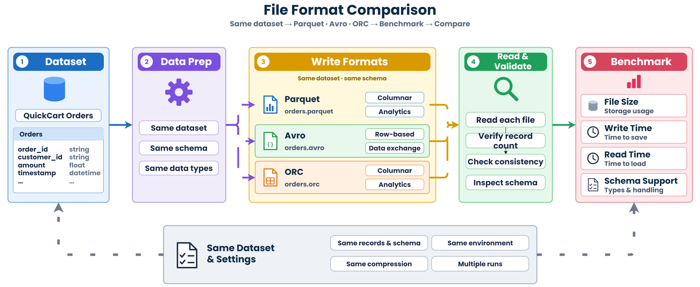

# QuickCart File Format Comparison Lab (Parquet, Avro, ORC)

This lab implements an empirical benchmark and schema compatibility comparison across three modern big data file formats: **Apache Parquet**, **Apache Avro**, and **Apache ORC**, using identical QuickCart order lifecycle datasets.



---

## 1. Project Directory Structure

```text
file-format-comparison-lab/
├── data/                       # Storage directory for generated Parquet, Avro, and ORC files
├── schemas/                    # Formal schema contracts (Avro .avsc and PyArrow Schema)
├── src/                        # Data generator, converters, validator, and benchmark runner
├── results/                    # Machine-readable benchmark report and metrics
├── requirements.txt            # Python dependencies (pandas, pyarrow, fastavro, tabulate)
└── README.md                   # Project overview and instructions
```

---

## 2. Environment Setup

Create an isolated virtual environment and install project dependencies:

```bash
# Create virtual environment
python3 -m venv .venv

# Activate virtual environment (Linux / macOS / VS Code Server)
source .venv/bin/activate

# Windows PowerShell:
# .\.venv\Scripts\Activate.ps1

# Install required dependencies
pip install -r requirements.txt
```

---

## 3. Workflow Overview

1. **Synthesize Data & Define Schemas:** Generate 100,000 realistic QuickCart order records with string, numeric, boolean, and timestamp attributes.
2. **Convert to Formats:** Export identical logical records to `.parquet`, `.avro`, and `.orc`.
3. **Validate Data Parity:** Verify record counts, column types, and numerical precision across all formats.
4. **Empirical Benchmarking:** Measure disk footprints, cold/warm write throughput, and full-scan vs projection read performance.
5. **Schema Evolution & Governance:** Compare schema flexibility, partition compatibility, and ecosystem adoption tradeoffs.
