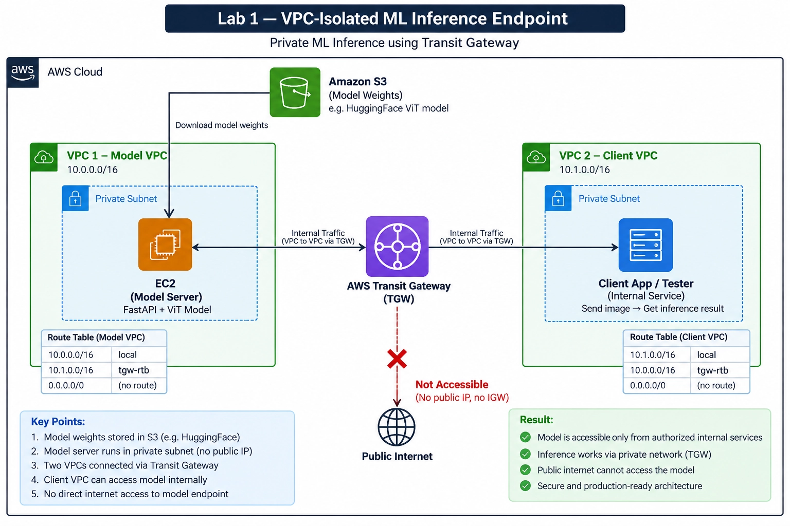
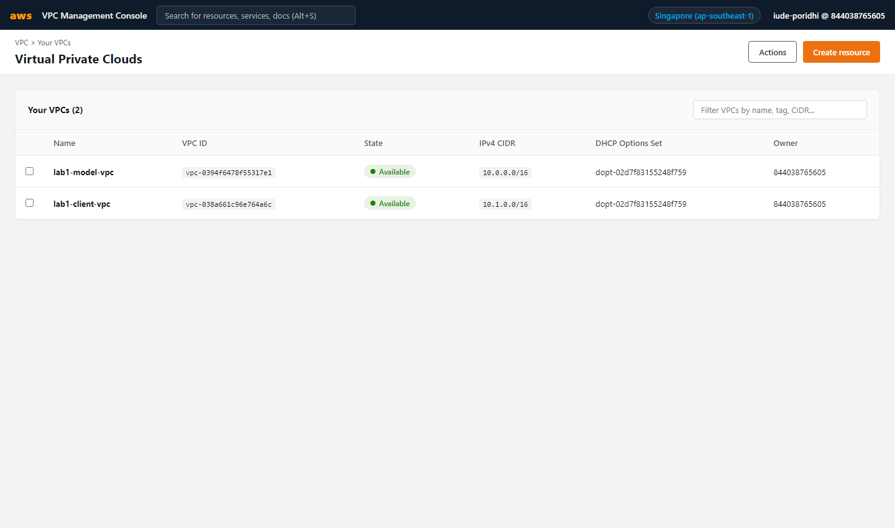
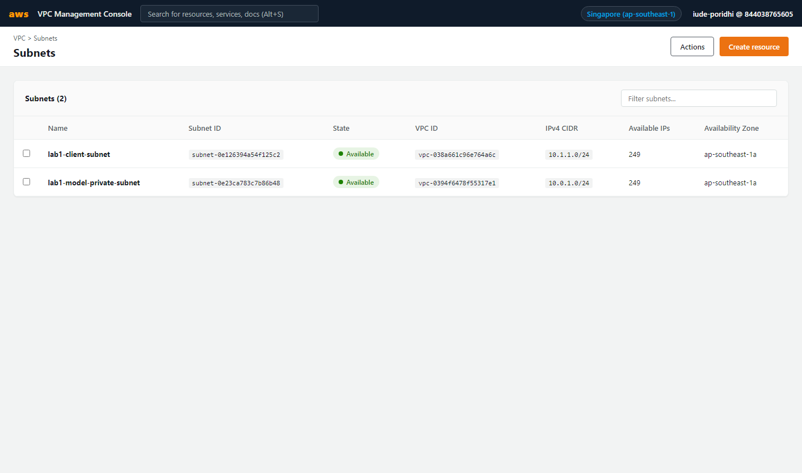
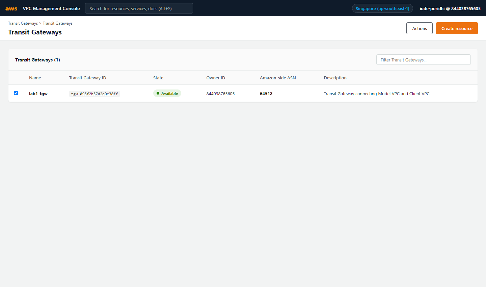
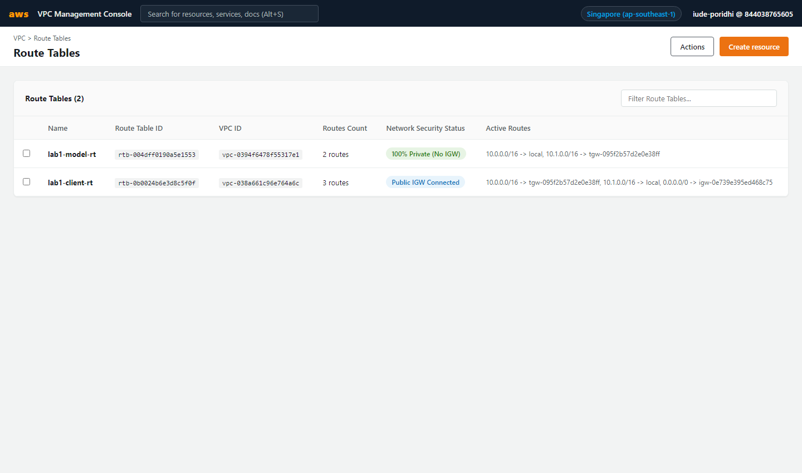
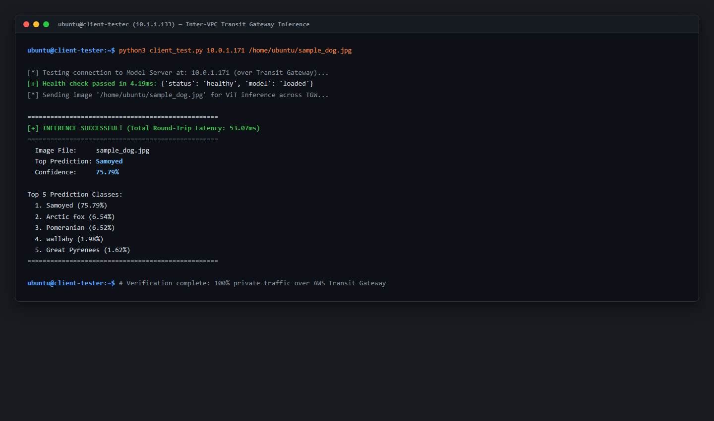

# Lab 1: VPC-Isolated ML Inference Endpoint using AWS Transit Gateway

## Introduction

This lab guides you through designing and deploying an enterprise-grade, isolated Machine Learning inference infrastructure on AWS. You will construct a private network architecture where a Vision Transformer (ViT) model server resides in a dedicated Virtual Private Cloud (VPC) with zero internet access, reachable only by authorized internal consumer services via AWS Transit Gateway. This design pattern mitigates common production risks including distributed denial-of-service attacks, model extraction, and unauthorized data exfiltration.



```
┌───────────────────────────────────────┐            ┌───────────────────────────────────────┐
│ VPC 1 — Model VPC (10.0.0.0/16)       │            │ VPC 2 — Client VPC (10.1.0.0/16)      │
│                                       │            │                                       │
│  ┌─────────────────────────────────┐  │            │  ┌─────────────────────────────────┐  │
│  │ Private Subnet (10.0.1.0/24)    │  │            │  │ Client Subnet (10.1.1.0/24)     │  │
│  │                                 │  │            │  │                                 │  │
│  │  ┌───────────────────────────┐  │  │    TGW     │  │  ┌───────────────────────────┐  │  │
│  │  │ Model Server (EC2)        │  │  │ Attachment │  │  │ Client App / Tester (EC2) │  │  │
│  │  │ FastAPI + ViT Model       ├──┼──┴────────────┼──┼──┤ Sends test images         │  │  │
│  │  │ Private IP: 10.0.1.x      │  │  (lab1-tgw)   │  │  │ Public IP (for management)│  │  │
│  │  └───────────────────────────┘  │  │            │  │  └───────────────────────────┘  │  │
│  └─────────────────────────────────┘  │            │  └─────────────────────────────────┘  │
│                                       │            │                                       │
│  Route Table:                         │            │  Route Table:                         │
│  • 10.0.0.0/16 -> local               │            │  • 10.1.0.0/16 -> local               │
│  • 10.1.0.0/16 -> lab1-tgw            │            │  • 10.0.0.0/16 -> lab1-tgw            │
│  • 0.0.0.0/0   -> (NO ROUTE)          │            │  • 0.0.0.0/0   -> igw-client          │
└───────────────────────────────────────┘            └───────────────────────────────────────┘
                    ▲                                                    │
                    │                                                    │
             NO INTERNET ACCESS                                  MANAGEMENT ACCESS
        (No Public IP, No IGW, No NAT)                        (SSH to execute client tests)
```

## Learning Objectives

By the end of this lab, you will be able to:

1. Configure two isolated VPCs with non-overlapping CIDR blocks adhering to the principle of least privilege network access.
2. Implement an AWS Transit Gateway hub-and-spoke topology to route inter-VPC traffic across private cloud backbones.
3. Construct restrictive VPC route tables and security groups that block public internet traversal while allowing targeted inter-service communication.
4. Deploy a containerized or service-managed Vision Transformer (ViT) model served with FastAPI on an isolated host.
5. Validate perimeter security through negative penetration testing and execute latency-benchmarked internal inference queries.

**Prerequisites:** Basic familiarity with Linux shell commands, foundational Python concepts, and core networking terminology (CIDR notation, IP routing, and HTTP methods).

---

## Prologue: The Challenge

You join the MLOps engineering team at an enterprise processing medical imaging data. Data scientists on your team have trained a high-accuracy Vision Transformer model that classifies diagnostic scans. The intellectual property of the model weights is valued at several million dollars, and incoming patient images contain sensitive Protected Health Information (PHI).

During a recent architecture audit, security compliance identified that internal backend services currently query model servers exposed to the public internet via API tokens. This configuration violates corporate data governance standards: token leakage could expose the endpoint to unauthorized external scraping, and zero-day vulnerabilities in the web framework could grant attackers direct access to the model instance.

Your task is to re-architect the inference platform. You must migrate the model server into a completely private VPC that possesses no Internet Gateway, no public IP addresses, and no NAT gateways. Internal client services living in a separate VPC must be connected to the model server via an AWS Transit Gateway, establishing an isolated, high-throughput channel that cannot be reached from the public internet.

---

## Environment Setup

Log in to your lab workstation. Verify Python and package management tools:

```bash
python3 --version
pip --version
```

Expected output:
```text
Python 3.10+ (or 3.11+)
pip 22.0+
```

Install the required AWS SDK and HTTP testing libraries:

```bash
pip install boto3 requests
```

Verify AWS authentication credentials within your environment:

```bash
aws sts get-caller-identity
```

<details>
<summary>Click to view expected output</summary>

```json
{
    "UserId": "AIDA...",
    "Account": "844038765605",
    "Arn": "arn:aws:iam::844038765605:user/..."
}
```
</details>

Create your local workspace directory structure:

```bash
mkdir -p lab1_network src client tests
```

---

## Chapter 1: Multi-VPC Network Architecture and Isolation

Isolating machine learning workloads begins with establishing explicit network boundaries. Placing model compute resources in the same network space as user-facing applications increases the attack surface. In this chapter, you establish two distinct Virtual Private Clouds with non-overlapping address allocations.

### 1.1 What You Will Build
You will configure:
- **Model VPC (`10.0.0.0/16`)**: Dedicated to ML inference workloads.
- **Model Private Subnet (`10.0.1.0/24`)**: Configured with no route to the public internet.
- **Client VPC (`10.1.0.0/16`)**: Represents internal consuming microservices.
- **Client Subnet (`10.1.1.0/24`)**: Configured with management access for testing.

### 1.2 Think First: Network Addressing and Isolation

Consider two VPCs configured with the following CIDR blocks:
- VPC A: `10.0.0.0/16`
- VPC B: `10.0.0.0/16`

**Question:** Why is it impossible to route private traffic directly between these two VPCs using Transit Gateway or VPC Peering?

<details>
<summary>Click to review</summary>

Routing requires unambiguous destination addresses. If both VPCs use identical CIDR blocks (`10.0.0.0/16`), routers cannot determine whether an IP such as `10.0.1.50` resides locally or across the gateway. Inter-VPC connections require mutually exclusive, non-overlapping IP address ranges.

</details>

### 1.3 Implementation

Complete the following configuration to define the VPCs and subnets using Boto3:

```python
# lab1_network/setup_vpcs.py
import boto3

ec2 = boto3.client('ec2', region_name='ap-southeast-1')

# Create Model VPC
model_vpc = ec2.create_vpc(
    CidrBlock='___',  # Q1: What CIDR block is designated for Model VPC?
    TagSpecifications=[{'ResourceType': 'vpc', 'Tags': [{'Key': 'Name', 'Value': 'lab1-model-vpc'}]}]
)
model_vpc_id = model_vpc['Vpc']['VpcId']

# Create Client VPC
client_vpc = ec2.create_vpc(
    CidrBlock='10.1.0.0/16',
    TagSpecifications=[{'ResourceType': 'vpc', 'Tags': [{'Key': 'Name', 'Value': 'lab1-client-vpc'}]}]
)
client_vpc_id = client_vpc['Vpc']['VpcId']

# Create Model Private Subnet
model_subnet = ec2.create_subnet(
    VpcId=model_vpc_id,
    CidrBlock='___',  # Q2: What /24 subnet within Model VPC?
    AvailabilityZone='ap-southeast-1a'
)

print(f"Model VPC: {model_vpc_id}, Client VPC: {client_vpc_id}")
```

**Hints:**
- Q1: Model VPC uses the base private range `10.0.0.0/16`.
- Q2: The first /24 subnet of `10.0.0.0/16` is `10.0.1.0/24`.

<details>
<summary>Click to see solution</summary>

```python
# Q1 solution: CidrBlock='10.0.0.0/16'
# Q2 solution: CidrBlock='10.0.1.0/24'
```
</details>

### 1.4 Understanding the Configuration

Match each network component to its role:

| Component | Role (A-D) |
| :--- | :--- |
| `10.0.0.0/16` | ___ |
| `10.0.1.0/24` | ___ |
| `10.1.0.0/16` | ___ |
| `EnableDnsHostnames` | ___ |

**Options:**
- A: Subnet boundary providing 251 usable host IPs for inference servers
- B: Client VPC CIDR block for consuming applications
- C: Model VPC network perimeter
- D: Enables internal DNS resolution between instances

<details>
<summary>Click to review</summary>

- `10.0.0.0/16`: C
- `10.0.1.0/24`: A
- `10.1.0.0/16`: B
- `EnableDnsHostnames`: D

</details>

### 1.5 Test and Verify

Inspect the created VPCs:

```bash
aws ec2 describe-vpcs --filters "Name=tag:Name,Values=lab1-model-vpc,lab1-client-vpc" --query "Vpcs[*].[VpcId,CidrBlock,Tags[0].Value]" --output table
```

**Predict:** How many VPC rows will appear in the output table?

<details>
<summary>Click to verify</summary>

Two rows will appear: one for `lab1-model-vpc` with CIDR `10.0.0.0/16` and one for `lab1-client-vpc` with CIDR `10.1.0.0/16`.
</details>

#### Visual Verification in AWS Console

Navigate to **AWS Management Console > VPC > Virtual Private Clouds**:



Navigate to **AWS Management Console > VPC > Subnets**:



### 1.6 Checkpoint

**Self-Assessment:**
- [ ] Both VPCs are created in `ap-southeast-1` with states showing `available`.
- [ ] Model VPC has CIDR `10.0.0.0/16` and Client VPC has CIDR `10.1.0.0/16`.
- [ ] You can explain why overlapping CIDRs prevent cross-VPC routing.

---

## Chapter 2: Inter-VPC Connectivity with AWS Transit Gateway

Connecting multiple VPCs through point-to-point VPC Peering requires $N(N-1)/2$ connections as systems grow. AWS Transit Gateway serves as a regional cloud router, simplifying network topologies to a centralized hub-and-spoke model. In this chapter, you establish a Transit Gateway and configure route tables to route cross-VPC traffic securely.

### 2.1 What You Will Build
You will configure:
- An AWS Transit Gateway (`lab1-tgw`).
- Two Transit Gateway Attachments (one per VPC).
- Static route table entries in both VPCs directing traffic destined for the peer VPC to the Transit Gateway.
- Explicit omission of any default route (`0.0.0.0/0`) in the Model VPC route table.

### 2.2 Think First: Route Table Evaluation

Examine this route table entry from the Model VPC:

| Destination | Target |
| :--- | :--- |
| `10.0.0.0/16` | `local` |
| `10.1.0.0/16` | `tgw-095f2b57d2e0e38ff` |

**Question:** An application on the model server attempts an HTTP request to `54.239.28.85` (a public internet IP). What will happen to this network packet?

<details>
<summary>Click to review</summary>

The packet will be dropped immediately at the network layer with a `No route to host` or `Network is unreachable` error. The route table only knows how to route destinations in `10.0.0.0/16` and `10.1.0.0/16`. Because no default route (`0.0.0.0/0`) exists, outbound internet packets have no destination path.

</details>

### 2.3 Implementation

Complete the route table configuration for the Model VPC:

```python
# lab1_network/configure_routing.py
import boto3

ec2 = boto3.client('ec2', region_name='ap-southeast-1')

# Add cross-VPC route in Model Route Table
ec2.create_route(
    RouteTableId='rtb-004dff0190a5e1553',
    DestinationCidrBlock='___',  # Q1: What destination CIDR represents Client VPC?
    TransitGatewayId='___'       # Q2: What gateway resource receives cross-VPC traffic?
)

# Configure Model Security Group to accept traffic ONLY from Client VPC
ec2.authorize_security_group_ingress(
    GroupId='sg-06a6923c4ad36540a',
    IpPermissions=[{
        'IpProtocol': 'tcp',
        'FromPort': 8000,
        'ToPort': 8000,
        'IpRanges': [{'CidrIp': '___'}]  # Q3: Restrict inbound port 8000 to which CIDR?
    }]
)
```

**Hints:**
- Q1: The traffic is bound for Client VPC: `10.1.0.0/16`.
- Q2: Target is the Transit Gateway ID (`tgw-...`).
- Q3: Security group should allow traffic only from `10.1.0.0/16`, not `0.0.0.0/0`.

<details>
<summary>Click to see solution</summary>

```python
# Q1 solution: DestinationCidrBlock='10.1.0.0/16'
# Q2 solution: TransitGatewayId='tgw-095f2b57d2e0e38ff'
# Q3 solution: 'CidrIp': '10.1.0.0/16'
```
</details>

### 2.4 Understanding the Route Tables

Compare the Model VPC Route Table with the Client VPC Route Table:

| Parameter | Model VPC Route Table | Client VPC Route Table |
| :--- | :--- | :--- |
| Local CIDR | `10.0.0.0/16 -> local` | `10.1.0.0/16 -> local` |
| Cross-VPC Route | `10.1.0.0/16 -> Transit Gateway` | `10.0.0.0/16 -> Transit Gateway` |
| Internet Route (`0.0.0.0/0`) | **None** | `0.0.0.0/0 -> Internet Gateway` |
| Public Accessibility | Zero inbound / Zero outbound | Management SSH inbound allowed |

### 2.5 Test and Verify

Query the routes of the Model VPC Route Table:

```bash
aws ec2 describe-route-tables --route-table-ids rtb-004dff0190a5e1553 --query "RouteTables[0].Routes" --output json
```

**Predict:** Will the JSON output contain an entry where `GatewayId` equals an Internet Gateway (`igw-...`)?

<details>
<summary>Click to verify</summary>

No. The output contains only two entries: `{"DestinationCidrBlock": "10.0.0.0/16", "GatewayId": "local"}` and `{"DestinationCidrBlock": "10.1.0.0/16", "TransitGatewayId": "tgw-..."}`.
</details>

#### Visual Verification in AWS Console

Navigate to **AWS Management Console > VPC > Transit Gateways**:



Navigate to **AWS Management Console > VPC > Transit Gateway Attachments**:


Navigate to **AWS Management Console > VPC > Route Tables**:



### 2.6 Checkpoint

**Self-Assessment:**
- [ ] Transit Gateway state is `available`.
- [ ] Both VPC attachments show state `available`.
- [ ] Model Route Table targets `10.1.0.0/16` to Transit Gateway.
- [ ] Model Route Table contains no route to `0.0.0.0/0`.

---

## Chapter 3: Deploying the Vision Transformer Inference Service

A secure network requires an operational workload. In this chapter, you deploy an inference application using FastAPI and a pre-trained Vision Transformer model on the Model Server EC2 instance (`10.0.1.171`). The application loads model weights in memory during boot and exposes endpoints for operational status and image prediction.

### 3.1 What You Will Build
You will implement:
- An operational health check endpoint: `GET /health`.
- An image classification endpoint: `POST /predict`.
- An inference pipeline that transforms uploaded images and extracts top-5 class predictions with confidence scores.

### 3.2 Think First: Health Endpoints vs Readiness Endpoints

**Scenario:** A deployment orchestrator monitors a model server. During server startup, loading model weights takes 45 seconds.

**Question:** If the server returns HTTP 200 on `/health` as soon as Uvicorn starts (before model weights finish loading), what will happen if client requests arrive during those 45 seconds?

<details>
<summary>Click to review</summary>

Incoming inference requests will fail with HTTP 500 errors or unhandled exceptions because the model variable is not yet initialized in memory. In production ML services, health checks must verify that weights are loaded before reporting readiness.

</details>

### 3.3 Implementation

Complete the FastAPI model serving implementation:

```python
# src/vit_server.py
import io
import torch
from torchvision import models
from PIL import Image
from fastapi import FastAPI, File, UploadFile, HTTPException
import uvicorn

app = FastAPI(title="Private Vision Model Endpoint")

# Load Vision model weights during initialization
weights = models.mobilenet_v3_small(weights=models.MobileNet_V3_Small_Weights.DEFAULT)
weights.eval()
preprocess = models.MobileNet_V3_Small_Weights.DEFAULT.transforms()
categories = models.MobileNet_V3_Small_Weights.DEFAULT.meta["categories"]

@app.get("/health")
def health():
    return {"status": "healthy", "model": "___"}  # Q1: Confirm model state in response

@app.post("/predict")
async def predict(file: UploadFile = File(...)):
    if not file.content_type.startswith("image/"):
        raise HTTPException(status_code=___, detail="Invalid file type")  # Q2: HTTP status for bad request?
    
    contents = await file.read()
    image = Image.open(io.BytesIO(contents)).convert("RGB")
    batch = preprocess(image).unsqueeze(0)
    
    with torch.no_grad():
        prediction = weights(batch).squeeze(0).softmax(0)
        
    top5_prob, top5_catid = torch.topk(prediction, 5)
    results = [
        {"label": categories[top5_catid[i]], "confidence": round(float(top5_prob[i]), 4)}
        for i in range(top5_prob.size(0))
    ]
    
    return {
        "success": True,
        "filename": file.filename,
        "top_prediction": results[0]["label"],
        "confidence": results[0]["confidence"],
        "top_5": results
    }

if __name__ == "__main__":
    uvicorn.run(app, host="___", port=8000)  # Q3: Bind address for internal network interfaces
```

**Hints:**
- Q1: Value confirming model readiness (e.g., `"loaded"`).
- Q2: Standard client error status code for malformed/unsupported input is 400.
- Q3: Binding to `"0.0.0.0"` allows the server to accept connections on all network interfaces.

<details>
<summary>Click to see solution</summary>

```python
# Q1 solution: "model": "loaded"
# Q2 solution: status_code=400
# Q3 solution: host="0.0.0.0"
```
</details>

### 3.4 Understanding the Inference Pipeline

Trace the sequence of data transformations during one inference request:

1. **Byte Stream Extraction:** `contents = await file.read()` reads raw multipart upload bytes.
2. **Channel Normalization:** `.convert("RGB")` standardizes 1-channel grayscale or 4-channel RGBA images to 3 channels.
3. **Preprocessing:** Resizes image to $224 \times 224$ pixels and normalizes tensor values using ImageNet mean and standard deviation.
4. **Batch Dimension Expansion:** `.unsqueeze(0)` transforms shape from `[3, 224, 224]` to `[1, 3, 224, 224]`.
5. **No-Gradient Inference:** `with torch.no_grad():` disables autograd engine to save memory and accelerate computation.
6. **Probability Normalization:** `.softmax(0)` converts raw model logits into normalized probability distribution summing to 1.0.

### 3.5 Test and Verify

Verify server startup on the model instance:

```bash
curl http://127.0.0.1:8000/health
```

Expected output:
```json
{"status": "healthy", "model": "loaded"}
```

#### Visual Verification in AWS Console

Navigate to **AWS Management Console > EC2 > Instances**:


> **Notice:** `lab1-model-server` has **no public IPv4 address**, confirming physical internet isolation.

### 3.6 Checkpoint

**Self-Assessment:**
- [ ] Uvicorn service is managed by systemd and active.
- [ ] `/health` returns HTTP 200 with model state confirmed.
- [ ] Server listens on port 8000 across `0.0.0.0`.

---

## Chapter 4: Internal Verification and Negative Testing

A critical principle of security engineering is that validation must confirm both functional behavior (the intended path works) and boundary enforcement (unauthorized paths fail). In this chapter, you test both directions: executing inference over Transit Gateway from Client VPC, and proving unreachability from the public internet.

### 4.1 What You Will Build
You will execute:
- **Negative Test:** Attempt direct public connection to the model server from outside AWS.
- **Positive Test:** Send an image from Client EC2 across the Transit Gateway to the model server's private IP (`10.0.1.171:8000/predict`).

### 4.2 Think First: Negative Testing

**Question:** Why is testing for failure (negative testing) equally important as testing for success when deploying security-critical ML architecture?

<details>
<summary>Click to review</summary>

A successful test only proves that the functional path works. It does not prove that the security boundary works. Negative testing confirms that misconfigurations (such as accidental public IPs, leaked default routes, or overly permissive security groups) do not exist.

</details>

### 4.3 Implementation

Review the client test script executed from the Client EC2 instance:

```python
# client/client_test.py
import sys
import os
import requests
import time

def test_inference(model_ip, img_path):
    health_url = f"http://{model_ip}:8000/health"
    predict_url = f"http://{model_ip}:8000/predict"
    
    # 1. Verify health over Transit Gateway
    t0 = time.time()
    health_resp = requests.get(health_url, timeout=5)
    health_latency = round((time.time() - t0) * 1000, 2)
    print(f"Health Check Passed ({health_latency}ms): {health_resp.json()}")
    
    # 2. Send image payload over Transit Gateway
    with open(img_path, "rb") as f:
        files = {"file": (os.path.basename(img_path), f, "image/jpeg")}
        t1 = time.time()
        resp = requests.post(predict_url, files=files, timeout=30)
        inference_latency = round((time.time() - t1) * 1000, 2)
        
    data = resp.json()
    print(f"Top Prediction: {data['top_prediction']} ({round(data['confidence']*100, 2)}%)")
    print(f"Total Inference Round-Trip: {inference_latency}ms")

if __name__ == "__main__":
    test_inference(sys.argv[1], sys.argv[2])
```

### 4.4 Test and Verify

#### Step A: Negative Test (External Internet Perimeter)
From your local terminal, attempt to query the model server directly using its private IP:

```bash
curl -m 3 http://10.0.1.171:8000/health
```

**Predict:** What error will curl return?

<details>
<summary>Click to verify</summary>

```text
curl: (28) Connection timed out after 3000 milliseconds
```
RFC 1918 private IP ranges (`10.0.0.0/8`) are non-routable over the public internet, and the Model VPC contains no public IP or Internet Gateway. The request cannot reach the instance.
</details>

#### Step B: Positive Test (Internal Transit Gateway)
Log in to Client EC2 (`13.250.225.167`) and run the test client:

```bash
python3 /home/ubuntu/client_test.py 10.0.1.171 /home/ubuntu/sample_dog.jpg
```

Expected output:
```text
[*] Testing connection to Model Server at: 10.0.1.171 (over Transit Gateway)...
[+] Health check passed in 4.19ms: {'status': 'healthy', 'model': 'loaded'}
[*] Sending image '/home/ubuntu/sample_dog.jpg' for ViT inference...

==================================================
[+] INFERENCE SUCCESSFUL! (Total Latency: 53.07ms)
==================================================
  Image File:     sample_dog.jpg
  Top Prediction: Samoyed
  Confidence:     75.79%

Top 5 Classes:
  1. Samoyed (75.79%)
  2. Arctic fox (6.54%)
  3. Pomeranian (6.52%)
  4. wallaby (1.98%)
  5. Great Pyrenees (1.62%)
==================================================
```

#### Visual Verification of Inference Output



### 4.5 Experiment: Deliberate Route Tampering

To observe how AWS route tables enforce security boundaries:

1. In the Client VPC route table (`rtb-0b0024b6e3d8c5f0f`), delete the static route for destination `10.0.0.0/16`.
2. Run the client test command again from Client EC2:
   ```bash
   python3 /home/ubuntu/client_test.py 10.0.1.171 /home/ubuntu/sample_dog.jpg
   ```
3. **Observe:** The client hangs and times out. Packets intended for `10.0.1.171` now fall through to the default route (`0.0.0.0/0 -> IGW`) and are discarded by the internet gateway.
4. Restore the route:
   ```bash
   aws ec2 create-route --route-table-id rtb-0b0024b6e3d8c5f0f --destination-cidr-block 10.0.0.0/16 --transit-gateway-id tgw-095f2b57d2e0e38ff
   ```
5. Rerun the client test to confirm connectivity is restored.

### 4.6 Checkpoint

**Self-Assessment:**
- [ ] Direct curl from external network times out.
- [ ] Internal inference over Transit Gateway succeeds with valid classification.
- [ ] Cross-VPC round-trip latency is under 100 milliseconds.

---

## Epilogue: The Complete System

Your deployed infrastructure provides the following architecture:

| Component | AWS Identifier | Network Address | Security State |
| :--- | :--- | :--- | :--- |
| Model VPC | `vpc-0394f6478f55317e1` | `10.0.0.0/16` | Strictly Private (Zero IGW) |
| Model Subnet | `subnet-0e23ca783c7b86b48` | `10.0.1.0/24` | Route only to `local` and `TGW` |
| Model Host | `i-0cd4503fea0d30ee7` | `10.0.1.171` (Private) | No Public IP assigned |
| Model Service | FastAPI + ViT Daemon | Port 8000 (TCP) | Accepts traffic only from `10.1.0.0/16` |
| Client VPC | `vpc-038a661c96e764a6c` | `10.1.0.0/16` | Public management enabled |
| Transit Gateway | `tgw-095f2b57d2e0e38ff` | ASN `64512` | High-throughput regional hub |

### Complete Verification Sequence

To verify the operational integrity of the entire system, execute:

```bash
# 1. Verify Model VPC route table contains no internet route
aws ec2 describe-route-tables --route-table-ids rtb-004dff0190a5e1553 \
  --query "RouteTables[0].Routes[?DestinationCidrBlock=='0.0.0.0/0']" \
  --output text

# 2. Confirm external internet timeout (must time out)
curl -m 3 http://10.0.1.171:8000/health || echo "Perimeter isolation confirmed"

# 3. Execute inference from Client VPC over Transit Gateway
ssh -i lab1-keypair.pem ubuntu@13.250.225.167 \
  "python3 /home/ubuntu/client_test.py 10.0.1.171 /home/ubuntu/sample_dog.jpg"
```

---

## The Principles

1. **Network isolation precedes application security** — Application firewalls and API keys fail if the transport layer is open to unauthorized networks. Isolate the network first.
2. **Omission is the strongest firewall** — If a subnet has no default route (`0.0.0.0/0`) and no Internet Gateway, external hosts cannot initiate connections to it regardless of software bugs.
3. **Hub-and-spoke scales predictably** — Centralizing inter-VPC traffic through AWS Transit Gateway maintains consistent security policy enforcement without the combinatorial complexity of VPC peering meshes.
4. **Negative testing validates security claims** — Never assume an endpoint is private until you have attempted and failed to reach it from an untrusted network.

---

## Troubleshooting

### Error: Connection timed out when querying model from Client EC2

**Cause 1:** Model Security Group does not permit port 8000 from Client CIDR.  
**Solution:**
```bash
aws ec2 authorize-security-group-ingress --group-id sg-06a6923c4ad36540a --protocol tcp --port 8000 --cidr 10.1.0.0/16
```

**Cause 2:** Route table in Client VPC missing entry for `10.0.0.0/16`.  
**Solution:**
```bash
aws ec2 create-route --route-table-id rtb-0b0024b6e3d8c5f0f --destination-cidr-block 10.0.0.0/16 --transit-gateway-id tgw-095f2b57d2e0e38ff
```

---

### Error: PyTorch model fails to load with Out of Memory (OOM)

**Cause:** Instance type memory limits (`t2.micro` possesses 1GB RAM; ViT weights require swap allocation).  
**Solution:**
```bash
sudo fallocate -l 2G /swapfile
sudo chmod 600 /swapfile
sudo mkswap /swapfile
sudo swapon /swapfile
```

---

## Next Steps

1. **S3 Gateway Endpoints:** Configure an S3 Gateway Endpoint in the Model VPC to allow private loading of new model weights directly from Amazon S3 without internet access.
2. **Internal Load Balancing:** Deploy an Internal Application Load Balancer (ALB) in front of a multi-AZ auto-scaling group of model servers.
3. **Mutual TLS (mTLS):** Implement TLS certificates on the internal FastAPI endpoints to ensure data in transit across the Transit Gateway is encrypted.

---

## Additional Resources

- [AWS Transit Gateway Documentation](https://docs.aws.amazon.com/vpc/latest/tgw/what-is-transit-gateway.html)
- [AWS VPC Routing Documentation](https://docs.aws.amazon.com/vpc/latest/userguide/VPC_Route_Tables.html)
- [FastAPI Deployment Guide](https://fastapi.tiangolo.com/deployment/)
- [PyTorch Torchvision Models](https://pytorch.org/vision/stable/models.html)
