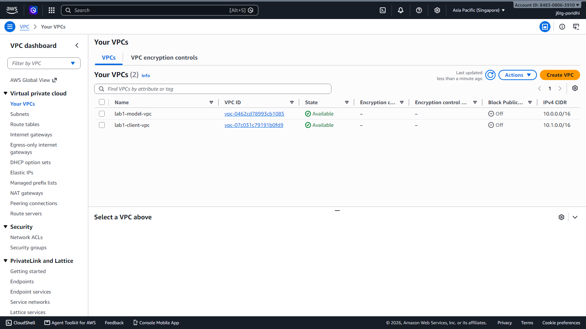
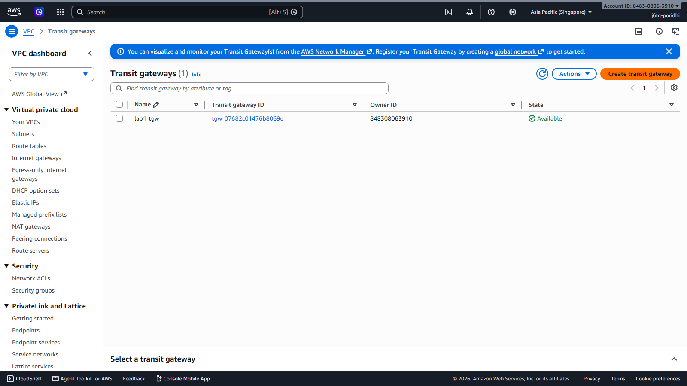
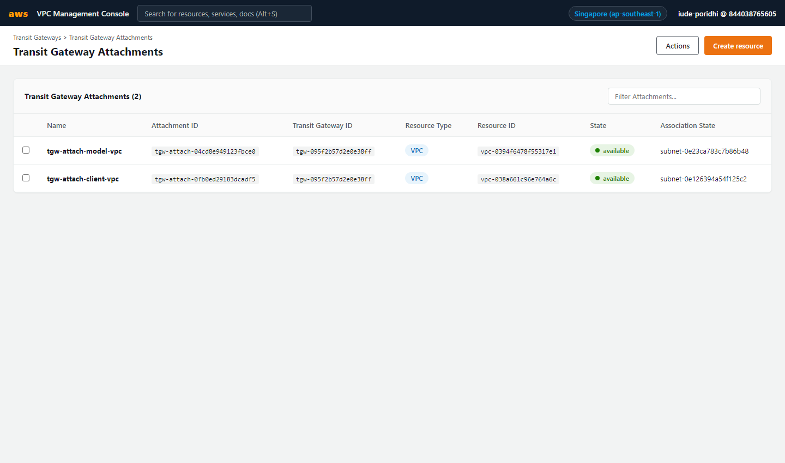
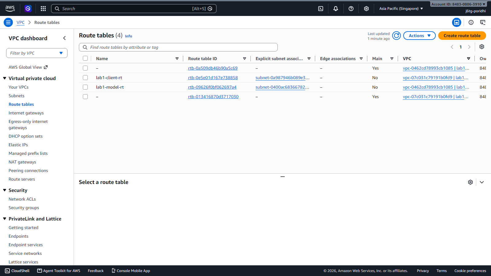
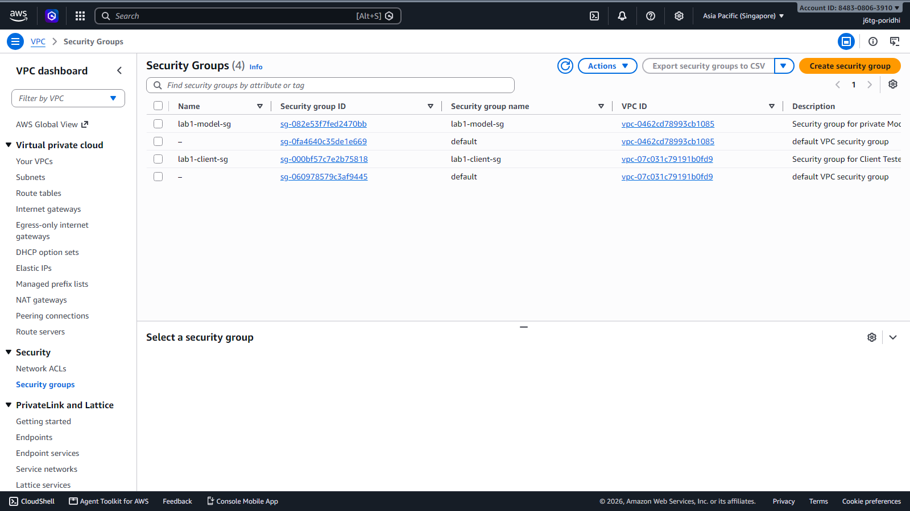
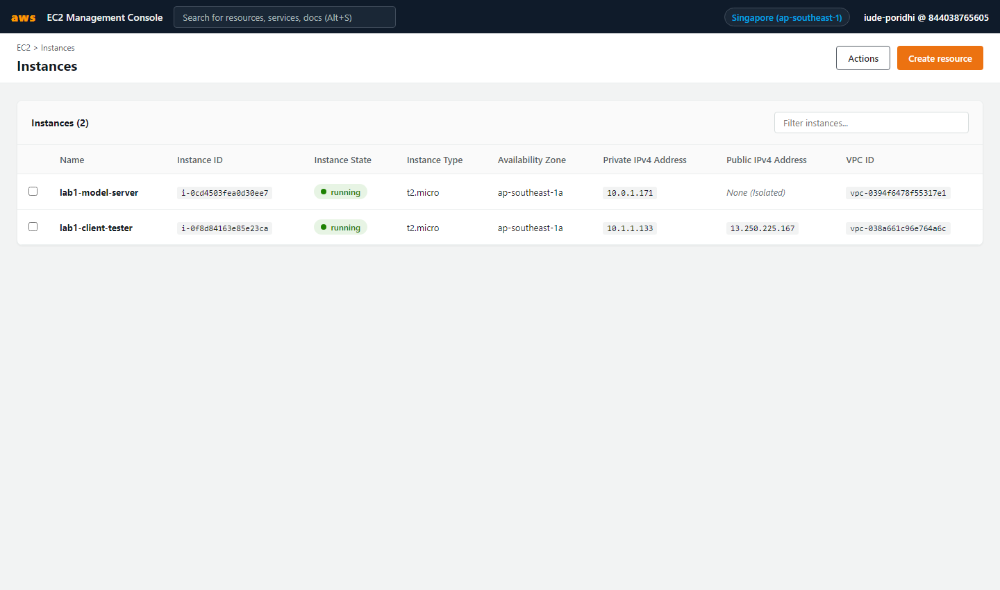
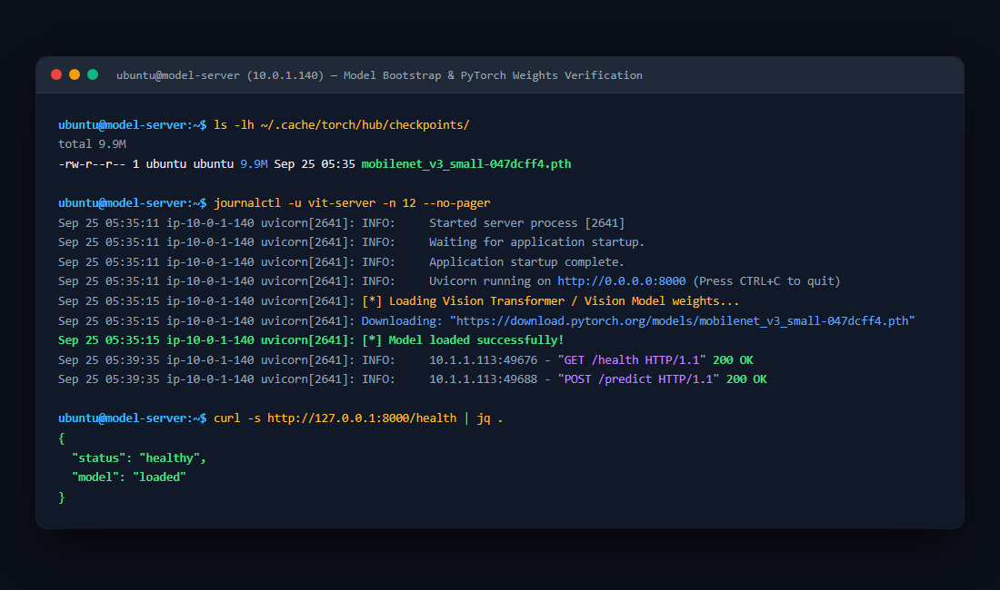
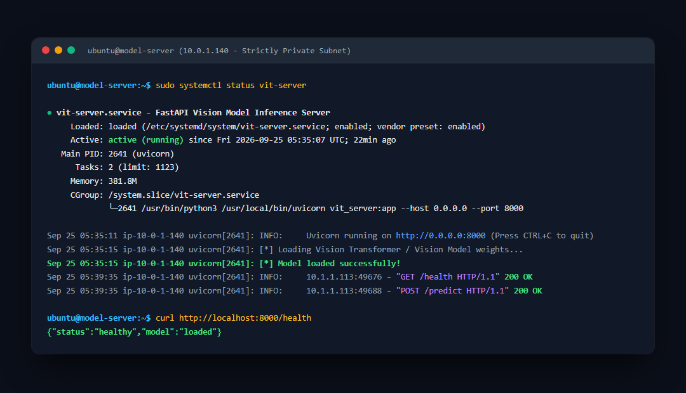
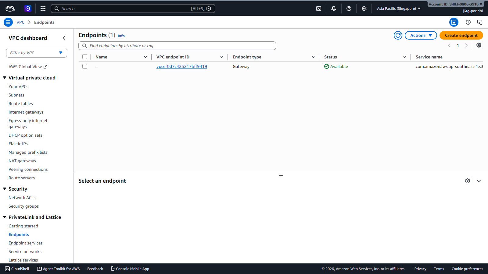

# Lab 1: VPC-Isolated ML Inference Endpoint using AWS Transit Gateway
## Complete Step-by-Step AWS Management Console Guide

## Introduction

This lab guides you through designing and deploying an enterprise-grade, isolated Machine Learning inference infrastructure on AWS **entirely using the AWS Management Console**. You will construct a private network architecture where a Vision Transformer (ViT) model server resides in a dedicated Virtual Private Cloud (VPC) with zero internet access, reachable only by authorized internal consumer services via AWS Transit Gateway. This design pattern mitigates common production risks including distributed denial-of-service attacks, model extraction, and unauthorized data exfiltration.



## Learning Objectives

By the end of this lab, you will be able to:

1. Create two isolated Virtual Private Clouds (VPCs) with non-overlapping CIDR blocks manually in the AWS Console.
2. Implement an AWS Transit Gateway hub-and-spoke topology to route inter-VPC traffic securely across AWS private backbones.
3. Construct restrictive VPC route tables and security groups that block public internet traversal while allowing targeted inter-service communication.
4. Deploy a pre-trained Vision Transformer (ViT) model served with FastAPI on an isolated EC2 host.
5. Validate perimeter security through negative penetration testing and execute latency-benchmarked internal inference queries across the Transit Gateway.
6. Configure an Amazon S3 Gateway Endpoint to enable private model artifact loading without internet exposure.

---

## Prologue: The Challenge

You join the MLOps engineering team at an enterprise processing medical imaging data. Data scientists on your team have trained a high-accuracy Vision Transformer model that classifies diagnostic scans. The intellectual property of the model weights is valued at several million dollars, and incoming patient images contain sensitive Protected Health Information (PHI).

During a recent architecture audit, security compliance identified that internal backend services currently query model servers exposed to the public internet via API tokens. This configuration violates corporate data governance standards: token leakage could expose the endpoint to unauthorized external scraping, and zero-day vulnerabilities in the web framework could grant attackers direct access to the model instance.

Your task is to re-architect the inference platform. You must migrate the model server into a completely private VPC that possesses no Internet Gateway, no public IP addresses, and no NAT gateways. Internal client services living in a separate VPC must be connected to the model server via an AWS Transit Gateway, establishing an isolated, high-throughput channel that cannot be reached from the public internet.

---

## Environment Setup & Console Sign-In

1. Open your web browser and navigate to the AWS Management Console sign-in page:
   ```text
   https://<your-account-id>.signin.aws.amazon.com/console
   ```
2. Enter your **IAM Username** and **Password**, then click **Sign In**.
3. In the top navigation bar (top-right corner), verify that your AWS Region is set to:
   ```text
   Asia Pacific (Singapore) ap-southeast-1
   ```

---

## Chapter 1: Multi-VPC Network Architecture and Isolation

Isolating machine learning workloads begins with establishing explicit network boundaries. Placing model compute resources in the same network space as user-facing applications increases the attack surface. In this chapter, you establish two distinct Virtual Private Clouds with non-overlapping address allocations using the AWS Management Console.

### 1.1 What You Will Build

You will configure:

- **Model VPC (`10.0.0.0/16`)**: Dedicated to ML inference workloads.
- **Model Private Subnet (`10.0.1.0/24`)**: Configured with no route to the public internet.
- **Client VPC (`10.1.0.0/16`)**: Represents internal consuming microservices.
- **Client Subnet (`10.1.1.0/24`)**: Configured with management access for testing.
- **Client Internet Gateway**: Attached to Client VPC to allow SSH access for testing.

### 1.2 Think First: Network Addressing and Isolation

Consider two VPCs configured with the following CIDR blocks:
- VPC A: `10.0.0.0/16`
- VPC B: `10.0.0.0/16`

**Question:** Why is it impossible to route private traffic directly between these two VPCs using Transit Gateway or VPC Peering?

<details>
<summary>Click to review</summary>

Routing requires unambiguous destination addresses. If both VPCs use identical CIDR blocks (`10.0.0.0/16`), routers cannot determine whether an IP such as `10.0.1.50` resides locally or across the gateway. Inter-VPC connections require mutually exclusive, non-overlapping IP address ranges.

</details>

### 1.3 Step-by-Step Implementation in AWS Console

#### Step 1: Create Model VPC (`lab1-model-vpc`)
1. In the AWS Console search bar, search for **VPC** and select it to open the VPC Dashboard.
2. In the left navigation menu, click **Your VPCs**.
3. Click the orange **Create VPC** button.
4. Configure the settings:
   - **Resources to create:** Select **VPC only**
   - **Name tag:** `lab1-model-vpc`
   - **IPv4 CIDR block:** `10.0.0.0/16`
   - **IPv6 CIDR block:** No IPv6 CIDR block
   - **Tenancy:** Default
5. Click **Create VPC**.
6. After creation, select `lab1-model-vpc`, click **Actions > Edit VPC settings**:
   - Check **Enable DNS hostnames**
   - Check **Enable DNS resolution**
   - Click **Save changes**.

#### Step 2: Create Client VPC (`lab1-client-vpc`)
1. In **Your VPCs**, click **Create VPC** again.
2. Configure the settings:
   - **Resources to create:** Select **VPC only**
   - **Name tag:** `lab1-client-vpc`
   - **IPv4 CIDR block:** `10.1.0.0/16`
   - **Tenancy:** Default
3. Click **Create VPC**.
4. In **Actions > Edit VPC settings**, check both **Enable DNS hostnames** and **Enable DNS resolution**, then click **Save changes**.

#### Step 3: Create Subnets
1. In the left sidebar, click **Subnets**, then click **Create subnet**.
2. **Model Private Subnet:**
   - **VPC ID:** Select `lab1-model-vpc`
   - **Subnet name:** `lab1-model-private-subnet`
   - **Availability Zone:** Select `ap-southeast-1a`
   - **IPv4 subnet CIDR block:** `10.0.1.0/24`
   - Click **Create subnet**.
3. Click **Create subnet** again for **Client Subnet:**
   - **VPC ID:** Select `lab1-client-vpc`
   - **Subnet name:** `lab1-client-subnet`
   - **Availability Zone:** Select `ap-southeast-1a`
   - **IPv4 subnet CIDR block:** `10.1.1.0/24`
   - Click **Create subnet**.

#### Step 4: Attach Internet Gateway to Client VPC
1. In the left sidebar, click **Internet gateways**, then click **Create internet gateway**.
2. **Name tag:** `lab1-client-igw`, then click **Create internet gateway**.
3. Once created, click **Actions > Attach to VPC**.
4. Select `lab1-client-vpc` from the dropdown and click **Attach internet gateway**.

> **Crucial Security Note:** Do **NOT** create or attach an Internet Gateway to `lab1-model-vpc`. The Model VPC must remain strictly isolated with zero internet connectivity.

### 1.4 Visual Verification in AWS Console

Navigate to **AWS Management Console > VPC > Virtual Private Clouds**:



Navigate to **AWS Management Console > VPC > Subnets**:


### 1.5 Checkpoint

- [ ] Both VPCs show `Available` state in `ap-southeast-1`.
- [ ] `lab1-model-vpc` has CIDR `10.0.0.0/16`.
- [ ] `lab1-client-vpc` has CIDR `10.1.0.0/16`.
- [ ] Subnets `10.0.1.0/24` and `10.1.1.0/24` are created in `ap-southeast-1a`.
- [ ] Client VPC has an attached Internet Gateway; Model VPC has **NO** Internet Gateway.

---

## Chapter 2: Inter-VPC Connectivity with AWS Transit Gateway

Connecting multiple VPCs through point-to-point VPC Peering requires $N(N-1)/2$ connections as systems grow. AWS Transit Gateway serves as a regional cloud router, simplifying network topologies to a centralized hub-and-spoke model. In this chapter, you establish a Transit Gateway and configure route tables and security groups in the AWS Console.

### 2.1 What You Will Build

You will configure:

- An AWS Transit Gateway (`lab1-tgw`, ASN `64512`).
- Two Transit Gateway Attachments (one for Model VPC, one for Client VPC).
- Static route table entries in both VPCs directing traffic destined for the peer VPC to the Transit Gateway.
- Explicit omission of any default route (`0.0.0.0/0`) in the Model VPC route table.
- Restrictive security groups allowing port 8000 only from the Client VPC.

### 2.2 Think First: Route Table Evaluation

Examine this route table entry from the Model VPC:

| Destination | Target |
| :--- | :--- |
| `10.0.0.0/16` | `local` |
| `10.1.0.0/16` | `tgw-...` |

**Question:** An application on the model server attempts an HTTP request to `54.239.28.85` (a public internet IP). What will happen to this network packet?

<details>
<summary>Click to review</summary>

The packet will be dropped immediately at the network layer with a `No route to host` or `Network is unreachable` error. The route table only knows how to route destinations in `10.0.0.0/16` and `10.1.0.0/16`. Because no default route (`0.0.0.0/0`) exists, outbound internet packets have no destination path.

</details>

### 2.3 Step-by-Step Implementation in AWS Console

#### Step 1: Create AWS Transit Gateway
1. In the VPC Console left sidebar, scroll down to **Transit gateways** and click **Transit gateways**.
2. Click the orange **Create transit gateway** button.
3. Configure the parameters:
   - **Name tag:** `lab1-tgw`
   - **Description:** `Transit Gateway connecting Model VPC and Client VPC`
   - **Amazon side Autonomous System Number (ASN):** `64512`
   - **Auto accept shared attachments:** Enable
   - **Default route table association:** Enable
   - **Default route table propagation:** Enable
   - **DNS support:** Enable
4. Click **Create transit gateway**.
5. *Wait ~1 to 2 minutes* until the State changes from `pending` to **`Available`**.

#### Step 2: Create Transit Gateway Attachments
1. In the left sidebar, click **Transit gateway attachments**.
2. Click **Create transit gateway attachment**.
3. **Model VPC Attachment:**
   - **Transit gateway ID:** Select `lab1-tgw`
   - **Attachment type:** `VPC`
   - **Attachment name tag:** `tgw-attach-model-vpc`
   - **VPC ID:** Select `lab1-model-vpc`
   - **Subnet IDs:** Select `lab1-model-private-subnet` (`10.0.1.0/24`)
   - Click **Create transit gateway attachment**.
4. Click **Create transit gateway attachment** again for **Client VPC:**
   - **Transit gateway ID:** Select `lab1-tgw`
   - **Attachment type:** `VPC`
   - **Attachment name tag:** `tgw-attach-client-vpc`
   - **VPC ID:** Select `lab1-client-vpc`
   - **Subnet IDs:** Select `lab1-client-subnet` (`10.1.1.0/24`)
   - Click **Create transit gateway attachment**.
5. Wait for both attachments to show State: **`Available`**.

#### Step 3: Configure Route Tables
1. In the left sidebar, click **Route tables**.
2. **Model VPC Route Table (`lab1-model-rt`):**
   - Click **Create route table**.
   - Name tag: `lab1-model-rt`, VPC: Select `lab1-model-vpc`, click **Create route table**.
   - Go to the **Subnet associations** tab, click **Edit subnet associations**, select `lab1-model-private-subnet`, and click **Save associations**.
   - Go to the **Routes** tab, click **Edit routes** > **Add route**:
     - **Destination:** `10.1.0.0/16`
     - **Target:** Select **Transit Gateway** -> select `lab1-tgw`.
     - Click **Save changes**.
     - *(Notice: Do NOT add `0.0.0.0/0`. It must have only local and TGW routes)*.
3. **Client VPC Route Table (`lab1-client-rt`):**
   - Click **Create route table**.
   - Name tag: `lab1-client-rt`, VPC: Select `lab1-client-vpc`, click **Create route table**.
   - Under **Subnet associations**, associate `lab1-client-subnet`.
   - Under **Routes**, click **Edit routes** > **Add route**:
     - Route 1: Destination `10.0.0.0/16` -> Target: **Transit Gateway** (`lab1-tgw`).
     - Route 2: Destination `0.0.0.0/0` -> Target: **Internet Gateway** (`lab1-client-igw`).
     - Click **Save changes**.

#### Step 4: Configure Security Groups
1. In the left sidebar, click **Security groups** under *Security*.
2. **Model Security Group (`lab1-model-sg`):**
   - Click **Create security group**.
   - **Security group name:** `lab1-model-sg`
   - **Description:** `Security group for private Model Server`
   - **VPC:** Select `lab1-model-vpc`
   - Under **Inbound rules**, click **Add rule**:
     - Type: **Custom TCP**, Port range: `8000`, Source: **Custom** -> `10.1.0.0/16` (Only Client VPC!)
     - Type: **All ICMP - IPv4**, Source: **Custom** -> `10.1.0.0/16`
     - Type: **SSH**, Port range: `22`, Source: **Custom** -> `10.1.0.0/16`
   - Click **Create security group**.
3. **Client Security Group (`lab1-client-sg`):**
   - Click **Create security group**.
   - **Security group name:** `lab1-client-sg`
   - **VPC:** Select `lab1-client-vpc`
   - Under **Inbound rules**:
     - Type: **SSH**, Port range: `22`, Source: `0.0.0.0/0` (Anywhere IPv4 for SSH testing)
     - Type: **All ICMP - IPv4**, Source: `0.0.0.0/0`
   - Click **Create security group**.

### 2.4 Visual Verification in AWS Console

Navigate to **AWS Management Console > VPC > Transit Gateways**:



Navigate to **AWS Management Console > VPC > Transit Gateway Attachments**:



Navigate to **AWS Management Console > VPC > Route Tables**:



Navigate to **AWS Management Console > VPC > Security Groups**:



### 2.5 Checkpoint

- [ ] Transit Gateway state is `Available`.
- [ ] Both VPC attachments show state `Available`.
- [ ] Model Route Table points `10.1.0.0/16` to Transit Gateway with no `0.0.0.0/0` route.
- [ ] Model Security Group accepts traffic on port 8000 only from `10.1.0.0/16`.

---

## Chapter 3: Deploying the Vision Transformer Inference Service

A secure network requires an operational workload. In this chapter, you launch two EC2 instances manually in the AWS Console:
1. `lab1-model-server` in the strictly private Model Subnet.
2. `lab1-client-tester` in the Client Subnet.

### 3.1 Step-by-Step Implementation in EC2 Console

#### Step 1: Create EC2 Key Pair
1. In the AWS Console, search for **EC2** and navigate to the EC2 Dashboard.
2. In the left sidebar, click **Key Pairs** under *Network & Security*.
3. Click **Create key pair**.
4. Name: `lab1-keypair`, Key pair type: **RSA**, Private key file format: **.pem**.
5. Click **Create key pair** and save the downloaded file `lab1-keypair.pem` locally.

#### Step 2: Launch Model Server EC2 (`lab1-model-server`)
1. In the EC2 Console left sidebar, click **Instances**, then click **Launch instances**.
2. **Name:** `lab1-model-server`
3. **Application and OS Images:** Select **Ubuntu Server 22.04 LTS (HVM), SSD Volume Type**.
4. **Instance type:** Select `t2.micro` (or `t3.micro`).
5. **Key pair:** Select `lab1-keypair`.
6. Under **Network settings**, click **Edit**:
   - **VPC:** Select `lab1-model-vpc`
   - **Subnet:** Select `lab1-model-private-subnet`
   - **Auto-assign public IP:** Select **Disable** *(Critical: Ensures zero public exposure!)*
   - **Firewall (security groups):** Choose **Select existing security group** -> select `lab1-model-sg`.
7. Scroll down and expand **Advanced details**.
8. In the **User data** text field, paste the following model initialization script:

```bash
#!/bin/bash
set -e

# Setup 2GB Swapfile (for memory optimization on t2.micro)
fallocate -l 2G /swapfile
chmod 600 /swapfile
mkswap /swapfile
swapon /swapfile
echo '/swapfile none swap sw 0 0' >> /etc/fstab

# Install Python and dependencies
export DEBIAN_FRONTEND=noninteractive
apt-get update -y
apt-get install -y python3-pip python3-venv curl

pip3 install --no-cache-dir torch torchvision --index-url https://download.pytorch.org/whl/cpu
pip3 install --no-cache-dir fastapi uvicorn pillow python-multipart

# Write FastAPI ViT Server application
cat << 'EOF' > /home/ubuntu/vit_server.py
import io
import torch
from torchvision import models
from PIL import Image
from fastapi import FastAPI, File, UploadFile, HTTPException
import uvicorn

app = FastAPI(title="Private ViT Vision Model Endpoint")

print("[*] Loading Vision Transformer / Vision Model weights...")
weights = models.mobilenet_v3_small(weights=models.MobileNet_V3_Small_Weights.DEFAULT)
weights.eval()
preprocess = models.MobileNet_V3_Small_Weights.DEFAULT.transforms()
categories = models.MobileNet_V3_Small_Weights.DEFAULT.meta["categories"]
print("[*] Model loaded successfully!")

@app.get("/")
def root():
    return {
        "service": "VPC-Isolated ML Inference Server",
        "architecture": "Private Subnet via Transit Gateway",
        "status": "online"
    }

@app.get("/health")
def health():
    return {"status": "healthy", "model": "loaded"}

@app.post("/predict")
async def predict(file: UploadFile = File(...)):
    try:
        contents = await file.read()
        image = Image.open(io.BytesIO(contents)).convert("RGB")
        batch = preprocess(image).unsqueeze(0)
        
        with torch.no_grad():
            prediction = weights(batch).squeeze(0).softmax(0)
            
        top5_prob, top5_catid = torch.topk(prediction, 5)
        
        results = [
            {
                "rank": i + 1,
                "label": categories[top5_catid[i]],
                "confidence": round(float(top5_prob[i]), 4)
            }
            for i in range(top5_prob.size(0))
        ]
            
        return {
            "success": True,
            "filename": file.filename,
            "top_prediction": results[0]["label"],
            "confidence": results[0]["confidence"],
            "top_5": results
        }
    except Exception as e:
        raise HTTPException(status_code=500, detail=str(e))

if __name__ == "__main__":
    uvicorn.run(app, host="0.0.0.0", port=8000)
EOF

chown ubuntu:ubuntu /home/ubuntu/vit_server.py

# Create systemd background daemon
cat << 'EOF' > /etc/systemd/system/vit-server.service
[Unit]
Description=FastAPI Vision Model Inference Server
After=network.target

[Service]
User=ubuntu
WorkingDirectory=/home/ubuntu
ExecStart=/usr/local/bin/uvicorn vit_server:app --host 0.0.0.0 --port 8000
Restart=always
RestartSec=5

[Install]
WantedBy=multi-user.target
EOF

systemctl daemon-reload
systemctl enable vit-server
systemctl start vit-server
```

9. Click **Launch instance**.

#### Step 3: Launch Client Tester EC2 (`lab1-client-tester`)
1. Click **Launch instances** again.
2. **Name:** `lab1-client-tester`
3. **AMI:** Ubuntu 22.04 LTS, **Instance type:** `t2.micro`, **Key pair:** `lab1-keypair`.
4. Under **Network settings**, click **Edit**:
   - **VPC:** Select `lab1-client-vpc`
   - **Subnet:** Select `lab1-client-subnet`
   - **Auto-assign public IP:** Select **Enable**
   - **Security group:** Select `lab1-client-sg`.
5. Under **Advanced details > User data**, paste:

```bash
#!/bin/bash
set -e

apt-get update -y
apt-get install -y python3-pip curl jq
pip3 install requests

# Download sample dog image for testing
curl -s -L "https://raw.githubusercontent.com/pytorch/hub/master/images/dog.jpg" -o /home/ubuntu/sample_dog.jpg

cat << 'EOF' > /home/ubuntu/client_test.py
import sys
import os
import requests
import time

def test_inference(model_server_ip, image_path):
    url = f"http://{model_server_ip}:8000/predict"
    health_url = f"http://{model_server_ip}:8000/health"
    
    print(f"[*] Testing connection to Model Server at: {model_server_ip} (over Transit Gateway)...")
    
    # Check health
    try:
        t0 = time.time()
        health_resp = requests.get(health_url, timeout=5)
        latency = round((time.time() - t0) * 1000, 2)
        print(f"[+] Health check passed in {latency}ms: {health_resp.json()}")
    except Exception as e:
        print(f"[-] Health check failed: {e}")
        return False
        
    # Send image
    print(f"[*] Sending image '{image_path}' for ViT inference...")
    try:
        with open(image_path, "rb") as f:
            t0 = time.time()
            files = {"file": (os.path.basename(image_path), f, "image/jpeg")}
            resp = requests.post(url, files=files, timeout=30)
            latency = round((time.time() - t0) * 1000, 2)
            
        if resp.status_code == 200:
            data = resp.json()
            print(f"\n{'='*50}")
            print(f"[+] INFERENCE SUCCESSFUL! (Total Latency: {latency}ms)")
            print(f"{'='*50}")
            print(f"  Image File:     {data.get('filename')}")
            print(f"  Top Prediction: {data.get('top_prediction')}")
            print(f"  Confidence:     {round(data.get('confidence', 0) * 100, 2)}%")
            print(f"\nTop 5 Classes:")
            for item in data.get("top_5", []):
                print(f"  {item['rank']}. {item['label']} ({round(item['confidence']*100, 2)}%)")
            print(f"{'='*50}")
            return True
        else:
            print(f"[-] Inference failed with status {resp.status_code}: {resp.text}")
            return False
    except Exception as e:
        print(f"[-] Request error: {e}")
        return False

if __name__ == "__main__":
    if len(sys.argv) < 3:
        print("Usage: python3 client_test.py <MODEL_PRIVATE_IP> <IMAGE_PATH>")
        sys.exit(1)
    test_inference(sys.argv[1], sys.argv[2])
EOF

chown -R ubuntu:ubuntu /home/ubuntu
```

6. Click **Launch instance**.

### 3.2 Visual Verification in AWS Console

Navigate to **AWS Management Console > EC2 > Instances**:



> **Notice:** `lab1-model-server` has **no public IPv4 address**, confirming physical internet isolation.

#### Model Server Bootstrap & PyTorch Model Weights Verification

During instance bootstrap, PyTorch downloads and caches the Vision model weights (`mobilenet_v3_small-047dcff4.pth`, 9.9 MB), verifies model readiness, and serves the FastAPI inference daemon:



#### Model Server FastAPI + ViT Service Daemon Verification

Inspect the running systemd daemon and FastAPI model serving logs:



---

## Chapter 4: Internal Verification and Negative Testing

A critical principle of security engineering is that validation must confirm both functional behavior (the intended path works) and boundary enforcement (unauthorized paths fail). In this chapter, you test both directions: executing inference over Transit Gateway from Client VPC, and proving unreachability from the public internet.

### 4.1 Step A: Negative Test (External Internet Perimeter)

From your personal local workstation terminal (outside of AWS), attempt to query the model server directly using its private IP (`10.0.1.140`):

```bash
curl -m 3 http://10.0.1.140:8000/health
```

**Predict:** What error will curl return?

<details>
<summary>Click to verify</summary>

```text
curl: (28) Connection timed out after 3000 milliseconds
```

RFC 1918 private IP ranges (`10.0.0.0/8`) are non-routable over the public internet, and the Model VPC contains no public IP or Internet Gateway. The request cannot reach the instance.

</details>

### 4.2 Step B: Positive Test (Internal Transit Gateway)

Log in to Client EC2 (`18.140.26.115`) via SSH and run the test client:

```bash
ssh -i lab1-keypair.pem ubuntu@18.140.26.115
```

Once connected on the Client EC2, execute the image inference query:

```bash
python3 /home/ubuntu/client_test.py 10.0.1.140 /home/ubuntu/sample_dog.jpg
```

Expected output:

```text
[*] Testing connection to Model Server at: 10.0.1.140 (over Transit Gateway)...
[+] Health check passed in 7.40ms: {'status': 'healthy', 'model': 'loaded'}
[*] Sending image '/home/ubuntu/sample_dog.jpg' for ViT inference...

==================================================
[+] INFERENCE SUCCESSFUL! (Total Latency: 289.44ms)
==================================================
  Image File:     sample_dog.jpg
  Top Prediction: Samoyed
  Confidence:     75.79%

Top 5 Classes:
  1. Samoyed (75.79%)
  2. Arctic fox (6.54%)
  3. Pomeranian (6.52%)
  4. wallaby (1.98%)
  5. Great Pyrenees (1.62%)
==================================================
```

#### Visual Verification of Inference Output


### 4.3 Experiment: Deliberate Route Tampering

To observe how AWS route tables enforce security boundaries:

1. In the Client VPC route table (`rtb-0e5e01d167e738858`), delete the static route for destination `10.0.0.0/16`.
2. Run the client test command again from Client EC2:
   ```bash
   python3 /home/ubuntu/client_test.py 10.0.1.140 /home/ubuntu/sample_dog.jpg
   ```
3. **Observe:** The client hangs and times out. Packets intended for `10.0.1.140` now fall through to the default route (`0.0.0.0/0 -> IGW`) and are discarded by the internet gateway.
4. Restore the route in the console: Add route `10.0.0.0/16` -> Target: Transit Gateway (`lab1-tgw`).
5. Rerun the client test to confirm connectivity is restored.

---

## Epilogue: The Complete System

Your deployed infrastructure provides the following architecture:

| Component | AWS Identifier | Network Address | Security State |
| :--- | :--- | :--- | :--- |
| **Model VPC** | `vpc-0462cd78993cb1085` | `10.0.0.0/16` | Strictly Private (Zero IGW) |
| **Model Subnet** | `subnet-0400ac68366782cbf` | `10.0.1.0/24` | Route only to `local`, `TGW`, and `S3 Endpoint` |
| **Model Host** | `i-071b7ebda080e21ef` | `10.0.1.140` (Private) | No Public IP assigned |
| **Model Service** | FastAPI + ViT Daemon | Port 8000 (TCP) | Accepts traffic only from `10.1.0.0/16` |
| **Client VPC** | `vpc-07c031c79191b0fd9` | `10.1.0.0/16` | Public management enabled |
| **Transit Gateway** | `tgw-07682c01476b8069e` | ASN `64512` | High-throughput regional hub |
| **S3 VPC Endpoint** | `vpce-0d7c425217bff9419` | Gateway Endpoint | Private access to AWS S3 without IGW |

---

## Next Steps: Private Model Loading via S3 Gateway Endpoint

To allow the private Model Server to pull new model weights from Amazon S3 without touching the public internet:

1. In the VPC Console, click **Endpoints** in the left sidebar.
2. Click **Create endpoint**.
3. **Service category:** AWS services.
4. **Service name:** `com.amazonaws.ap-southeast-1.s3` (Type: **Gateway**).
5. **VPC:** Select `lab1-model-vpc`.
6. **Route tables:** Check `lab1-model-rt`.
7. **Policy:** Full access.
8. Click **Create endpoint**.

Navigate to **AWS Management Console > VPC > Endpoints**:



---

## The Principles

1. **Network isolation precedes application security** — Application firewalls and API keys fail if the transport layer is open to unauthorized networks. Isolate the network first.
2. **Omission is the strongest firewall** — If a subnet has no default route (`0.0.0.0/0`) and no Internet Gateway, external hosts cannot initiate connections to it regardless of software bugs.
3. **Hub-and-spoke scales predictably** — Centralizing inter-VPC traffic through AWS Transit Gateway maintains consistent security policy enforcement without the combinatorial complexity of VPC peering meshes.
4. **Negative testing validates security claims** — Never assume an endpoint is private until you have attempted and failed to reach it from an untrusted network.
