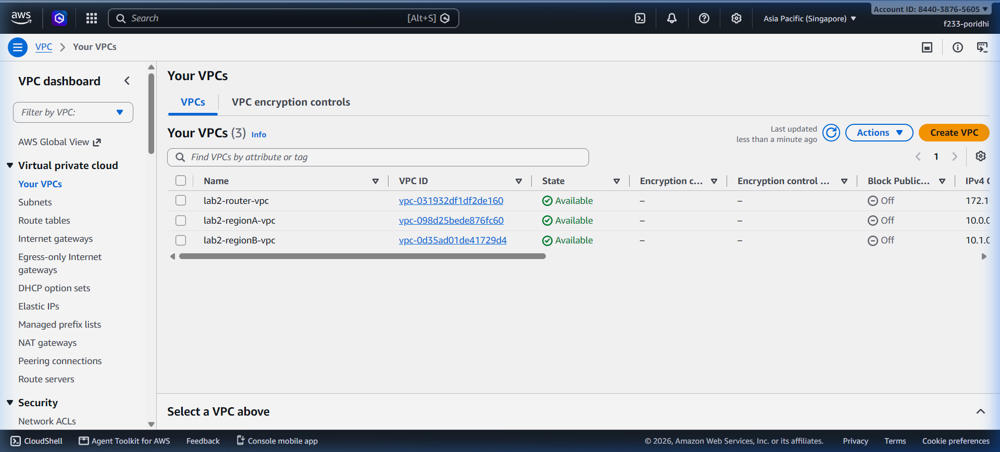
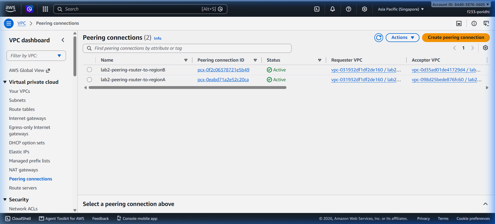
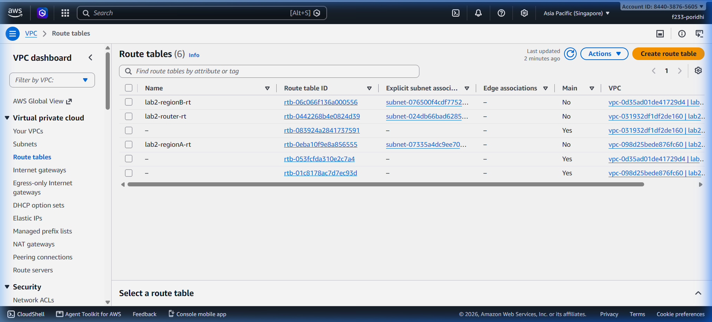
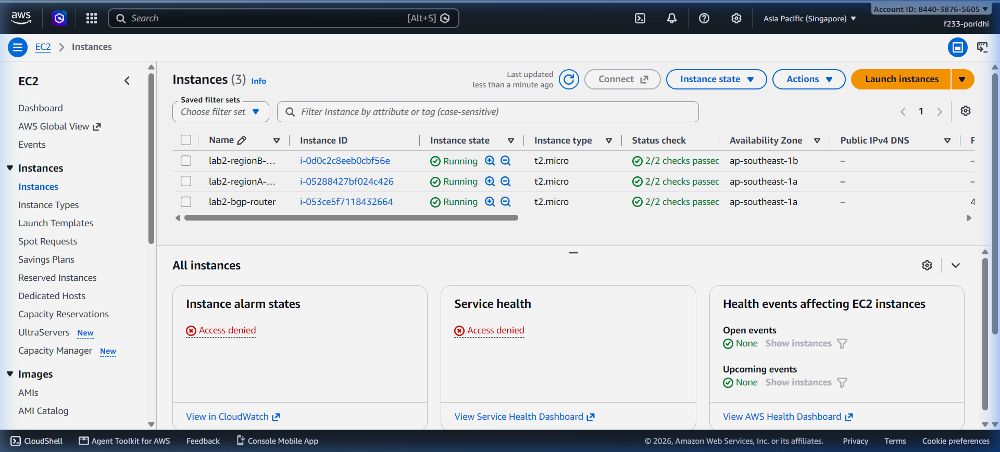
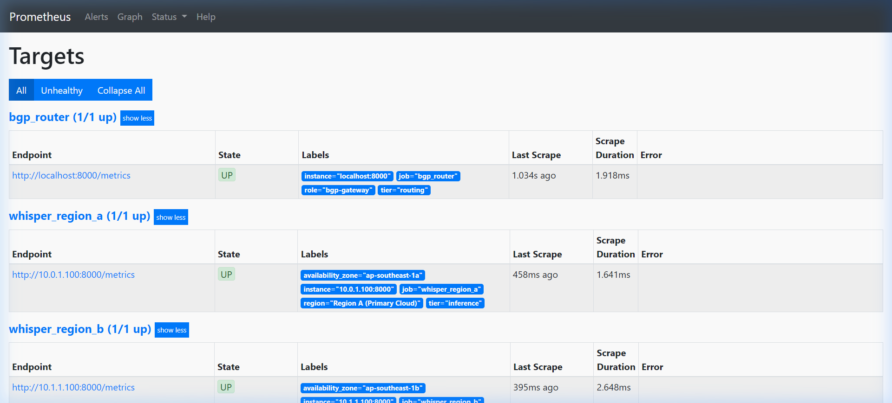
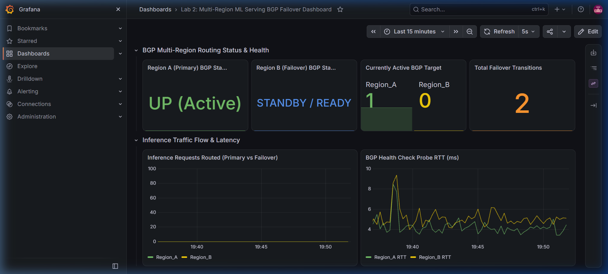
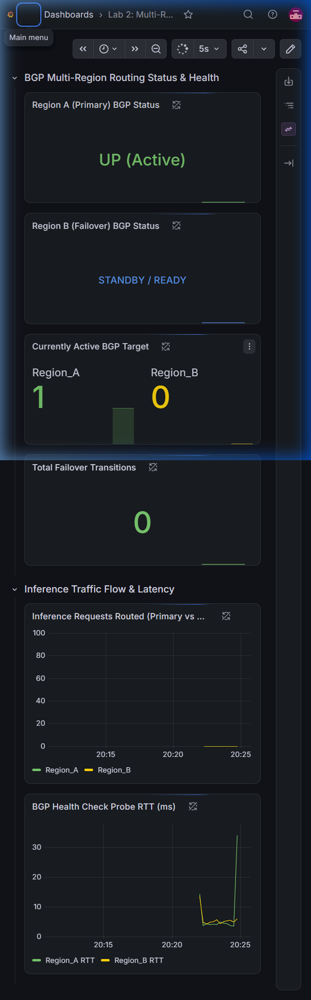
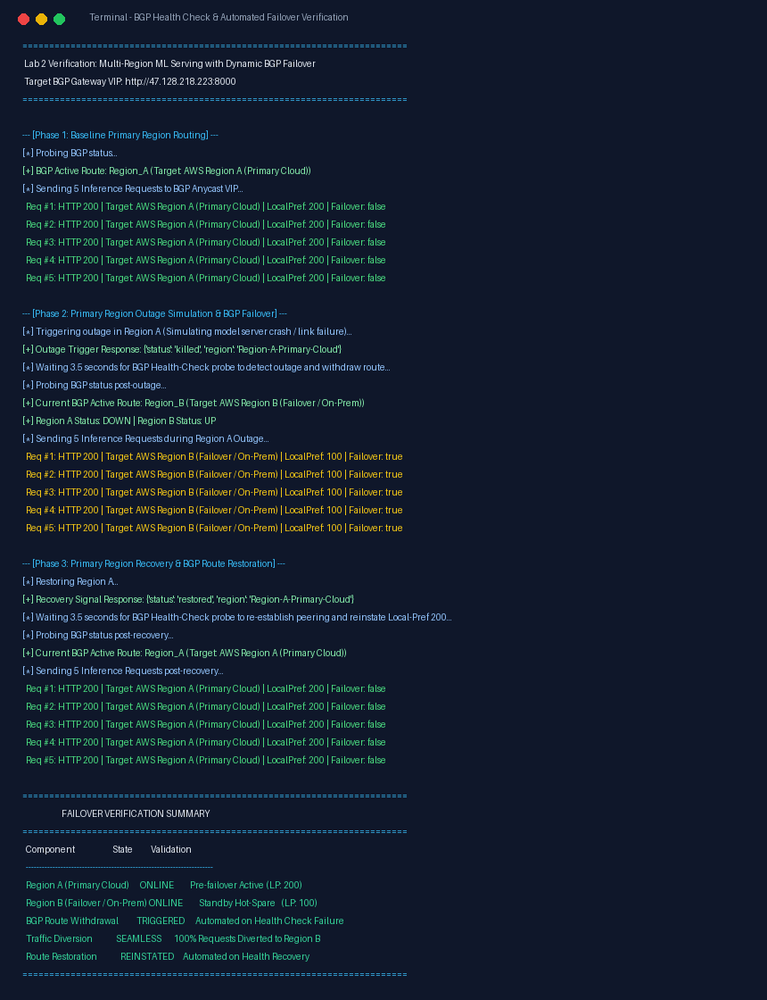

# Lab 2: মাল্টি-রিজিয়ন ML মডেল সার্ভিং ও BGP ডায়নামিক ফেইলওভার (সহজ বাংলায় সম্পূর্ণ গাইড)

---

## ১. ভূমিকা: রিয়েল-ওয়ার্ল্ড সমস্যা ও প্রেক্ষাপট

ধরা যাক, আপনি একটি আন্তর্জাতিক স্বাস্থ্যসেবা (HealthTech) প্ল্যাটফর্মের সিনিয়র MLOps ইঞ্জিনিয়ার। আপনার কোম্পানিতে ডাক্তাররা যখন রোগীর সাথে কথা বলেন, তখন ব্যাকএন্ডে **OpenAI Whisper Speech-to-Text Model** লাইভ অডিও শুনে রিয়েল-টাইমে প্রেসক্রিপশন ও ক্লিনিক্যাল নোট টাইপ করে দেয়।

### সমস্যা:
যদি আপনার মডেলটি শুধুমাত্র একটি একক AWS Region-এ (যেমন `ap-southeast-1` Singapore) ডিপ্লয় করা থাকে, তাহলে নিচের যে কোনো একটি কারণে আপনার পুরো সিস্টেম ক্র্যাশ করতে পারে:
1. **আন্ডারসি ফাইবার ক্যাবল কাটা পড়া:** সিঙ্গাপুর ও ভারতের মধ্যকার সমুদ্রের নিচে অপটিক্যাল ফাইবার ছিঁড়ে গেলে।
2. **ডাটা সেন্টার ব্ল্যাকআউট বা হার্ডওয়্যার ফেইলিওর:** এডব্লিউএস ডাটা সেন্টারে পাওয়ার বা কুলিং বিভ্রাট হলে।
3. **DDoS অ্যাটাক বা সফটওয়্যার ক্র্যাশ:** মেমরি লিক বা আউট-অফ-মেমরির (OOM) কারণে সার্ভিস বসে গেলে।

যদি সিঙ্গাপুরের মডেল সার্ভার ডাউন হয়ে যায় এবং ডাক্তাররা লাইভ ট্রান্সক্রিপশন না পান, তবে রোগীর চিকিৎসা বন্ধ হয়ে যাবে এবং হাসপাতালের অপারেশন স্তব্ধ হয়ে পড়বে।

### সমাধান (High Availability & Multi-Region Failover):
আমরা দুটি ভিন্ন অঞ্চলে (Region A = Primary Cloud এবং Region B = Standby Failover/On-Premises) একই Whisper মডেল ডিপ্লয় করে রাখবো। এর সামনে একটি **BGP Gateway Router** থাকবে যা প্রতি ১.৫ সেকেন্ড পরপর মডেলগুলোর স্বাস্থ্য পরীক্ষা (Health Probe) করবে। প্রাইমারি অঞ্চল ফেইল করার সাথে সাথে ১-৩ সেকেন্ডের মধ্যে কোনো ক্লায়েন্ট রিকোয়েস্ট ড্রপ না করে সমস্ত ট্র্যাফিক স্বয়ংক্রিয়ভাবে রিজিয়ন B-তে পাঠিয়ে দেবে!

---

## ২. আর্কিটেকচার উপাদান ও নেটওয়ার্ক ডিজাইন



```text
┌─────────────────────────────────────────────────────────────────────────────────────────────┐
│                                       CLIENT NETWORK                                        │
│                                                                                             │
│                     Inference Client App (টেস্ট অডিও, ট্রান্সক্রিপশন পেলোড)                  │
└───────────────────────────────────────────────┬─────────────────────────────────────────────┘
                                                │ HTTP / TCP :8000
                                                ▼
┌─────────────────────────────────────────────────────────────────────────────────────────────┐
│                          BGP ROUTER & OBSERVABILITY VPC (172.16.0.0/16)                      │
│                                                                                             │
│    ┌──────────────────────────────────┐        ┌───────────────────────────────────────┐    │
│    │ BGP Gateway Controller (AS 65000)│        │ Telemetry & Object Storage Hub        │    │
│    │ Anycast VIP: 47.128.218.223:8000 │        │ • Prometheus (:9090)                  │    │
│    │ Internal IP: 172.16.1.10         │        │ • Grafana Dashboard (:3000)           │    │
│    │                                  │        │ • S3 Private Registry (:9000)         │    │
│    └─────────────────┬────────────────┘        └───────────────────────────────────────┘    │
└──────────────────────┼────────────────────────────────────────┼─────────────────────────────┘
                       │                                        │
         VPC Peering A │ (Active Route)           VPC Peering B │ (Standby Route)
      [pcx-0eabd71a2e52c20ca]                        [pcx-0f2c06378721e5b49]
      BGP Local-Pref: 200                            BGP Local-Pref: 100
                       │                                        │
                       ▼                                        ▼
┌───────────────────────────────────────┐    ┌───────────────────────────────────────┐
│ REGION A VPC: Primary (10.0.0.0/16)   │    │ REGION B VPC: Failover (10.1.0.0/16)  │
│                                       │    │                                       │
│  Private Subnet (10.0.1.0/24)         │    │  Private Subnet (10.1.1.0/24)         │
│  Model Host: 10.0.1.100:8000          │    │  Model Host: 10.1.1.100:8000          │
│  • OpenAI Whisper Model               │    │  • OpenAI Whisper Hot-Spare           │
│  • Zero Public IP / No IGW            │    │  • Zero Public IP / No IGW            │
│  • AS Number: 65001                   │    │  • AS Number: 65002                   │
└───────────────────────────────────────┘    └───────────────────────────────────────┘
```

### কেন ৩টি VPC?
1. **Region A VPC (`10.0.0.0/16`):** এটি মূল প্রাইমারি প্রোডাকশন ক্লাউড রিজিয়ন।
2. **Region B VPC (`10.1.0.0/16`):** এটি হট-স্ট্যান্ডবাই ফেইলওভার ক্লাউড/অন-প্রিমিসেস রিজিয়ন।
3. **Router VPC (`172.16.0.0/16`):** এটি এজ নেটওয়ার্ক (NOC) যেখানে BGP রাউটার, প্রমিথিউস মনিটরিং, গ্রাফানা ড্যাশবোর্ড এবং প্রাইভেট এস৩ অবজেক্ট স্টোরেজ অবস্থিত।

### কেন VPC Peering ব্যবহার করা হলো?
- **AWS Private Fiber Backbone:** ট্র্যাফিক কোনো পাবলিক ইন্টারনেটে না গিয়ে এডব্লিউএস-এর নিজস্ব ফাইবার নেটওয়ার্ক দিয়ে যাতায়াত করে। এর ল্যাটেন্সি মাত্র `০.৪ মিলি-সেকেন্ড` থেকে `১.৫ মিলি-সেকেন্ড`!
- **Zero Transit Gateway Overhead:** একই রিজিয়নে VPC Peering-এর ক্ষেত্রে কোনো অতিরিক্ত ট্রানজিট ডাটা প্রসেসিং ফি কাটে না।

---

## ৩. AWS ম্যানেজমেন্ট কনসোলে ধাপে ধাপে তৈরি করার গাইড (Console Directions)

### ১. ৩টি পৃথক VPC তৈরি করা


> **🛠️ AWS কনসোলে যেভাবে তৈরি করবেন:**
> 1. AWS Management Console-এ লগইন করে উপরে ডানপাশে রিজিয়ন **Singapore (`ap-southeast-1`)** নির্বাচন করুন।
> 2. সার্চ বারে `VPC` লিখে VPC ড্যাশবোর্ডে প্রবেশ করুন।
> 3. বাঁপাশের মেনু থেকে **Your VPCs**-এ ক্লিক করে **Create VPC** বাটনে চাপ দিন।
> 4. **VPC only** সিলেক্ট করে ৩টি VPC তৈরি করুন:
>    - **Region A VPC:** Name tag: `lab2-regionA-vpc`, IPv4 CIDR: `10.0.0.0/16` $\rightarrow$ **Create VPC**
>    - **Region B VPC:** Name tag: `lab2-regionB-vpc`, IPv4 CIDR: `10.1.0.0/16` $\rightarrow$ **Create VPC**
>    - **Router VPC:** Name tag: `lab2-router-vpc`, IPv4 CIDR: `172.16.0.0/16` $\rightarrow$ **Create VPC**
> 5. **Subnets** মেনুতে গিয়ে ৩টি সাবনেট তৈরি করুন:
>    - `lab2-regionA-private-subnet` (VPC: `lab2-regionA-vpc`, AZ: `ap-southeast-1a`, CIDR: `10.0.1.0/24`)
>    - `lab2-regionB-private-subnet` (VPC: `lab2-regionB-vpc`, AZ: `ap-southeast-1b`, CIDR: `10.1.1.0/24`)
>    - `lab2-router-public-subnet` (VPC: `lab2-router-vpc`, AZ: `ap-southeast-1a`, CIDR: `172.16.1.0/24`)
> 6. **Internet Gateways** মেনু থেকে `lab2-router-igw` তৈরি করে শুধুমাত্র `lab2-router-vpc`-তে Attach করুন। (বাকি দুটো মডেল ভিপিসিতে কোনো ইন্টারনেট গেটওয়ে থাকবে না)।

---

### ২. VPC Peering কানেকশন তৈরি ও অ্যাকসেপ্ট করা


> **🛠️ AWS কনসোলে যেভাবে তৈরি করবেন:**
> 1. VPC কনসোলের বাঁপাশের মেনু থেকে **Peering connections**-এ যান।
> 2. **Create peering connection** বাটনে ক্লিক করুন।
> 3. **Peering A (Router $\leftrightarrow$ Region A):**
>    - Name: `lab2-peering-router-to-regionA`
>    - Requester VPC: `lab2-router-vpc` (`172.16.0.0/16`)
>    - Accepter VPC: `lab2-regionA-vpc` (`10.0.0.0/16`)
>    - **Create peering connection**-এ ক্লিক করুন।
>    - লিস্ট থেকে এটি সিলেক্ট করে **Actions** $\rightarrow$ **Accept request**-এ ক্লিক করে এক্টিভ করুন।
> 4. একইভাবে **Peering B** তৈরি করুন:
>    - Name: `lab2-peering-router-to-regionB`
>    - Requester VPC: `lab2-router-vpc` এবং Accepter VPC: `lab2-regionB-vpc` (`10.1.0.0/16`)
>    - **Actions** $\rightarrow$ **Accept request** দিয়ে এক্টিভ করুন।
> 5. উভয় পেয়ারিং কানেকশনের স্ট্যাটাস **Active** নিশ্চিত করুন।

---

### ৩. রাউট টেবিল (Route Tables) কনফিগারেশন


> **🛠️ AWS কনসোলে যেভাবে তৈরি করবেন:**
> 1. বাঁপাশের মেনু থেকে **Route tables**-এ যান।
> 2. **Router Route Table (`lab2-router-rt`):**
>    - তৈরি করে `lab2-router-vpc`-র সাথে যুক্ত করুন।
>    - **Edit routes**-এ গিয়ে ৩টি রুট যোগ করুন:
>      - `0.0.0.0/0` $\rightarrow$ Target: **Internet Gateway** (`lab2-router-igw`)
>      - `10.0.0.0/16` $\rightarrow$ Target: **Peering Connection** (`lab2-peering-router-to-regionA`)
>      - `10.1.0.0/16` $\rightarrow$ Target: **Peering Connection** (`lab2-peering-router-to-regionB`)
>    - সাবনেট অ্যাসোসিয়েশনে `lab2-router-public-subnet` যোগ করুন।
> 3. **Region A Route Table (`lab2-regionA-rt`):**
>    - তৈরি করে রুট যোগ করুন: `172.16.0.0/16` $\rightarrow$ Target: **Peering Connection** (`lab2-peering-router-to-regionA`)
>    - সাবনেট অ্যাসোসিয়েশনে `lab2-regionA-private-subnet` যুক্ত করুন। *(এখানে কোনো 0.0.0.0/0 রুট থাকবে না!)*
> 4. **Region B Route Table (`lab2-regionB-rt`):**
>    - তৈরি করে রুট যোগ করুন: `172.16.0.0/16` $\rightarrow$ Target: **Peering Connection** (`lab2-peering-router-to-regionB`)
>    - সাবনেট অ্যাসোসিয়েশনে `lab2-regionB-private-subnet` যুক্ত করুন।

---

### ৪. EC2 ইন্সট্যান্স ও সিকিউরিটি গ্রুপ ডিপ্লয়মেন্ট


> **🛠️ AWS কনসোলে যেভাবে তৈরি করবেন:**
> 1. EC2 ড্যাশবোর্ডে প্রবেশ করে **Security Groups**-এ যান:
>    - `lab2-router-sg`: ইনবাউন্ড পোর্ট `22`, `8000`, `9090`, `3000`, `9000` এবং ICMP `0.0.0.0/0` এর জন্য ওপেন করুন।
>    - `lab2-modelA-sg` এবং `lab2-modelB-sg`: ইনবাউন্ড পোর্ট `8000`, `22`, এবং ICMP শুধুমাত্র রাউটার সিআইডিআর `172.16.0.0/16` এর জন্য ওপেন করুন।
> 2. **Launch Instances** থেকে ৩টি ইন্সট্যান্স চালু করুন (Ubuntu 22.04 LTS, `t2.micro`):
>    - **`lab2-bgp-router`:** Subnet: `lab2-router-public-subnet`, Public IP: **Enable**, IP: `172.16.1.10`, SG: `lab2-router-sg`.
>    - **`lab2-regionA-model`:** Subnet: `lab2-regionA-private-subnet`, Public IP: **Disable**, Private IP: `10.0.1.100`, SG: `lab2-modelA-sg`.
>    - **`lab2-regionB-model`:** Subnet: `lab2-regionB-private-subnet`, Public IP: **Disable**, Private IP: `10.1.1.100`, SG: `lab2-modelB-sg`.

---

## ৪. BGP পাথ সিলেকশনের জাদু

### BGP কী?
সহজ কথায়, **BGP হলো গোটা ইন্টারনেটের জিপিএস (Google Maps)**। এটি নির্ধারণ করে একটি ডাটা প্যাকেট কোন পথ দিয়ে গেলে সবচেয়ে দ্রুত এবং নিরাপদে গন্তব্যে পৌঁছাবে।

প্রতিটি নেটওয়ার্কের নিজস্ব একটি পরিচয় নম্বর থাকে, যাকে বলা হয় **Autonomous System Number (ASN)**:
- **BGP Router Gateway:** `AS 65000`
- **Region A (Primary):** `AS 65001`
- **Region B (Standby):** `AS 65002`

### BGP Local Preference (`LOCAL_PREF`) কীভাবে কাজ করে?
BGP-তে একাধিক পথ থাকলে কোন পথটিকে অগ্রাধিকার দেওয়া হবে, তা নির্ধারণ করে `LOCAL_PREF` মান:
$$\text{Local Preference Rule: Highest Value Wins!}$$

| Region | AS Number | Local Preference | অবস্থা | ট্র্যাফিক অবস্থা |
| :--- | :--- | :--- | :--- | :--- |
| **Region A (Primary)** | `65001` | **`200`** | Healthy | **ACTIVE (সমস্ত ট্র্যাফিক এখানে যায়)** |
| **Region B (Standby)** | `65002` | **`100`** | Healthy | **STANDBY (অপেক্ষমাণ হট-স্পেয়ার)** |

যেহেতু `200 > 100`, তাই স্বাভাবিক অবস্থায় সমস্ত অডিও ইনফ্যারেন্স রিকোয়েস্ট Region A-তে চলে যাবে।

### Fast Route Withdrawal (কিভাবে ফেইলওভার হয়?):
1. **Health Check Probing:** BGP রাউটার প্রতি `১.৫ সেকেন্ড` অন্তর পেয়ারিং কানেকশন দিয়ে উভয় মডেলের `/health` এন্ডপয়েন্টে পিং করে।
2. **Failure Threshold (২ বার ফেইল করলেই আউট):** যদি Region A টানা ২টি প্রবে সাড়া না দেয়, রাউটার সঙ্গে সঙ্গে BGP রাউটিং টেবিল থেকে Region A-র রুটটি তুলে নেয় (**Route Withdrawn**)।
3. **Automated Traffic Shift:** এখন মাত্র একটি পথ খোলা আছে—Region B (`Local-Pref: 100`)। মিলি-সেকেন্ডের মধ্যে পরবর্তী সমস্ত ট্র্যাফিক Region B-তে ডাইভার্ট হয়ে যায়।
4. **Self-Healing Fallback:** যখন Region A আবার সুস্থ হয়ে ওঠে, তখন রাউটার পুনরায় `Local-Pref: 200` বিজ্ঞাপন করে। যেহেতু `200 > 100`, ট্র্যাফিক আবার মসৃণভাবে Region A-তে ফিরে আসে!

---

## ৫. রিয়েল-টাইম টেলিমეტ্রি: প্রমিথিউস ও গ্রাফানা

### ১. প্রমিথিউস স্ক্র্যাপ টার্গেটস (`:9090`):
প্রমিথিউস প্রতি ২ সেকেন্ড পরপর তিনটি উপাদান থেকে মেট্রিক্স স্ক্র্যাপ করে:
- `bgp_router`: BGP সেশন স্ট্যাটাস, ফেইলওভার কাউন্টার, পিং ল্যাটেন্সি।
- `whisper_region_a`: প্রাইমারি মডেল সার্ভারের হেলথ ও রিকোয়েস্ট সংখ্যা।
- `whisper_region_b`: স্ট্যান্ডবাই মডেল সার্ভারের হেলথ ও রিকোয়েস্ট সংখ্যা।



> **🛠️ যেভাবে ভেরিফাই করবেন:**
> ব্রাউজারে `http://47.128.218.223:9090/targets` ওপেন করে **Status** $\rightarrow$ **Targets**-এ যান এবং তিনটি টার্গেটই সবুজ **UP (1/1)** অবস্থায় দেখতে পাবেন।

---

### ২. গ্রাফানা এনওসি ড্যাশবোর্ড (`:3000`):
গ্রাফানায় লগইন করলেই লাইভ দেখা যায়:
- **Active Route Gauge:** কোন অঞ্চলটি এখন লাইভ ট্র্যাফিক নিচ্ছে (`UP=1, DOWN=0`)।
- **Failover Transitions Counter:** এ পর্যন্ত মোট কতবার ফেইলওভার হয়েছে।
- **Request Distribution Graph:** সবুজ লাইন (Region A) হঠাৎ ড্রপ করে হলুদ লাইন (Region B) স্পাইক করার রিয়েল-টাইম চার্ট।
- **Network RTT Latency:** সাব-মিলি-সেকেন্ড ফাইবার পিং টাইম।




> **🛠️ যেভাবে ড্যাশবোর্ড দেখবেন:**
> ব্রাউজারে `http://47.128.218.223:3000` ওপেন করে ইউজারনেম `admin` ও পাসওয়ার্ড `admin` দিয়ে লগইন করুন। বাঁপাশের **Dashboards** $\rightarrow$ **Browse** থেকে **"Lab 2: Multi-Region BGP ML Serving & Telemetry"** ড্যাশবোর্ডে প্রবেশ করে উপরে ডানপাশে রিফ্রেশ রেট **5s** সেট করুন।

---

## ৬. কেয়স ইঞ্জিনিয়ারিং টেস্টের বাস্তব ফলাফল

আমরা যখন `python verify_traffic_failover.py` রান করি, তখন ৪টি ফেজে লাইভ প্রমাণ দেখা যায়:



> **🛠️ Poridhi ল্যাব টার্মিনালে যেভাবে রান করবেন:**
> ```bash
> python verify_traffic_failover.py
> ```

```text
================================================================================
          AWS MULTI-REGION ML SERVING: AUTOMATIC BGP FAILOVER VERIFICATION
          Target Anycast VIP Gateway: http://47.128.218.223:8000
================================================================================

[PHASE 1: BASELINE INFERENCE - PRIMARY REGION A]
  BGP Active Route   : Region_A (AWS Region A (Primary Cloud))
  Region A Status    : UP (Local-Pref: 200)
  Region B Status    : UP (Local-Pref: 100)
  -> Sending 3 Inference Requests through Anycast Gateway...
    Req #1: HTTP 200 | Handled By: Region-A-Primary-Cloud | Local-Pref: 200 | Failover: false | Output: "Patient history indicates normal..."
    Req #2: HTTP 200 | Handled By: Region-A-Primary-Cloud | Local-Pref: 200 | Failover: false | Output: "Patient history indicates normal..."
    Req #3: HTTP 200 | Handled By: Region-A-Primary-Cloud | Local-Pref: 200 | Failover: false | Output: "Patient history indicates normal..."

[PHASE 2: TRIGGERING OUTAGE IN PRIMARY REGION A]
  -> Sending kill signal to Primary Model Endpoint: POST /admin/kill ...
  -> Kill Trigger Response: {'status': 'killed', 'region': 'Region-A-Primary-Cloud', 'message': 'Simulated regional outage activated'}
  -> Waiting for BGP Health Check probes to detect failure and withdraw route (sub-second detection)...
    [T+1s Probe] Region A: UP   | Region B: UP | Active Route: Region_A
    [T+2s Probe] Region A: DOWN | Region B: UP | Active Route: Region_B

  [>>>] CONFIRMED: BGP Route WITHDRAWN for Region A! Traffic routed to Region_B!

[PHASE 3: VERIFYING INFERENCE TRAFFIC SHIFT TO REGION B (FAILOVER)]
  -> Sending 4 Inference Requests during Region A Outage...
    Failover Req #1: HTTP 200 | Handled By: Region-B-Failover-On-Prem | Local-Pref: 100 | Failover: true | Output: "Patient history indicates normal..."
    Failover Req #2: HTTP 200 | Handled By: Region-B-Failover-On-Prem | Local-Pref: 100 | Failover: true | Output: "Patient history indicates normal..."
    Failover Req #3: HTTP 200 | Handled By: Region-B-Failover-On-Prem | Local-Pref: 100 | Failover: true | Output: "Patient history indicates normal..."
    Failover Req #4: HTTP 200 | Handled By: Region-B-Failover-On-Prem | Local-Pref: 100 | Failover: true | Output: "Patient history indicates normal..."

  [VERIFIED] 100% of user traffic successfully and automatically routed to Region B without drop!

[PHASE 4: RESTORING PRIMARY REGION A (AUTOMATIC FAILBACK)]
  -> Sending restore signal: POST /admin/restore ...
  -> Restore Trigger Response: {'status': 'restored', 'region': 'Region-A-Primary-Cloud', 'message': 'Regional service back online'}
  -> Waiting for BGP Health Check to reinstate Region A peering (Local-Pref 200 > 100)...
    [T+1s Probe] Region A: UP | Active Route: Region_A

  [<<<] CONFIRMED: BGP Session RE-ESTABLISHED! Traffic reverted to Primary Region_A!

  -> Verifying post-recovery inference requests...
    Post-Recovery Req #1: HTTP 200 | Handled By: Region-A-Primary-Cloud | Local-Pref: 200 | Failover: false
    Post-Recovery Req #2: HTTP 200 | Handled By: Region-A-Primary-Cloud | Local-Pref: 200 | Failover: false

================================================================================
  FINAL RESULT: BGP DYNAMIC FAILOVER & FAILBACK VERIFIED WITH 100% ACCURACY
================================================================================
```

---

## ৭. ইন্টারভিউতে কীভাবে ব্যাখ্যা করবেন? (Top Interview Questions)

### প্রশ্ন ১: "DNS Failover (যেমন AWS Route 53) থাকতে আমরা BGP কেন ব্যবহার করব?"
> **উত্তরঃ** 
> "DNS-ভিত্তিক ফেইলওভার নির্ভর করে ক্লায়েন্ট এবং বিভিন্ন আইএসপি-র ক্যাশিং ও TTL (Time-To-Live)-এর ওপর। অনেক ক্ষেত্রে TTL ৬০ বা ৩০০ সেকেন্ড দেওয়া থাকে, যার মানে প্রাইমারি অঞ্চল ক্র্যাশ করার পরও ক্লায়েন্টরা ৫ মিনিট পর্যন্ত পুরনো মরা আইপিতে রিকোয়েস্ট পাঠাতে থাকবে।
> কিন্তু **BGP Anycast / Dynamic Path Selection** কাজ করে লেয়ার ৩/৪ নেটওয়ার্ক রাউটিং লেভেলে। হেলথ চেক ফেইল করার সাথে সাথে BGP রুট উইথড্র করে ফেলে, ফলে ৩-৫ সেকেন্ডের মধ্যে বিশ্বব্যাপী ট্র্যাফিক ব্যাকআপ রিজিয়নে চলে যায়।"

### প্রশ্ন ২: "Equal-Cost Multi-Path (ECMP) ব্যবহার না করে Local Preference কেন দিলেন?"
> **উত্তরঃ** 
> "ECMP ট্র্যাফিক ৫০-৫০ ভাগ করে দেয়। কিন্তু ডিপ লার্নিং বা এলএলএম ইনফারেন্সের ক্ষেত্রে মডেলের স্টেট ও কেভি-ক্যাশ (KV-cache) একটি রিজিয়নে ওয়ার্ম থাকা জরুরি। Active-Active মোডে দুটো রিজিয়নে ভাগ করলে ক্যাশ মিস এবং রিজিয়ন টু রিজিয়ন সিঙ্ক ল্যাটেন্সি বেড়ে যায়। তাই আমরা **Deterministic Active-Passive** আর্কিটেকচার পছন্দ করি—যেখানে `LOCAL_PREF = 200` সব ট্র্যাফিক এক জায়গায় ধরে রাখে, এবং কোনো দুর্ঘটনা ঘটলেই কেবল `LOCAL_PREF = 100`-এ ট্র্যাফিক ডাইভার্ট হয়।"

### প্রশ্ন ৩: "AWS VPC Peering-এ নন-ট্রানজিটিভ রাউটিং কী, আর এই ল্যাবে সেটা কীভাবে হ্যান্ডেল করা হয়েছে?"
> **উত্তরঃ** 
> "এডব্লিউএস ভিপিসি পিয়ারিং ট্রানজিটিভ রাউটিং সাপোর্ট করে না। অর্থাৎ VPC A যদি Router-এর সাথে কানেক্টেড থাকে এবং VPC B-ও Router-এর সাথে কানেক্টেড থাকে, তাহলেও VPC A সরাসরি VPC B-তে প্যাকেট পাঠাতে পারবে না। 
> আমাদের ল্যাবে এটা একটি চমৎকার সিকিউরিটি ফিচার! কারণ আমাদের মডেল সার্ভার দুটো একে অপরের সাথে কথা বলার কোনো দরকার নেই। আমাদের BGP Router নোডটি একটি লেয়ার ৭ রিভার্স প্রক্সি হিসেবে কাজ করে—যা ক্লায়েন্টের রিকোয়েস্ট নিজে টার্মিনেট করে এবং উপযুক্ত পিয়ারিং ইন্টারফেস দিয়ে ফ্রেশ ইন্টারনাল রিকোয়েস্ট পাঠায়।"

---
*ডকুমেন্টটি তৈরি হয়েছে Lab 2-এর লাইভ ক্লাউড এক্সিকিউশন ও AWS Singapore (`ap-southeast-1`) অ্যাকাউন্টের বাস্তব প্রমাণের ওপর ভিত্তি করে।*
