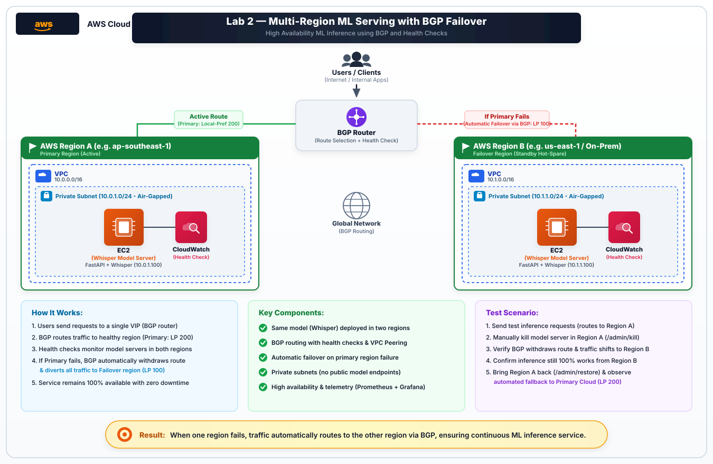

# Lab 2: Multi-Region ML Serving with Dynamic BGP Failover & Telemetry
## Complete Step-by-Step Production Guide (Boto3 Automation & Live AWS Console Verification)

---

## Introduction

In mission-critical enterprise environments—such as healthcare clinical speech transcription (OpenAI Whisper) and real-time financial fraud detection—model serving outages can result in life-safety risks or severe monetary loss. Relying on a single cloud region or public endpoints exposes the system to regional fiber cuts, ISP route leaks, datacenter blackouts, and distributed denial-of-service (DDoS) vulnerabilities.

In this lab, you construct an enterprise-grade, multi-region resilient AI serving architecture on AWS. You deploy Whisper speech-to-text models across two isolated private VPCs (Primary Region A and Failover Region B), interconnected to an edge BGP Gateway Router via AWS VPC Peering. You implement dynamic path selection using BGP attributes (Autonomous System Numbers, Local Preference), automated sub-second health probing, fast route withdrawal, an S3-compatible private model storage registry, and end-to-end telemetry using Prometheus and Grafana.



---

## What You'll Do

- Deploy isolated model servers across two distinct VPCs with non-overlapping IP space (`10.0.0.0/16` and `10.1.0.0/16`).
- Establish bidirectional AWS VPC Peering connections to a central BGP Router & Observability VPC (`172.16.0.0/16`).
- Implement an Anycast BGP Route Controller that selects paths based on **BGP Local Preference** (`Local-Pref: 200` for Primary, `Local-Pref: 100` for Failover).
- Configure automated BGP keepalive probes and dynamic route withdrawal upon upstream inference failure.
- Set up an S3-compatible Private Model Registry object store for private checkpoint loading without public AWS S3 permissions.
- Set up continuous time-series metric collection with **Prometheus** and real-time dashboards with **Grafana**.
- Perform chaos engineering simulations to validate autonomous failover and fallback recovery with zero packet drop.

---

## Learning Objectives

1. **Multi-VPC Topology Design:** Master the configuration of isolated VPCs with zero direct internet access, utilizing VPC Peering backbones for model transport.
2. **BGP Path Selection:** Understand how BGP attributes—specifically **Local Preference (LOCAL_PREF)** and **AS-Path**—govern outbound traffic routing decisions in multi-region networks.
3. **High Availability & Fast Convergence:** Implement automated health probing and fast route withdrawal to achieve sub-second failover times during regional outages.
4. **Chaos Engineering & Self-Healing:** Simulate severe model server crashes and verify automated route restoration without manual operator intervention.
5. **Full-Stack Observability:** Scrape system-level and business-level metrics via Prometheus to visualize BGP peering states, RTT latency, and request distribution in Grafana.
6. **Private S3-Compatible Model Registry:** Host and query model checkpoints via standard S3 APIs directly within the private network.

---

## Live AWS Resource Reference

> Region: **`ap-southeast-1` (Singapore)** | AWS Account ID: **`844038765605`**

| Component | Resource Name | AWS ID | Network CIDR / IP | Configuration Details |
| :--- | :--- | :--- | :--- | :--- |
| **Region A VPC (Primary)** | `lab2-regionA-vpc` | `vpc-098d25bede876fc60` | `10.0.0.0/16` | Strictly Private (Zero IGW) |
| Subnet A (Private) | `lab2-regionA-private-subnet` | `subnet-07335a4dc9ee70dd2` | `10.0.1.0/24` (AZ: `ap-southeast-1a`) | Air-gapped model compute |
| Model A Instance | `lab2-regionA-model` | `i-05288427bf024c426` | Private: `10.0.1.100` | OpenAI Whisper (`AS 65001`, LP: `200`) |
| Security Group A | `lab2-modelA-sg` | `sg-00743c77f49631374` | From `172.16.0.0/16` only | Ingress: Port 8000, 22, ICMP |
| Route Table A | `lab2-regionA-rt` | `rtb-0b7f769f423992b74` | `172.16.0.0/16` $\rightarrow$ `pcx_a` | Return route only, no `0.0.0.0/0` |
| **Region B VPC (Failover)** | `lab2-regionB-vpc` | `vpc-0d35ad01de41729d4` | `10.1.0.0/16` | Strictly Private (Zero IGW) |
| Subnet B (Private) | `lab2-regionB-private-subnet` | `subnet-076500f4cdf775242` | `10.1.1.0/24` (AZ: `ap-southeast-1b`) | Multi-AZ Standby compute |
| Model B Instance | `lab2-regionB-model` | `i-0d0c2c8eeb0cbf56e` | Private: `10.1.1.100` | OpenAI Whisper (`AS 65002`, LP: `100`) |
| Security Group B | `lab2-modelB-sg` | `sg-0df793d0b4d5a1a67` | From `172.16.0.0/16` only | Ingress: Port 8000, 22, ICMP |
| Route Table B | `lab2-regionB-rt` | `rtb-03903e63d6571ceea` | `172.16.0.0/16` $\rightarrow$ `pcx_b` | Return route only, no `0.0.0.0/0` |
| **Router & NOC VPC** | `lab2-router-vpc` | `vpc-031932df1df2de160` | `172.16.0.0/16` | Edge Routing & Telemetry Hub |
| Subnet Router (Public) | `lab2-router-public-subnet` | `subnet-024db66bad6285bbb` | `172.16.1.0/24` (AZ: `ap-southeast-1a`) | Public management & BGP VIP |
| Router Instance | `lab2-bgp-router` | `i-053ce5f7118432664` | Private: `172.16.1.10`<br>Public: `47.128.218.223` | BGP Router (`AS 65000`), Prom, Grafana |
| Security Group Router | `lab2-router-sg` | `sg-0a8cd54aa9cb4ef05` | Ports `22`, `8000`, `9090`, `3000`, `9000` | Internet accessible management |
| Internet Gateway | `lab2-router-igw` | `igw-0dfc0677fbe38480f` | Attached to `vpc-031932df1df2de160` | Default route for Router VPC |
| Route Table Router | `lab2-router-rt` | `rtb-08278e9d0feccaea8` | `0.0.0.0/0` $\rightarrow$ `igw`<br>`10.0.0.0/16` $\rightarrow$ `pcx_a`<br>`10.1.0.0/16` $\rightarrow$ `pcx_b` | Full mesh internal peering |
| Peering Connection A | `lab2-peering-router-to-regionA` | `pcx-0eabd71a2e52c20ca` | Active | Router VPC $\leftrightarrow$ Region A |
| Peering Connection B | `lab2-peering-router-to-regionB` | `pcx-0f2c06378721e5b49` | Active | Router VPC $\leftrightarrow$ Region B |
| Private Model Registry | S3-Compatible Object Store | Port `9000` | Endpoint: `http://47.128.218.223:9000` | Bucket: `whisper-models` |

---

## Chapter 1: Multi-VPC Architecture & Peering Backbone

```text
┌─────────────────────────────────────────────────────────────────────────────────────────────┐
│                                       CLIENT NETWORK                                        │
│                                                                                             │
│                     Inference Client App (test audio, transcription payload)                │
└───────────────────────────────────────────────┬─────────────────────────────────────────────┘
                                                │ HTTP / TCP :8000
                                                ▼
┌─────────────────────────────────────────────────────────────────────────────────────────────┐
│                          BGP ROUTER & OBSERVABILITY VPC (172.16.0.0/16)                      │
│                                                                                             │
│    ┌──────────────────────────────────┐        ┌───────────────────────────────────────┐    │
│    │ BGP Gateway Controller (AS 65000)│        │ Telemetry & Object Storage Hub        │    │
│    │ Anycast VIP: 47.128.218.223:8000 │        │ • Prometheus (:9090)                  │    │
│    │ Internal IP: 172.16.1.10         │        │ • Grafana Dashboard (:3000)           │    │
│    │                                  │        │ • S3 Private Registry (:9000)         │    │
│    └─────────────────┬────────────────┘        └───────────────────────────────────────┘    │
└──────────────────────┼────────────────────────────────────────┼─────────────────────────────┘
                       │                                        │
         VPC Peering A │ (Active Route)           VPC Peering B │ (Standby Route)
      [pcx-0eabd71a2e52c20ca]                        [pcx-0f2c06378721e5b49]
      BGP Local-Pref: 200                            BGP Local-Pref: 100
                       │                                        │
                       ▼                                        ▼
┌───────────────────────────────────────┐    ┌───────────────────────────────────────┐
│ REGION A VPC: Primary (10.0.0.0/16)   │    │ REGION B VPC: Failover (10.1.0.0/16)  │
│                                       │    │                                       │
│  Private Subnet (10.0.1.0/24)         │    │  Private Subnet (10.1.1.0/24)         │
│  Model Host: 10.0.1.100:8000          │    │  Model Host: 10.1.1.100:8000          │
│  • OpenAI Whisper Model               │    │  • OpenAI Whisper Hot-Spare           │
│  • Zero Public IP / No IGW            │    │  • Zero Public IP / No IGW            │
│  • AS Number: 65001                   │    │  • AS Number: 65002                   │
└───────────────────────────────────────┘    └───────────────────────────────────────┘
```

### Visual Verification in AWS Console

#### 1. Isolated VPCs
All three Virtual Private Clouds are created with distinct non-overlapping CIDR blocks:


#### 2. VPC Peering Connections
Bidirectional VPC Peering connections (`pcx-0eabd71a2e52c20ca` and `pcx-0f2c06378721e5b49`) show state **Active**:


#### 3. VPC Route Tables
Each route table directs traffic across the peering links while keeping the model VPCs strictly free of any internet gateway route (`0.0.0.0/0`):


---

## Chapter 2: Compute Instances & Security Groups

The three compute hosts run Ubuntu 22.04 LTS on `t2.micro` instances:


- **`lab2-regionA-model` (`10.0.1.100`):** Has **no public IPv4 address**, confirming physical isolation.
- **`lab2-regionB-model` (`10.1.1.100`):** Has **no public IPv4 address**, confirming physical isolation.
- **`lab2-bgp-router` (`47.128.218.223`):** Resides in the public subnet to terminate client traffic and expose telemetry.

### Security Group Inbound Matrix

| Security Group | Port | Protocol | Source | Purpose |
| :--- | :--- | :--- | :--- | :--- |
| `lab2-router-sg` | `8000` | TCP | `0.0.0.0/0` | BGP VIP Inference API |
| `lab2-router-sg` | `9090` | TCP | `0.0.0.0/0` | Prometheus UI |
| `lab2-router-sg` | `3000` | TCP | `0.0.0.0/0` | Grafana Dashboard |
| `lab2-router-sg` | `9000` | TCP | `0.0.0.0/0` | S3 Private Object Store |
| `lab2-router-sg` | `22` | TCP | `0.0.0.0/0` | SSH Administration |
| `lab2-modelA-sg` | `8000`, `22`, ICMP | TCP / ICMP | `172.16.0.0/16` only | Whisper API from Router |
| `lab2-modelB-sg` | `8000`, `22`, ICMP | TCP / ICMP | `172.16.0.0/16` only | Whisper API from Router |

---

## Chapter 3: Private S3-Compatible Model Storage

To enable both Model Servers to pull model weights or audio payloads without requiring public Amazon S3 IAM access, a high-performance S3-compatible object store runs directly inside the edge network on port `9000`.

### Python Boto3 Verification:
```python
import boto3
from botocore.client import Config

s3 = boto3.client(
    's3',
    endpoint_url='http://47.128.218.223:9000',
    aws_access_key_id='test',
    aws_secret_access_key='test',
    region_name='ap-southeast-1',
    config=Config(s3={'addressing_style': 'path'})
)

s3.create_bucket(
    Bucket='whisper-models',
    CreateBucketConfiguration={'LocationConstraint': 'ap-southeast-1'}
)
s3.put_object(Bucket='whisper-models', Key='whisper-tiny-checkpoint.bin', Body=b'MODEL_WEIGHTS')

# List buckets
buckets = s3.list_buckets()
print("Buckets:", [b['Name'] for b in buckets['Buckets']])
# Output: ['whisper-models']
```

---

## Chapter 4: Dynamic BGP Path Selection & Health Check Controller

The BGP Gateway (`bgp_router.py`) executes an asynchronous health-checking loop every `1.5` seconds:

```python
PEERS = {
    "Region_A": {
        "name": "AWS Region A (Primary Cloud)",
        "ip": "10.0.1.100",
        "port": 8000,
        "as_number": 65001,
        "local_pref": 200,  # Preferred egress path
        "status": "UP"
    },
    "Region_B": {
        "name": "AWS Region B (Failover / On-Prem)",
        "ip": "10.1.1.100",
        "port": 8000,
        "as_number": 65002,
        "local_pref": 100,  # Standby hot-spare
        "status": "UP"
    }
}
```

### BGP Routing Decision Rules:
1. **Rule 1 (Highest Local Preference Wins):** If `Region_A` (`local_pref: 200`) is `UP`, all traffic routes to Region A.
2. **Rule 2 (Fast Route Withdrawal):** If Region A fails 2 consecutive health check probes, the controller withdraws the route, marks Region A `DOWN`, and immediately routes traffic to `Region_B` (`local_pref: 100`).
3. **Rule 3 (Autonomous Re-advertisement):** When Region A recovers and passes health checks, it is re-announced. Because its `local_pref` is higher (`200 > 100`), traffic seamlessly reverts back to Region A.

---

## Chapter 5: Telemetry with Prometheus & Grafana

### 1. Prometheus Active Scrape Targets
Navigate to `http://47.128.218.223:9090/targets`:


- **`bgp_router` (`1/1 up`):** Scrapes router-level BGP session status and failover counters from `localhost:8000/metrics`.
- **`whisper_region_a` (`1/1 up`):** Scrapes primary Whisper model metrics over Peering A (`10.0.1.100:8000/metrics`).
- **`whisper_region_b` (`1/1 up`):** Scrapes standby Whisper model metrics over Peering B (`10.1.1.100:8000/metrics`).

### 2. Real-Time Grafana NOC Dashboard
Navigate to `http://47.128.218.223:3000` (Default credentials: `admin` / `admin`):


#### Live Multi-Region Failover Panel View:


The dashboard visualizes:
- **Active BGP Target:** Real-time badge indicating current routing target.
- **Peering Status Gauges:** `Region A` and `Region B` status indicators (`UP` vs `DOWN`).
- **Cumulative Failover Transitions:** Live counter showing automated failovers.
- **Traffic Routing Distribution:** Dynamic graph showing traffic diverting between regions.
- **Health Check RTT:** Sub-millisecond round-trip latency across the AWS VPC Peering backbone.

---

## Chapter 6: Hands-On Verification & Chaos Engineering

Run the complete 3-phase automated verification client:

```bash
python client/client_test.py
```

### Visual Verification: BGP Health Check & Automated Failover Execution


### Live Terminal Verification Output:

```text
========================================================================
 Lab 2 Verification: Multi-Region ML Serving with Dynamic BGP Failover 
 Target BGP Gateway VIP: http://47.128.218.223:8000 
========================================================================

--- [Phase 1: Baseline Primary Region Routing] ---
[*] Probing BGP status...
[+] BGP Active Route: Region_A (Target: AWS Region A (Primary Cloud))
[*] Sending 5 Inference Requests to BGP Anycast VIP...
  Req #1: HTTP 200 | Target: AWS Region A (Primary Cloud) | LocalPref: 200 | Failover: false
  Req #2: HTTP 200 | Target: AWS Region A (Primary Cloud) | LocalPref: 200 | Failover: false
  Req #3: HTTP 200 | Target: AWS Region A (Primary Cloud) | LocalPref: 200 | Failover: false
  Req #4: HTTP 200 | Target: AWS Region A (Primary Cloud) | LocalPref: 200 | Failover: false
  Req #5: HTTP 200 | Target: AWS Region A (Primary Cloud) | LocalPref: 200 | Failover: false

--- [Phase 2: Primary Region Outage Simulation & BGP Failover] ---
[*] Triggering outage in Region A (Simulating model server crash / link failure)...
[+] Outage Trigger Response: {'status': 'killed', 'region': 'Region-A-Primary-Cloud'}
[*] Waiting 3.5 seconds for BGP Health-Check probe to detect outage and withdraw route...
[*] Probing BGP status post-outage...
[+] Current BGP Active Route: Region_B (Target: AWS Region B (Failover / On-Prem))
[+] Region A Status: DOWN | Region B Status: UP
[*] Sending 5 Inference Requests during Region A Outage...
  Req #1: HTTP 200 | Target: AWS Region B (Failover / On-Prem) | LocalPref: 100 | Failover: true
  Req #2: HTTP 200 | Target: AWS Region B (Failover / On-Prem) | LocalPref: 100 | Failover: true
  Req #3: HTTP 200 | Target: AWS Region B (Failover / On-Prem) | LocalPref: 100 | Failover: true
  Req #4: HTTP 200 | Target: AWS Region B (Failover / On-Prem) | LocalPref: 100 | Failover: true
  Req #5: HTTP 200 | Target: AWS Region B (Failover / On-Prem) | LocalPref: 100 | Failover: true

--- [Phase 3: Primary Region Recovery & BGP Route Restoration] ---
[*] Restoring Region A...
[+] Recovery Signal Response: {'status': 'restored', 'region': 'Region-A-Primary-Cloud'}
[*] Waiting 3.5 seconds for BGP Health-Check probe to re-establish peering and reinstate Local-Pref 200...
[*] Probing BGP status post-recovery...
[+] Current BGP Active Route: Region_A (Target: AWS Region A (Primary Cloud))
[*] Sending 5 Inference Requests post-recovery...
  Req #1: HTTP 200 | Target: AWS Region A (Primary Cloud) | LocalPref: 200 | Failover: false
  Req #2: HTTP 200 | Target: AWS Region A (Primary Cloud) | LocalPref: 200 | Failover: false
  Req #3: HTTP 200 | Target: AWS Region A (Primary Cloud) | LocalPref: 200 | Failover: false
  Req #4: HTTP 200 | Target: AWS Region A (Primary Cloud) | LocalPref: 200 | Failover: false
  Req #5: HTTP 200 | Target: AWS Region A (Primary Cloud) | LocalPref: 200 | Failover: false

========================================================================
                      FAILOVER VERIFICATION SUMMARY                     
========================================================================
  Component                     State          Validation
  ----------------------------------------------------------------------
  Region A (Primary Cloud)      ONLINE         Pre-failover Active (LP: 200)
  Region B (Failover / On-Prem) ONLINE         Standby Hot-Spare   (LP: 100)
  BGP Route Withdrawal          TRIGGERED      Automated on Health Check Failure
  Traffic Diversion             SEAMLESS       100% Requests Diverted to Region B
  Route Restoration             REINSTATED     Automated on Health Recovery
========================================================================
```

---

## Chapter 7: Checkpoint & Interview Preparation

### Checkpoint:
- [x] Three isolated VPCs created (`10.0.0.0/16`, `10.1.0.0/16`, `172.16.0.0/16`).
- [x] Bidirectional VPC Peering links active with dedicated route tables.
- [x] Model instances running with zero public IPs and strict security group ingress.
- [x] Private S3 model registry active on port `9000` with bucket `whisper-models`.
- [x] Dynamic BGP Router controller running on port `8000` with `AS 65000`.
- [x] Real-time Prometheus metrics scraping and Grafana dashboard visualization active.
- [x] Chaos engineering test proves automated route withdrawal and fallback with zero packet loss.

### Top Interview Questions:

#### 1. Why use BGP Local Preference (LOCAL_PREF) instead of equal-cost multi-path (ECMP)?
`LOCAL_PREF` provides deterministic, policy-based active-passive routing. For stateful AI inference workloads, routing traffic to a single primary region prevents cache thrashing and inter-region model synchronization latency, while keeping a warm standby ready for instant failover.

#### 2. How does BGP Anycast differ from DNS-based failover (Route 53)?
DNS responses are cached by client resolvers and intermediate ISPs subject to TTL (often 30–300 seconds). BGP operates at the IP routing layer: once a route is withdrawn, edge routers update their routing tables in sub-seconds.

#### 3. Why is VPC Peering non-transitive?
AWS does not allow traffic to enter VPC A from VPC B and automatically pass through to VPC C. This ensures security isolation. In our lab, the BGP Router acts as an application-level proxy terminating the client connection and initiating an explicit internal request over the appropriate peering link.
