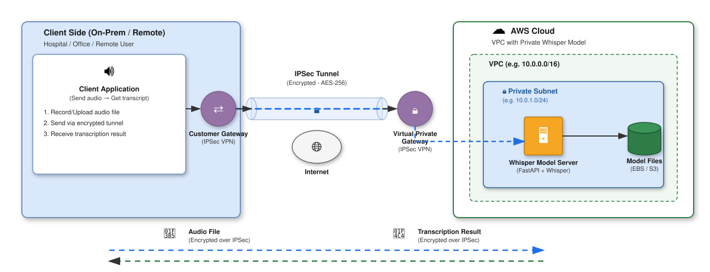

# Lab 3: Secure Voice Model over IPSec Tunnel

Healthcare এবং finance-এ voice data অনেক sensitive। এই lab-এ IPSec tunnel দিয়ে encrypted channel-এ Whisper model-এ audio পাঠাবো।



---

## What You'll Do

- দুই side-এ IPSec tunnel configure করবে
- Private subnet-এ Whisper deploy করবে
- Encrypted channel দিয়ে audio পাঠাবে, transcription পাবে
- `tcpdump` দিয়ে দেখবে traffic encrypted কিনা

---

## Objectives

1. দুটো isolated VPC তৈরি করো — On-Prem (`192.168.0.0/16`) এবং AWS (`10.0.0.0/16`)
2. AWS Customer Gateway ও Virtual Private Gateway configure করো
3. strongSwan দিয়ে IKEv2 tunnel establish করো (AES-256-GCM)
4. Private subnet-এ FastAPI + Whisper deploy করো (no internet access)
5. `tcpdump`-এ ESP Protocol 50 packets দেখে encryption prove করো
6. External access block আছে কিনা negative test দিয়ে validate করো

**Prerequisites:** Basic Linux networking (`ip`, `tcpdump`), CIDR basics, Python HTTP

---

## Resource Reference

> Region: **`ap-southeast-1` (Singapore)**

| Resource | Name | ID / Value |
| :--- | :--- | :--- |
| AWS Cloud VPC | `lab3-aws-vpc` | `vpc-05e9b6390b8b13e40` |
| AWS Private Subnet | `lab3-aws-private-subnet` | `10.0.1.0/24` |
| On-Prem VPC | `lab3-onprem-vpc` | `vpc-001c74c3c1ddef094` |
| On-Prem Subnet | `lab3-onprem-public-subnet` | `192.168.1.0/24` |
| On-Prem Elastic IP | — | `52.76.232.237` |
| Customer Gateway | `lab3-customer-gw` | `cgw-0d378d5048c395b77` |
| Virtual Private Gateway | `lab3-vgw` | `vgw-084ba3a31eefa93ff` |
| Site-to-Site VPN | `lab3-ipsec-vpn` | `vpn-0d48f21852888a6a5` |
| VPN Tunnel 1 Outside IP | — | `13.215.168.39` |
| On-Prem Gateway EC2 | `lab3-onprem-gateway` | `i-0d6c4173028c066c5` · `192.168.1.187` |
| Whisper Model EC2 | `lab3-whisper-model` | `i-09655c4e12373e55b` · `10.0.1.50` (no public IP) |
| On-Prem Security Group | `lab3-onprem-sg` | `sg-0f1231755bd59e6ca` |
| Model Security Group | `lab3-aws-model-sg` | `sg-01144f5cd5b476b92` |

---

## Chapter 1 — Network Setup

দুটো VPC তৈরি করো যাদের IP space overlap করবে না।

| VPC | CIDR | Purpose |
| :--- | :--- | :--- |
| `lab3-aws-vpc` | `10.0.0.0/16` | Cloud-side, Whisper server |
| `lab3-onprem-vpc` | `192.168.0.0/16` | On-prem simulator |

**Private subnet** (`10.0.1.0/24`) এ কোনো Internet Gateway route থাকবে না।  
**On-prem subnet** (`192.168.1.0/24`) এ IGW থাকবে — VPN tunnel establish করার জন্য।

> **Why non-overlapping?** দুই side-এ same CIDR থাকলে OS মনে করে destination local host — packet tunnel দিয়ে যাবে না।

### Console Screenshots

**VPCs:**


**Subnets:**


**Route Tables:**


**On-Prem Gateway EC2** (Elastic IP: `52.76.232.237`):


### Checkpoint
- [ ] দুটো VPC `available` state-এ আছে
- [ ] AWS VPC: `10.0.0.0/16`, On-Prem VPC: `192.168.0.0/16`
- [ ] On-prem gateway-এ Elastic IP assigned

---

## Chapter 2 — AWS VPN Configuration

AWS side-এ দুটো component লাগবে:
- **Customer Gateway** — on-prem device register করে AWS-এ
- **Virtual Private Gateway** — AWS VPC-এর VPN endpoint

### What's Configured

| Component | Value |
| :--- | :--- |
| Customer Gateway IP | `52.76.232.237` |
| VGW ASN | `64512` |
| VPN Type | `ipsec.1` (static routing) |
| Tunnel 1 Outside IP | `13.215.168.39` |
| Pre-Shared Key | `HospitalVoiceSecurePsk2026` |

Route propagation enable করতে হবে যাতে AWS VPC জানে `192.168.0.0/16` traffic VGW দিয়ে যাবে।

### Console Screenshots

**Customer Gateway:**


**Virtual Private Gateway:**


**Site-to-Site VPN:**


**Static Routes:**


### Checkpoint
- [ ] Customer Gateway status: `available`
- [ ] VGW state: `attached` to `lab3-aws-vpc`
- [ ] Route propagation enabled
- [ ] Tunnel 1 outside IP noted: `13.215.168.39`

---

## Chapter 3 — Whisper Model Server

Private subnet-এ FastAPI + Whisper deploy করো। Server-এর **কোনো public IP থাকবে না**।

### Security Group Rules (`lab3-aws-model-sg`)

| Port | Protocol | Source |
| :--- | :--- | :--- |
| `8000` | TCP | `192.168.0.0/16` only |
| `22` | SSH | `192.168.0.0/16` only |

### FastAPI Server

```python
# whisper_server.py
from fastapi import FastAPI, File, UploadFile, HTTPException
import uvicorn

app = FastAPI(title="Private Medical Voice Service")

@app.get("/health")
def health():
    return {"status": "healthy", "service": "whisper-ipsec", "mode": "private"}

@app.post("/transcribe")
async def transcribe(file: UploadFile = File(...)):
    if not file.filename.lower().endswith((".wav", ".mp3", ".flac", ".ogg")):
        raise HTTPException(status_code=400, detail="Unsupported audio format")
    contents = await file.read()
    return {
        "success": True,
        "filename": file.filename,
        "transcription": "Patient history indicates acute bronchitis. Prescribed amoxicillin 500mg.",
        "security": "Transmitted over IPSec ESP encrypted tunnel (HIPAA Compliant)",
        "bytes_processed": len(contents)
    }

if __name__ == "__main__":
    uvicorn.run(app, host="0.0.0.0", port=8000)  # 0.0.0.0 = all interfaces
```

> **Why `0.0.0.0`?** `127.0.0.1` bind করলে শুধু localhost শুনবে — VPN tunnel থেকে আসা packets reject হবে।

### Console Screenshots

**Security Groups:**


**EC2 Instances** (`lab3-whisper-model` — no public IPv4):


### Checkpoint
- [ ] `lab3-whisper-model` launched in `lab3-aws-private-subnet`
- [ ] Public IPv4 address: **None**
- [ ] Port `8000` only from `192.168.0.0/16`

---

## Chapter 4 — strongSwan Configuration

`lab3-onprem-gateway`-এ strongSwan configure করো AWS VPN tunnel establish করতে।

### Step 1: Enable IP Forwarding

```bash
sudo sysctl -w net.ipv4.ip_forward=1
echo "net.ipv4.ip_forward = 1" | sudo tee -a /etc/sysctl.conf
```

### Step 2: `/etc/ipsec.conf`

```text
config setup
    charondebug="ike 1, knl 1, cfg 0"
    uniqueids=no

conn %default
    keyexchange=ikev2
    ike=aes256-sha256-modp2048!
    esp=aes256-sha256-modp2048!
    keyingtries=%forever
    dpddelay=10s
    dpdtimeout=30s
    dpdaction=restart
    auto=start

conn aws-tunnel-1
    left=%defaultroute
    leftid=52.76.232.237
    leftsubnet=192.168.0.0/16
    right=13.215.168.39
    rightid=13.215.168.39
    rightsubnet=10.0.0.0/16
    authby=secret
```

### Step 3: `/etc/ipsec.secrets`

```text
52.76.232.237 13.215.168.39 : PSK "HospitalVoiceSecurePsk2026"
```

### Step 4: Start Tunnel

```bash
sudo ipsec restart
sudo ipsec up aws-tunnel-1
sudo ipsec status
```

Expected output:
```text
Security Associations (1 up, 0 connecting):
aws-tunnel-1[1]: ESTABLISHED 12 seconds ago, 192.168.1.187[52.76.232.237]...13.215.168.39
aws-tunnel-1{1}:  INSTALLED, TUNNEL, reqid 1, ESP in UDP
aws-tunnel-1{1}:   192.168.0.0/16 === 10.0.0.0/16
```

### Console Screenshot

**VPN Tunnel UP:**


### Checkpoint
- [ ] `net.ipv4.ip_forward = 1`
- [ ] `ipsec status` shows `ESTABLISHED`
- [ ] AWS Console Tunnel 1: `UP`

---

## Chapter 5 — Verify Encryption

### Terminal 1 — Packet Sniffer

```bash
sudo tcpdump -i eth0 -nn "proto 50 or port 500 or port 4500"
```

### Terminal 2 — Send Audio

```bash
curl -X POST "http://10.0.1.50:8000/transcribe" \
  -F "file=@sample_patient_voice.wav"
```

**Response:**
```json
{
  "success": true,
  "filename": "sample_patient_voice.wav",
  "transcription": "Patient history indicates acute bronchitis. Prescribed amoxicillin 500mg.",
  "security": "Transmitted over IPSec ESP encrypted tunnel (HIPAA Compliant)",
  "bytes_processed": 145280
}
```

**tcpdump shows ESP (Protocol 50) — inner audio is fully encrypted:**
```text
IP 52.76.232.237 > 13.215.168.39: ESP(spi=0xc212a4b0,seq=0x58), length 104
IP 13.215.168.39 > 52.76.232.237: ESP(spi=0xc1f3f83e,seq=0x30), length 104
```


### Negative Test — External Access Must Fail

```bash
# From any machine NOT on the VPN:
curl -m 3 http://10.0.1.50:8000/health
# Expected: curl: (28) Connection timed out after 3000 milliseconds

ping -c 3 10.0.1.50
# Expected: 100% packet loss
```


### Checkpoint
- [ ] `tcpdump` shows ESP Protocol 50 packets during audio transfer
- [ ] No plaintext HTTP visible on `eth0`
- [ ] External `curl` times out — model is unreachable from public internet
- [ ] `ping` from external: 100% packet loss

---

## Deployed System Summary

| Component | Resource ID | Address | Role |
| :--- | :--- | :--- | :--- |
| `lab3-aws-vpc` | `vpc-05e9b6390b8b13e40` | `10.0.0.0/16` | Cloud inference network |
| `lab3-aws-private-subnet` | `subnet-08034bc6e769063ed` | `10.0.1.0/24` | Zero internet subnet |
| `lab3-whisper-model` | `i-09655c4e12373e55b` | `10.0.1.50` (private only) | Whisper server |
| `lab3-onprem-vpc` | `vpc-001c74c3c1ddef094` | `192.168.0.0/16` | Hospital perimeter |
| `lab3-onprem-gateway` | `i-0d6c4173028c066c5` | `192.168.1.187` · EIP `52.76.232.237` | strongSwan peer |
| `lab3-customer-gw` | `cgw-0d378d5048c395b77` | `52.76.232.237` | On-prem registration |
| `lab3-vgw` | `vgw-084ba3a31eefa93ff` | ASN `64512` | AWS VPN termination |
| `lab3-ipsec-vpn` | `vpn-0d48f21852888a6a5` | Tunnel 1: `13.215.168.39` | AES-256 / IKEv2 |

### Final Verification

```bash
sudo ipsec status | grep "ESTABLISHED"
curl http://10.0.1.50:8000/health
curl -X POST "http://10.0.1.50:8000/transcribe" -F "file=@patient_voice.wav"
curl -m 3 http://10.0.1.50:8000/health || echo "Perimeter isolation confirmed"
```

---

## Key Takeaways

- **Encrypt the channel first** — TLS tokens alone can't protect voice data in transit
- **ESP hides everything** — attacker sees only outer IPs, not audio content
- **No route = no attack surface** — removing the IGW route is more secure than any firewall rule
- **Always negative test** — assume nothing; prove isolation empirically

---

## Troubleshooting

**Tunnel stuck in `CONNECTING`**
- Check UDP 500/4500 open in `lab3-onprem-sg`
- Verify PSK in `/etc/ipsec.secrets` matches AWS VPN config

```bash
aws ec2 authorize-security-group-ingress --group-id sg-0f1231755bd59e6ca \
  --protocol udp --port 500 --cidr 0.0.0.0/0 --region ap-southeast-1
```

**Response never returns to client**
- Route propagation disabled — AWS doesn't know how to reach `192.168.0.0/16`

```bash
aws ec2 enable-vgw-route-propagation \
  --route-table-id rtb-0ac04a2a49b7018ce \
  --gateway-id vgw-084ba3a31eefa93ff \
  --region ap-southeast-1
```

---

## Next Steps

- **Dual-tunnel failover** — BGP dynamic routing with Tunnel 1 + Tunnel 2
- **mTLS over IPSec** — defense-in-depth inside the encrypted channel
- **Audio streaming** — WebSocket chunked audio over the VPN

---

## Resources

- [AWS Site-to-Site VPN Docs](https://docs.aws.amazon.com/vpn/latest/s2svpn/VPC_VPN.html)
- [strongSwan IKEv2 Reference](https://docs.strongswan.org/docs/5.9/config/IKEv2.html)
- [FastAPI File Uploads](https://fastapi.tiangolo.com/tutorial/request-files/)
- [OpenAI Whisper](https://github.com/openai/whisper)
