# Lab 4 — Private Model Registry via Transit Gateway


---

## Introduction

In enterprise and air-gapped environments, production ML systems are prohibited from accessing public hubs (e.g., Hugging Face) directly over the Internet. This lab demonstrates how to deploy **MinIO** as an S3-compatible private model registry inside a dedicated Registry VPC and securely share it across isolated consumer VPCs using AWS Transit Gateway and VPC Endpoints—with **zero Internet access**.

## Objectives

- **Deploy Isolated Multi-VPC Architecture:** Set up 3 private VPCs (`Registry VPC`, `VPC-A`, `VPC-B`) with no Internet Gateways.
- **Interconnect via Transit Gateway:** Provision an AWS Transit Gateway (`tgw-lab4`), attach all VPCs, and configure route tables for private routing.
- **Provision Private Endpoints:** Create interface VPC endpoints (S3/MinIO and AWS Systems Manager) so all traffic stays strictly on the AWS network backbone.
- **Deploy MinIO Private Model Registry:** Configure MinIO (S3-compatible object storage) in the Registry VPC to host and version Hugging Face model artifacts.
- **Validate Cross-VPC Pull & Inference:** Pull models from consumer instances in VPC-A and VPC-B via MinIO over the Transit Gateway and verify local inference in complete network isolation.

---

## Resource Reference

> Region: **`ap-southeast-1` (Singapore)**

| Resource | Name | CIDR / ID / Details |
| :--- | :--- | :--- |
| Registry VPC | vpc-registry-vpc | 10.0.0.0/16 |
| VPC-A | vpc-a-vpc | 10.1.0.0/16 |
| VPC-B | vpc-b-vpc | 10.2.0.0/16 |
| Transit Gateway | tgw-lab4 | tgw-0274295293ff9d624 |
| MinIO Model Registry | minio-server / bucket | Private S3-compatible store (`:9000`) |
| S3 Interface Endpoint | s3-interface-registry | Registry VPC (Interface Endpoint) |
| SSM Endpoint | vpce-ssm-registry | Registry VPC |

---

## Chapter 1 — Build the Network Foundation

Create **3 VPCs** with non-overlapping CIDRs + one **private subnet** each. No Internet Gateway.

| VPC | CIDR | Purpose |
| :--- | :--- | :--- |
| vpc-registry-vpc | 10.0.0.0/16 | Central model store |
| vpc-a-vpc | 10.1.0.0/16 | Team 1 inference |
| vpc-b-vpc | 10.2.0.0/16 | Team 2 inference |

**AWS Console → VPC → Your VPCs → Create VPC**
1. VPC only → Name `vpc-registry-vpc`, IPv4 CIDR `10.0.0.0/16` → Create VPC
2. Repeat for `vpc-a-vpc` (`10.1.0.0/16`) and `vpc-b-vpc` (`10.2.0.0/16`)
3. **Subnets → Create subnet** — one private subnet per VPC, **disable** auto-assign public IP

**Registry VPC — subnets list (all Available):**

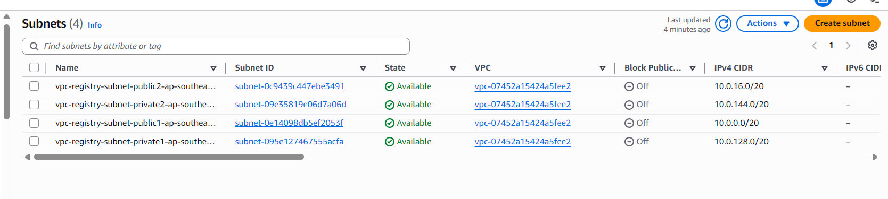

**VPC-A details (CIDR 10.1.0.0/16, State Available):**

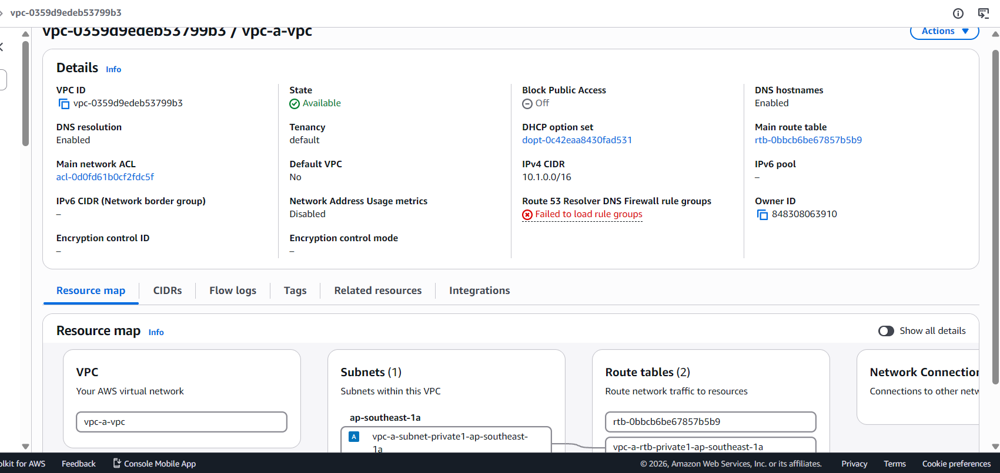

**VPC-B details (CIDR 10.2.0.0/16, State Available):**

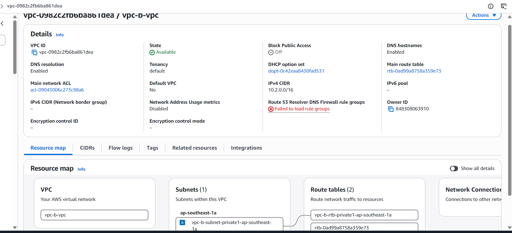

### ✅ Checkpoint
- [ ] 3 VPCs in ap-southeast-1, all Available
- [ ] CIDRs: 10.0.0.0/16, 10.1.0.0/16, 10.2.0.0/16 — no overlap
- [ ] One private subnet per VPC, no Internet Gateway

---

## Chapter 2 — Create the Transit Gateway

Transit Gateway = single routing hub for all VPCs.

**AWS Console → VPC → Transit Gateways → Create transit gateway**
1. Name `tgw-lab4`
2. Enable: **DNS support**, **Default route table association**, **Default route table propagation**
3. Create → wait until State = **Available** (2–4 min)

**TGW creation form (propagation settings + name tag):**

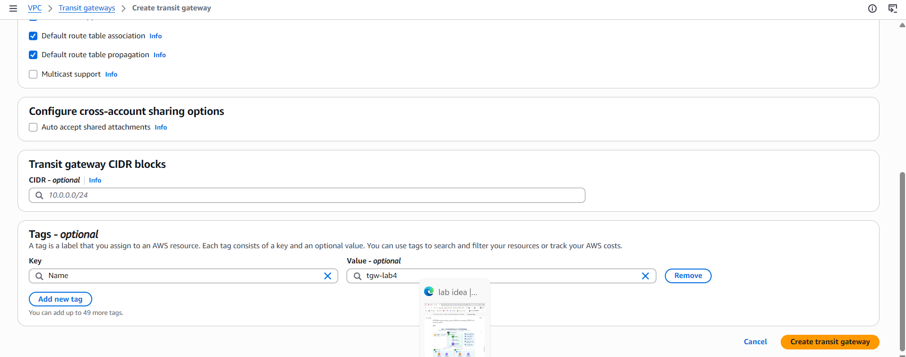

**TGW tgw-lab4 details — confirm DNS support Enabled, default association/propagation Enabled:**

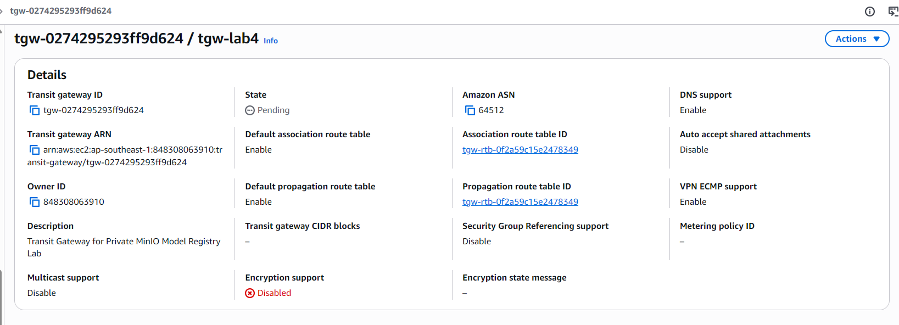

### ✅ Checkpoint
- [ ] TGW State: Available
- [ ] DNS support: Enabled
- [ ] Default association and propagation: Enabled

---

## Chapter 3 — Attach VPCs to Transit Gateway

**AWS Console → VPC → Transit Gateway Attachments → Create transit gateway attachment**

Create **3 attachments** (one per VPC):

| Name | VPC | Private Subnet |
| :--- | :--- | :--- |
| tgw-att-vpc-a | vpc-a-vpc | subnet-a-private |
| tgw-att-vpc-b | vpc-b-vpc | subnet-b-private |
| tgw-att-vpc-registry | vpc-registry-vpc | subnet-registry-private |

Steps for each:
1. Attachment type: **VPC**
2. Select Transit Gateway: `tgw-lab4`
3. Select the correct VPC and its private subnet
4. Create → wait for State = **Available**

> ⚠️ Do NOT test routing while attachment shows Pending.

**VPC-A attachment (tgw-att-vpc-a) — Pending state, subnet confirmed:**

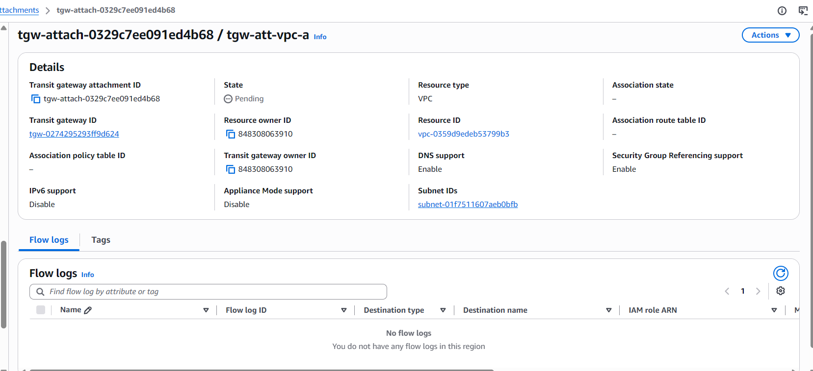

**VPC-B attachment — Available state:**

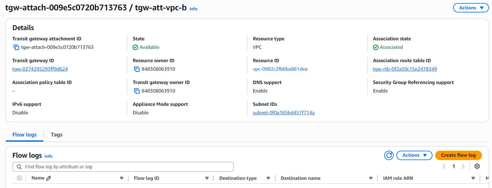

**Registry attachment — Pending (wait for Available before proceeding):**

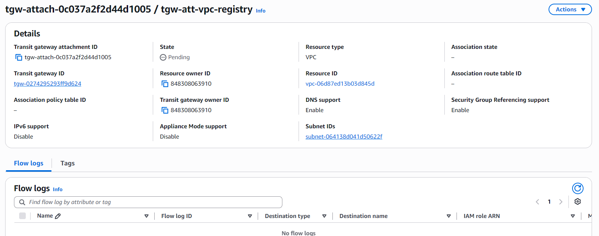

### ✅ Checkpoint
- [ ] All 3 attachments: State = Available, Associated
- [ ] Each attachment uses the correct private subnet

---

## Chapter 4 — Verify Transit Gateway Route Table

With default propagation ON, AWS auto-adds each VPC CIDR to the TGW route table.

**AWS Console → VPC → Transit Gateway Route Tables → select table → Routes tab**

Expected propagated routes:

| Destination | Attachment |
| :--- | :--- |
| 10.0.0.0/16 | tgw-att-vpc-registry |
| 10.1.0.0/16 | tgw-att-vpc-a |
| 10.2.0.0/16 | tgw-att-vpc-b |

> No manual static routes needed if propagation is working correctly.

### ✅ Checkpoint
- [ ] TGW route table shows all 3 VPC CIDRs as Propagated
- [ ] Associations tab shows all 3 attachments linked

---

## Chapter 5 — Configure VPC Route Tables

Add `10.0.0.0/8 → TGW` to **each VPC's private route table**.

**AWS Console → VPC → Route Tables → select table → Routes → Edit routes → Add route**

| Destination | Target |
| :--- | :--- |
| `10.0.0.0/8` | Transit Gateway `tgw-lab4` |

Apply to all 3 private route tables (vpc-a, vpc-b, vpc-registry).

**VPC-A route table — 10.0.0.0/8 via TGW, Status Active:**

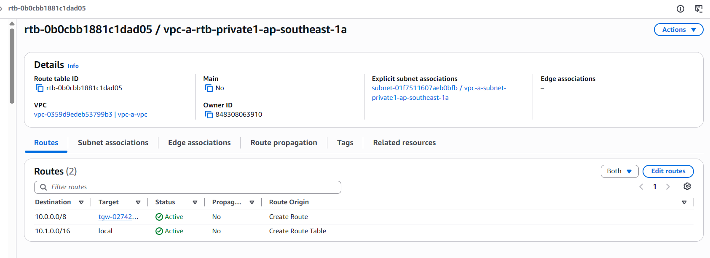

**VPC-B route table — same route added:**

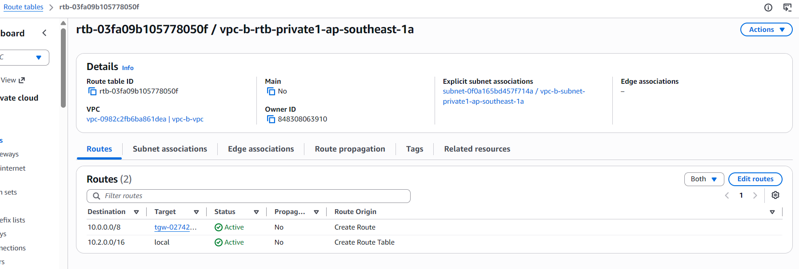

**Registry route table — TGW route Active:**

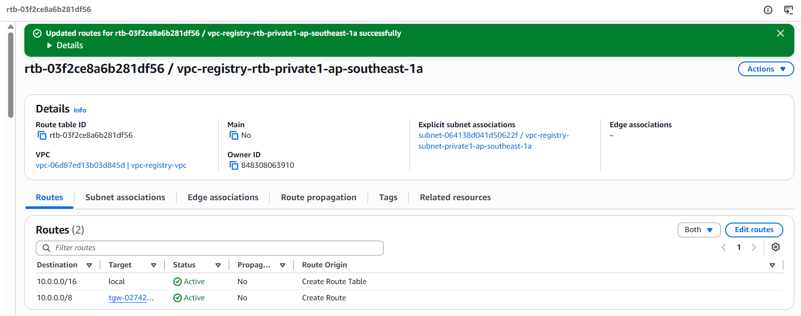

### ✅ Checkpoint
- [ ] All 3 route tables: `10.0.0.0/8 → TGW` Active
- [ ] No `0.0.0.0/0 → IGW` route in any private table

---

## Chapter 6 — Create S3 Interface Endpoint (Critical)

> **S3 Gateway Endpoint cannot be accessed through a Transit Gateway.** You MUST use an **Interface Endpoint**.

| | S3 Gateway | S3 Interface |
| :--- | :---: | :---: |
| Cross-VPC via TGW | ❌ | ✅ |
| Uses ENI in subnet | No | Yes |
| Internet required | No | No |

**AWS Console → VPC → Endpoints → Create endpoint**
1. Name: `s3-interface-registry`, Type: **AWS services**
2. Search "S3" → select the row with type **Interface** (NOT Gateway)
3. VPC: `vpc-registry-vpc`, Subnet: `subnet-registry-private`, IP type: IPv4
4. Security Group inbound: TCP 443 from `10.1.0.0/16` and `10.2.0.0/16`
5. Enable **Private DNS** → Create endpoint

Also create SSM endpoints (`com.amazonaws.ap-southeast-1.ssm` and `com.amazonaws.ap-southeast-1.ssmmessages`) in the same VPC for Session Manager access.

**Create endpoint page — select "AWS services" category:**

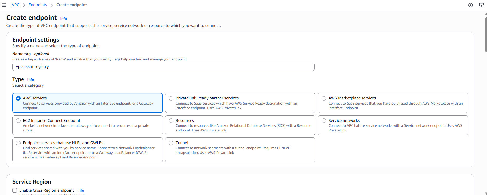

**Service selection — choose Interface row, not Gateway:**

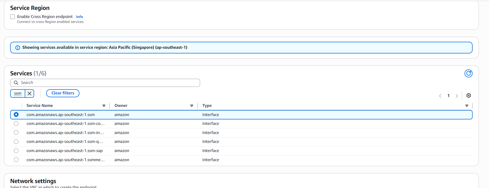

**Private DNS setting — enable it:**

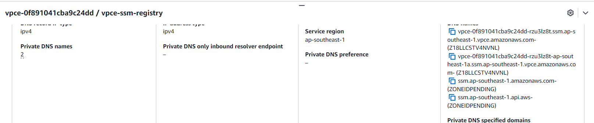

**Security group inbound — TCP 443 from VPC CIDRs:**

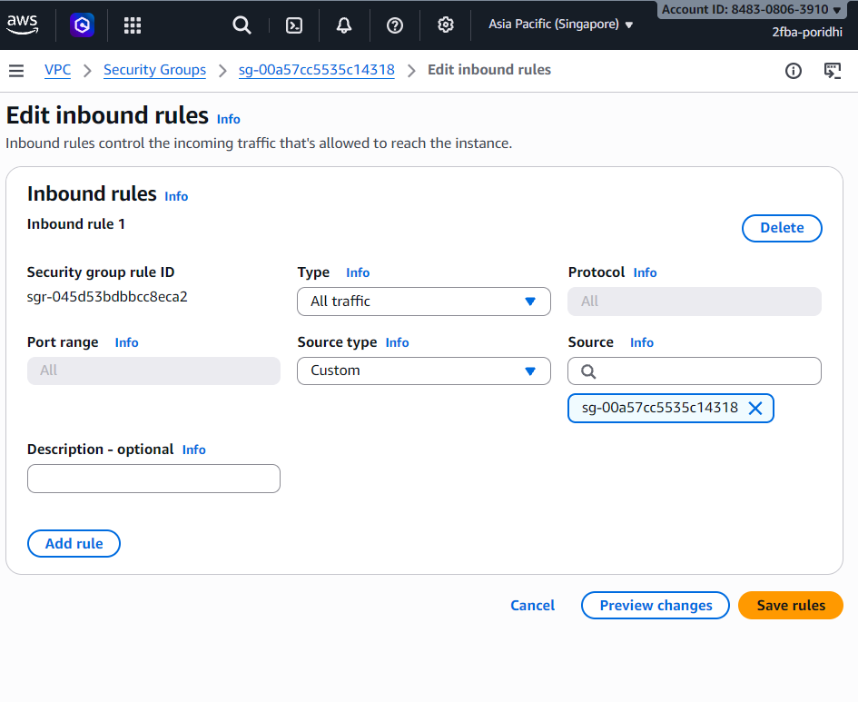

**SSM endpoint details — Status Available, Private DNS enabled:**

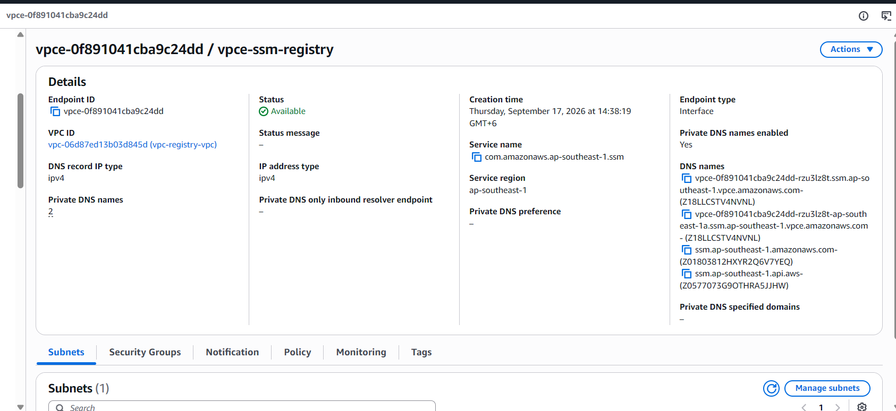

### ✅ Checkpoint
- [ ] S3 Interface Endpoint in Registry VPC (type = Interface, NOT Gateway)
- [ ] Private DNS: Enabled
- [ ] Security group: TCP 443 from 10.1.0.0/16 & 10.2.0.0/16
- [ ] SSM endpoints (ssm, ssmmessages): Available

---

## Chapter 7 — Set Up the MinIO Private Model Store

MinIO serves as our S3-compatible private model registry in the Registry VPC.

### 1. MinIO Server & Bucket Configuration (Registry VPC)
If deploying MinIO in the Registry VPC:
```bash
# Run MinIO (API on :9000, Web Console on :9001)
minio server /data --console-address ":9001"

# Configure MinIO client (mc)
mc alias set myminio http://localhost:9000 minioadmin minioadmin

# Create the model bucket (fully private)
mc mb myminio/model-registry
mc anonymous set none myminio/model-registry
```

### 2. S3 Bucket Configuration (AWS Console)
If using AWS S3 directly or as a backing store:
**AWS Console → S3 → Create bucket**
1. Bucket name: e.g., `model-registry-lab4` (or globally unique name)
2. Region: `ap-southeast-1`
3. **Block all public access** — check all 4 boxes
4. Versioning: Enable → Create bucket
5. Inside bucket: create folder `models/<model-name>/`

```
models/
  <model-name>/
    config.json
    model.safetensors
    tokenizer.json
    tokenizer_config.json
```

### ✅ Checkpoint
- [ ] MinIO / S3 model bucket created with all public access blocked
- [ ] `models/<model-name>/` folder structure exists

---

## Chapter 8 — One-Time Model Pull from Hugging Face

> Run this **only** from an environment with Internet access (local machine or jump EC2). **Production VPCs are not involved.**

```bash
pip install -U huggingface_hub
huggingface-cli login
huggingface-cli download <MODEL_ID> --local-dir ./model
find ./model -maxdepth 2 -type f | sort
```

---

## Chapter 9 — Upload Model to MinIO / S3

```bash
# Option A: Upload using MinIO Client (mc)
mc cp --recursive ./model/ myminio/model-registry/models/<model-name>/

# Option B: Upload using AWS CLI (pointing to MinIO or S3)
aws --endpoint-url http://<registry-ip>:9000 s3 sync ./model s3://model-registry/models/<model-name>/
# (Or direct to AWS S3: aws s3 sync ./model s3://<bucket>/models/<model-name>/)

# Verify contents and record SHA-256 hash for integrity verification
sha256sum ./model/<model-file>   # record this hash
```

### ✅ Checkpoint
- [ ] Model artifacts stored at `models/<model-name>/` in MinIO / S3
- [ ] SHA-256 hash recorded

---

## Chapter 10 — Launch Private EC2 Instances

**AWS Console → EC2 → Launch instance**

| Instance | VPC | Subnet | Public IP |
| :--- | :--- | :--- | :--- |
| ec2-inference-a | vpc-a-vpc | subnet-a-private | **None** |
| ec2-inference-b | vpc-b-vpc | subnet-b-private | **None** |

**IAM Role — attach `AmazonSSMManagedInstanceCore` + inline policy:**

```json
{
  "Version": "2012-10-17",
  "Statement": [{
    "Effect": "Allow",
    "Action": ["s3:GetObject", "s3:ListBucket"],
    "Resource": [
      "arn:aws:s3:::<bucket>",
      "arn:aws:s3:::<bucket>/models/*"
    ]
  }]
}
```

### ✅ Checkpoint
- [ ] Both EC2s: no Public IP, IAM role attached
- [ ] SSM Session Manager can reach each instance

---

## Chapter 11 — Pull Model from VPC-A

```bash
aws ssm start-session --target <ec2-inference-a-id> --region ap-southeast-1
```

Inside the session:

```bash
# Confirm no Internet route
ip route
# Must NOT show: 0.0.0.0/0

# Verify private resolution / connectivity to Registry VPC
getent hosts s3.ap-southeast-1.amazonaws.com

# Pull from MinIO (or direct S3 Interface Endpoint)
aws --endpoint-url http://<registry-ip>:9000 s3 sync s3://model-registry/models/<model-name>/ ~/model/
# (If pulling directly via AWS S3 Interface Endpoint: aws s3 sync s3://<bucket>/models/<model-name>/ ~/model/)

find ~/model -type f | sort
```

---

## Chapter 12 — Pull Model from VPC-B

```bash
aws ssm start-session --target <ec2-inference-b-id> --region ap-southeast-1

# Pull from MinIO / S3 via Transit Gateway
aws --endpoint-url http://<registry-ip>:9000 s3 sync s3://model-registry/models/<model-name>/ ~/model/
# (Or: aws s3 sync s3://<bucket>/models/<model-name>/ ~/model/)

sha256sum ~/model/<model-file>   # must match VPC-A hash
```

### ✅ Checkpoint
- [ ] VPC-A pulled model successfully from MinIO / S3
- [ ] VPC-B pulled model successfully from MinIO / S3
- [ ] SHA-256 hashes match on both instances

---

## Chapter 13 — Run Inference

```python
from transformers import AutoTokenizer, AutoModel

MODEL_DIR = "./model"
tokenizer = AutoTokenizer.from_pretrained(MODEL_DIR)
model = AutoModel.from_pretrained(MODEL_DIR)

print(f"Loaded: {type(model).__name__}")
inputs = tokenizer("Hello, private registry!", return_tensors="pt")
outputs = model(**inputs)
print("Output shape:", outputs.last_hidden_state.shape)
```

### ✅ Checkpoint
- [ ] Inference runs on both instances — no network errors
- [ ] Model loaded from `~/model/`, NOT from Hugging Face

---

## Chapter 14 — Air-Gap Verification

**Step 1 — No Internet route:**
```bash
ip route
# Expected: NO line with 0.0.0.0/0
```

**Step 2 — MinIO / S3 works via private Transit Gateway path:**
```bash
aws --endpoint-url http://<registry-ip>:9000 s3 ls s3://model-registry/models/<model-name>/
# (OR: aws s3 ls s3://<bucket>/models/<model-name>/)
# Expected: file listing
```

**Step 3 — Negative test:**
1. **VPC → Route Tables → vpc-a-rtb-private1 → Edit routes → Delete** `10.0.0.0/8`
2. In SSM session on VPC-A:
```bash
aws --endpoint-url http://<registry-ip>:9000 s3 ls s3://model-registry/models/<model-name>/
# Expected: connection timeout
```
3. **Restore the route** → confirm MinIO / S3 access returns

### ✅ Final Checkpoint
- [ ] `ip route` shows no Internet route
- [ ] MinIO / S3 sync works from both VPCs
- [ ] Removing TGW route → model registry access times out (negative test ✓)
- [ ] Restoring route → access returns

---

## Architecture Summary

```
  Allowed Internet Environment
           |
           | one-time pull
           v
       HuggingFace
           |
           v
  ┌─────────────────────────┐
  │   MinIO Model Bucket    │  (S3-compatible Private Model Store)
  └───────────┬─────────────┘
             │
      VPC Endpoint / ENI
             │
  ┌──────────┴──────────┐
  │   Registry VPC      │  10.0.0.0/16
  └──────────┬──────────┘
             │
      Transit Gateway (tgw-lab4)
        /              \
  ┌─────┴──────┐   ┌────┴───────┐
  │  VPC-A     │   │  VPC-B     │
  │ 10.1.0.0/16│   │10.2.0.0/16 │
  │ EC2 (priv) │   │ EC2 (priv) │
  │ Model Pull │   │ Model Pull │
  │(from MinIO)│   │(from MinIO)│
  └────────────┘   └────────────┘
     No Internet      No Internet
```

---

## Troubleshooting

| Problem | Fix |
| :--- | :--- |
| TGW attachment stuck Pending | Wait 2–5 min, refresh |
| S3 access fails via TGW | Delete S3 Gateway endpoint, recreate as **Interface** type |
| DNS resolves to public S3 IP | Enable Private DNS on endpoint; enable DNS hostnames on VPC |
| AccessDenied from S3 | Check IAM role: `s3:GetObject` + `s3:ListBucket` on exact bucket ARN |
| SSM session fails | Confirm ssm + ssmmessages endpoints exist; SG allows TCP 443 from EC2 subnet |

```bash
# Verify S3 DNS resolves to private IP
getent hosts s3.ap-southeast-1.amazonaws.com

# Enable DNS hostnames if needed
aws ec2 modify-vpc-attribute --vpc-id <vpc-id> --enable-dns-hostnames
```

---

## Key Takeaways

- **S3 Interface, not Gateway** — Gateway endpoints are VPC-local; cross-VPC access requires Interface endpoint
- **Route both sides** — VPC subnet routes AND TGW propagated routes must both exist
- **Always run the negative test** — removing the TGW route and seeing S3 fail is the real proof of air-gap
- **Least privilege** — inference instances only need `s3:GetObject` + `s3:ListBucket` on the exact model prefix

---

## Next Steps

- Model versioning: `s3://<bucket>/models/<name>/v1.0.0/`
- S3 Object Lock — prevent overwrite of approved weights
- KMS encryption — server-side encryption at rest
- CloudTrail — audit every `s3:GetObject` call
- Separate TGW route tables — isolate Team A from Team B

---

## References

- [AWS Transit Gateway VPC Attachments](https://docs.aws.amazon.com/vpc/latest/tgw/tgw-vpc-attachments.html)
- [AWS Transit Gateway Route Tables](https://docs.aws.amazon.com/vpc/latest/tgw/tgw-route-tables.html)
- [AWS PrivateLink for Amazon S3](https://docs.aws.amazon.com/AmazonS3/latest/userguide/privatelink-interface-endpoints.html)
- [Systems Manager VPC Endpoints](https://docs.aws.amazon.com/systems-manager/latest/userguide/setup-create-vpc.html)
- [Hugging Face Hub Download](https://huggingface.co/docs/huggingface_hub/guides/download)
