# Lab 4 — Private Model Registry via Transit Gateway

**Environment:** AWS Singapore (`ap-southeast-1`)  
**Architecture:** S3-backed private model registry, multiple VPCs, AWS Transit Gateway  
**Lab objective:** Store model weights in S3 and allow private model retrieval and inference from VPC-A and VPC-B without direct Internet access.

> **Source note:** This lab is structured according to the Poridhi Labs Development Guide. The guide requires an Introduction, Learning Objectives, Prologue, Environment Setup, chapters, Epilogue, Principles, Troubleshooting, Next Steps, and Additional Resources. It also recommends active-learning elements such as prediction questions, fill-in-the-blanks, experiments, and self-assessment. 

> **Important AWS networking note:** The supplied architecture diagram labels the S3 endpoint as a **Gateway Endpoint** and routes VPC-A/VPC-B traffic through Transit Gateway. AWS documents that an S3 **gateway endpoint cannot be accessed through a Transit Gateway**. For the exact multi-VPC flow in this lab, use an **S3 Interface Endpoint** in the registry VPC, or create S3 gateway endpoints directly in each consumer VPC. The implementation below keeps the intended centralized-registry design and therefore uses an S3 **Interface Endpoint** in the registry VPC. citeturn1search0turn1search3

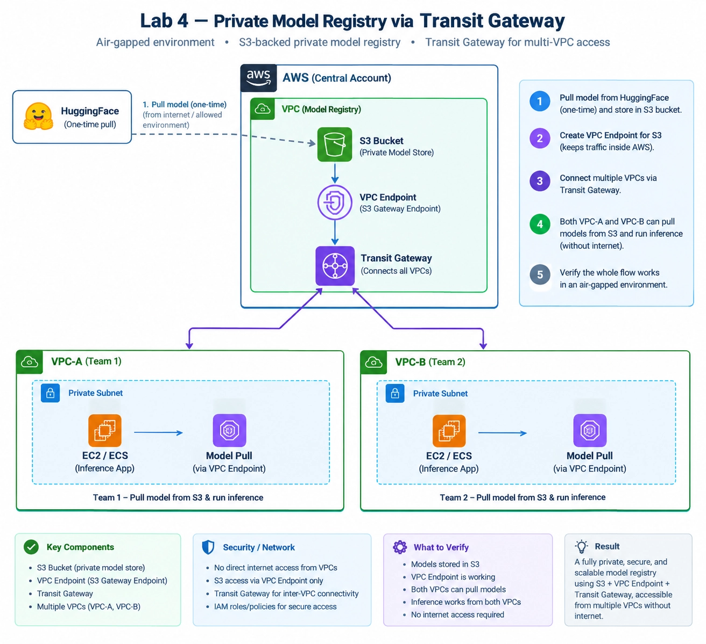

## Introduction

An air-gapped ML environment should not require model-serving VPCs to access the public Internet. This lab builds a private model-registry pattern where a one-time model download is performed from an allowed environment, model weights are stored in Amazon S3, and private VPCs retrieve the model through AWS networking.

The completed environment contains VPC-A, VPC-B, a Registry VPC, a Transit Gateway, private subnets, S3, and private endpoints.

### Console Evidence

> These screenshots document the corresponding console configuration or intermediate state.


**Lab 4 architecture diagram**


## Learning Objectives

By the end of this lab, you will be able to:

1. Create and configure three VPCs for an isolated ML environment.
2. Create private subnets and associate the correct route tables.
3. Create a Transit Gateway and attach multiple VPCs.
4. Configure Transit Gateway route-table associations and propagation.
5. Configure VPC route tables to send inter-VPC traffic to the Transit Gateway.
6. Create an S3-backed model registry.
7. Configure private S3 access without an Internet Gateway or NAT Gateway.
8. Store model weights in S3 and retrieve them from private compute instances.
9. Verify model loading and inference from VPC-A and VPC-B.
10. Diagnose common endpoint, routing, DNS, IAM, and credential errors.

**Prerequisites:** Basic AWS VPC knowledge, familiarity with EC2, IAM, S3, Linux commands, and basic ML model loading.

## Prologue: The Challenge

You are building an ML platform for an environment where production inference VPCs must not have direct Internet access.

The model is initially obtained from Hugging Face from an allowed environment. After the one-time download, the model is stored in a private S3 bucket. VPC-A and VPC-B must retrieve the same model without Internet connectivity.

### Success criteria

The lab is complete when:

- The model file exists in S3.
- VPC-A can retrieve the model.
- VPC-B can retrieve the model.
- The private compute instances have no Internet route.
- Transit Gateway connectivity is working.
- S3 traffic uses a private endpoint path.
- A simple inference test succeeds from both VPCs.

---

# Environment Snapshot

The following values are taken from the AWS console screenshots supplied for this lab.

| Component | Current observed value |
|---|---|
| AWS Region | `ap-southeast-1` — Singapore |
| VPC-A | `vpc-0359d9edeb53799b3` |
| VPC-A name | `vpc-a-vpc` |
| VPC-B | `vpc-0982c2fb6ba861dea` |
| VPC-B name | `vpc-b-vpc` |
| Registry VPC | `vpc-06d87ed13b03d845d` |
| Registry VPC name | `vpc-registry-vpc` |
| Transit Gateway | `tgw-0274295293ff9d624` |
| Transit Gateway name | `tgw-lab4` |
| TGW route table | `tgw-rtb-0f2a59c15e2478349` |
| VPC-A private subnet | `subnet-01f7511607aeb0bfb` |
| VPC-B private subnet | `subnet-0f0a165bd457f714a` |
| Registry private subnet | `subnet-064138d041d50622f` |
| VPC-A private route table | `rtb-0b0cbb1881c1dad05` |
| VPC-B private route table | `rtb-03fa09b105778050f` |
| Registry private route table | `rtb-03f2ce8a6b281df56` |
| VPC-A TGW attachment | `tgw-attach-0329c7ee091ed4b68` |
| VPC-B TGW attachment | `tgw-attach-009e5c0720b713763` |
| Registry TGW attachment | `tgw-attach-0c037a2f2d44d1005` |
| SSM endpoint | `vpce-0f891041cba9c24dd` |
| SSM endpoint SG | `sg-00a57cc5553c14318` |
| SSM messages endpoint | `vpce-054f19aa28c5f8ea0` |

> Resource IDs are environment-specific. Do not reuse them in another AWS account.

---

# Chapter 1: Build the Network Foundation

The network must be established before model storage and inference can be tested. The key requirement is non-overlapping VPC CIDRs and private subnet routing.

## 1.1 What You Will Build

Create:

```text
VPC-A
  └── Private subnet
       └── EC2 / inference workload

VPC-B
  └── Private subnet
       └── EC2 / inference workload

Registry VPC
  └── Private subnet
       └── Private S3 endpoint
```

The three VPCs are connected through one Transit Gateway.

## 1.2 Think First: Why Three VPCs?

**Question:** Why is the model registry separated from VPC-A and VPC-B?

<details>
<summary>Click to review</summary>

The Registry VPC represents a centralized model-storage service boundary. Consumer VPCs can retrieve the model without placing the S3 storage function directly inside every application VPC.

</details>

## 1.3 VPC Configuration

Use non-overlapping CIDRs. The completed environment shown in the screenshots uses:

| VPC | CIDR shown/used |
|---|---|
| VPC-A | `10.1.0.0/16` |
| VPC-B | `10.2.0.0/16` |
| Registry VPC | `10.0.0.0/16` |

Create at least one private subnet in the Availability Zone used by the lab.

The completed screenshots show the following private subnets:

```text
VPC-A:
subnet-01f7511607aeb0bfb

VPC-B:
subnet-0f0a165bd457f714a

Registry:
subnet-064138d041d50622f
```

### Console Evidence

> These screenshots document the corresponding console configuration or intermediate state.


**Registry VPC subnet configuration**


**Earlier VPC-A configuration screenshot**

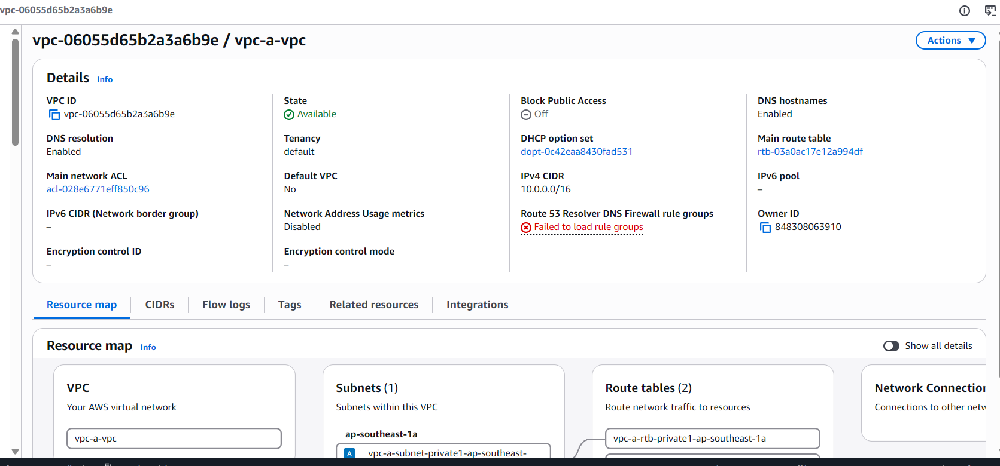


**VPC-A current details**


**VPC-B current details**


**Registry private subnet**

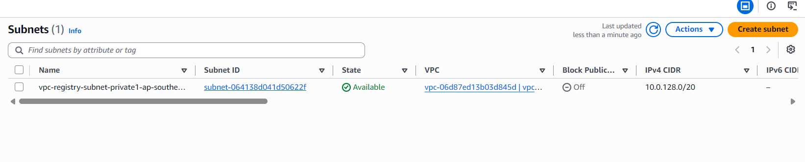


**Registry VPC subnets list**

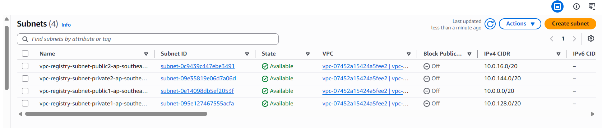


## 1.4 Test and Verify

**Predict:** What should happen if two VPCs use overlapping CIDRs?

<details>
<summary>Click to verify</summary>

Transit Gateway cannot route overlapping VPC CIDRs as independent destinations. Keep all attached VPC CIDRs non-overlapping. AWS documents this requirement for VPC attachments. citeturn0search0

</details>

### Self-Assessment

- [ ] Three VPCs exist.
- [ ] CIDRs do not overlap.
- [ ] Private subnets exist.
- [ ] VPC-A private subnet is `subnet-01f7511607aeb0bfb`.
- [ ] VPC-B private subnet is `subnet-0f0a165bd457f714a`.
- [ ] Registry private subnet is `subnet-064138d041d50622f`.

---

# Chapter 2: Create the Transit Gateway

Transit Gateway provides the central routing hub between the VPCs.

## 2.1 Think First: What Does TGW Solve?

**Question:** If VPC-A and VPC-B must communicate with several other VPCs, why is a central Transit Gateway useful?

<details>
<summary>Click to review</summary>

Without a central routing hub, each VPC-to-VPC connection can require additional networking constructs. Transit Gateway provides a central attachment and routing model for multiple VPCs.

</details>

## 2.2 Create the TGW

Open:

**AWS Console → VPC → Transit Gateways → Create transit gateway**

Use:

```text
Name tag:
tgw-lab4

DNS support:
Enable

Default route table association:
Enable

Default route table propagation:
Enable

VPN ECMP support:
Enable
```

The supplied screenshot shows the TGW creation form with the name `tgw-lab4`.

AWS creates a Transit Gateway route table for forwarding traffic between associated attachments. citeturn0search1turn0search3

### Console Evidence

> These screenshots document the corresponding console configuration or intermediate state.


**Transit Gateway creation settings**


**Create Transit Gateway form**

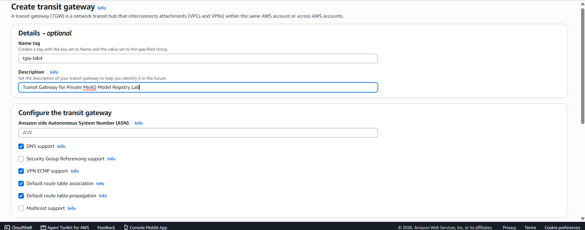


**Transit Gateway tgw-lab4 details**


**Transit Gateway list**

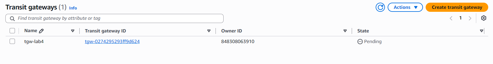


## 2.3 Verify

Expected:

```text
Transit Gateway:
tgw-0274295293ff9d624

Name:
tgw-lab4

State:
Available
```

### Self-Assessment

- [ ] TGW exists.
- [ ] TGW state is `Available`.
- [ ] DNS support is enabled.
- [ ] Default association is enabled.
- [ ] Default propagation is enabled.

---

# Chapter 3: Attach the VPCs to Transit Gateway

Each VPC needs a TGW VPC attachment.

## 3.1 Create VPC-A Attachment

Open:

**VPC → Transit Gateway Attachments → Create transit gateway attachment**

Configure:

```text
Name:
tgw-att-vpc-a

Transit gateway:
tgw-0274295293ff9d624

Attachment type:
VPC

VPC:
vpc-0359d9edeb53799b3

Subnet:
subnet-01f7511607aeb0bfb
```

AWS requires at least one subnet per Availability Zone used by the attachment. citeturn0search6

Wait until the attachment becomes:

```text
State: Available
Association state: Associated
```

### Console Evidence

> These screenshots document the corresponding console configuration or intermediate state.


**VPC-A Transit Gateway attachment — pending state**


**VPC-A Transit Gateway attachment details**

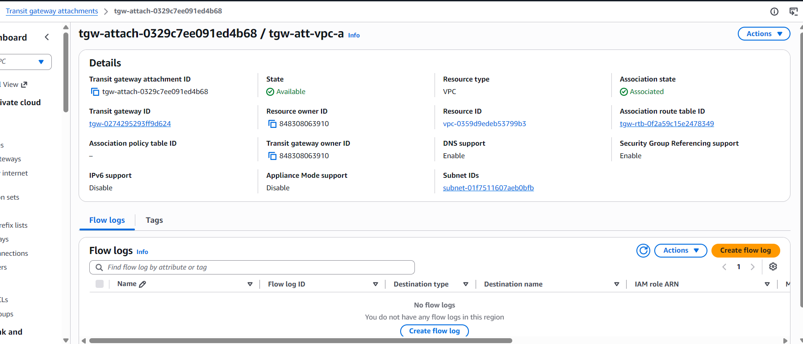


## 3.2 Create VPC-B Attachment

Use:

```text
Name:
tgw-att-vpc-b

Transit gateway:
tgw-0274295293ff9d624

VPC:
vpc-0982c2fb6ba861dea

Subnet:
subnet-0f0a165bd457f714a
```

Expected attachment:

```text
tgw-attach-009e5c0720b713763
State: Available
Association state: Associated
```

### Console Evidence

> These screenshots document the corresponding console configuration or intermediate state.


**VPC-B Transit Gateway attachment — available**


**VPC-B Transit Gateway attachment details**

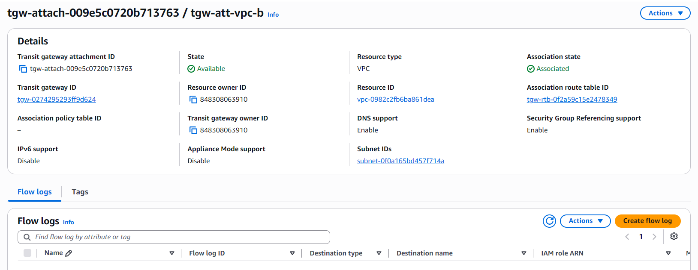


## 3.3 Create Registry VPC Attachment

Use:

```text
Name:
tgw-att-vpc-registry

Transit gateway:
tgw-0274295293ff9d624

VPC:
vpc-06d87ed13b03d845d

Subnet:
subnet-064138d041d50622f
```

Expected final state:

```text
State: Available
Association state: Associated
```

The supplied screenshots show the Registry attachment while it was still `Pending`. Treat that screenshot as an intermediate state and wait for `Available` before testing connectivity.

### Console Evidence

> These screenshots document the corresponding console configuration or intermediate state.


**Registry Transit Gateway attachment — pending state**


## 3.4 Test and Verify

**Predict:** Should you immediately test routing while an attachment is `Pending`?

<details>
<summary>Click to verify</summary>

No. Wait for the attachment to become `Available`, then verify its route-table association and propagation.

</details>

### Self-Assessment

- [ ] VPC-A attachment is `Available`.
- [ ] VPC-B attachment is `Available`.
- [ ] Registry attachment is `Available`.
- [ ] All attachments use the intended private subnets.
- [ ] All attachments are associated with the intended TGW route table.

---

# Chapter 4: Configure Transit Gateway Routing

A TGW attachment alone does not create complete end-to-end routing. The TGW route table must know where each VPC CIDR belongs.

## 4.1 Verify the TGW Route Table

Open:

**VPC → Transit Gateway Route Tables**

Select:

```text
tgw-rtb-0f2a59c15e2478349
```

Check the **Associations** tab.

Expected associations:

```text
VPC-A attachment
VPC-B attachment
Registry attachment
```

AWS supports associating a TGW attachment with a TGW route table and propagating the VPC CIDR into the route table. citeturn0search1turn0search11

## 4.2 Verify Propagated Routes

Expected routes are conceptually:

```text
10.1.0.0/16 → VPC-A attachment
10.2.0.0/16 → VPC-B attachment
10.0.0.0/16 → Registry attachment
```

Do not manually create duplicate static routes if propagation already provides the routes.

## 4.3 Think First: Route Direction

Suppose an instance in VPC-A sends traffic to a Registry VPC private address.

**Question:** What must happen after the packet leaves VPC-A?

<details>
<summary>Click to review</summary>

The VPC-A subnet route table sends the destination toward the Transit Gateway. The TGW route table then selects the Registry VPC attachment based on the destination CIDR.

</details>

---

# Chapter 5: Configure VPC Route Tables

The private subnet route tables need a route toward the Transit Gateway.

## 5.1 VPC-A Private Route Table

Open:

**VPC → Route Tables**

Select:

```text
rtb-0b0cbb1881c1dad05
vpc-a-rtb-private1-ap-southeast-1a
```

Add:

```text
Destination:
10.0.0.0/8

Target:
Transit Gateway
tgw-0274295293ff9d624
```

The screenshot shows this TGW route as active.

### Console Evidence

> These screenshots document the corresponding console configuration or intermediate state.


**VPC-A private route table**


**Route destination CIDR dropdown**

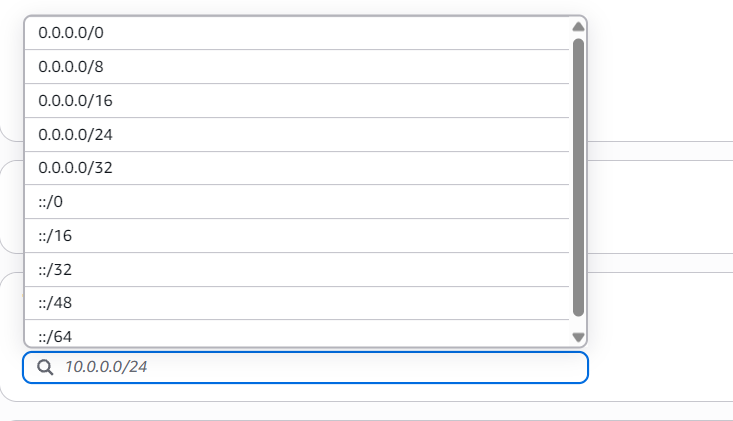


## 5.2 VPC-B Private Route Table

Select:

```text
rtb-03fa09b105778050f
vpc-b-rtb-private1-ap-southeast-1a
```

Add:

```text
Destination:
10.0.0.0/8

Target:
Transit Gateway
tgw-0274295293ff9d624
```

### Console Evidence

> These screenshots document the corresponding console configuration or intermediate state.


**VPC-B private route table**


**Route tables list**

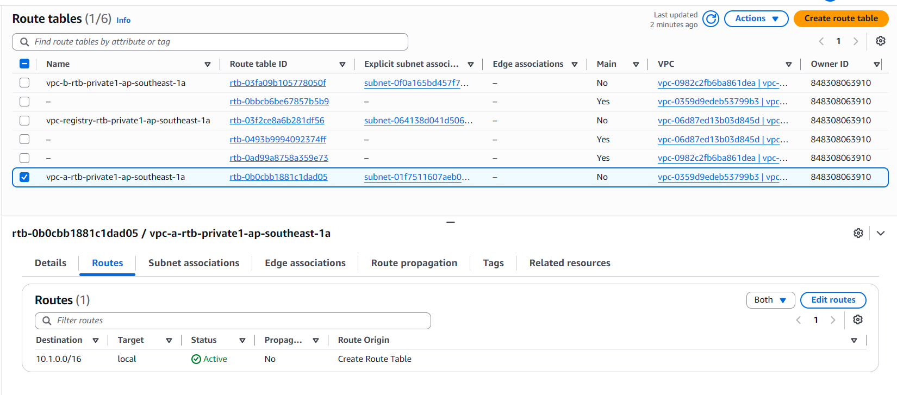


**Route tables list — second captured state**

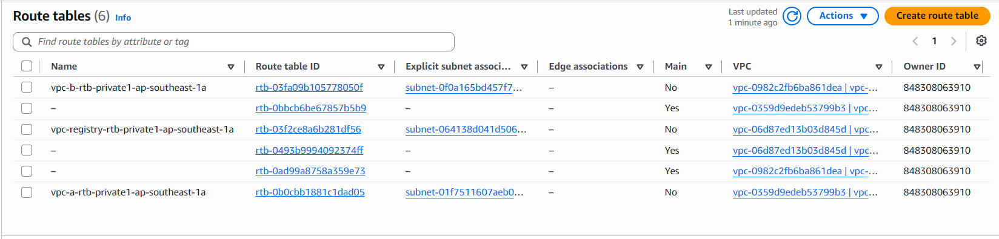


## 5.3 Registry Private Route Table

Select:

```text
rtb-03f2ce8a6b281df56
vpc-registry-rtb-private1-ap-southeast-1a
```

Add:

```text
Destination:
10.0.0.0/8

Target:
Transit Gateway
tgw-0274295293ff9d624
```

The supplied screenshot confirms that the Registry private route table was updated successfully.

AWS documents that VPC subnet route tables need routes pointing to the Transit Gateway for traffic destined for other attached networks. citeturn0search0turn0search3

### Console Evidence

> These screenshots document the corresponding console configuration or intermediate state.


**Registry private route table updated successfully**


## 5.4 Why `10.0.0.0/8`?

The route is broad enough to cover the lab's private address ranges:

```text
Registry: 10.0.0.0/16
VPC-A:    10.1.0.0/16
VPC-B:    10.2.0.0/16
```

For production, use the narrowest required destination prefixes rather than a broad private range when practical.

### Self-Assessment

- [ ] VPC-A private route table contains a TGW route.
- [ ] VPC-B private route table contains a TGW route.
- [ ] Registry private route table contains a TGW route.
- [ ] The routes point to `tgw-0274295293ff9d624`.
- [ ] The correct private subnet is associated with each route table.

---

# Chapter 6: Configure Private S3 Access

This chapter contains an important architectural distinction.

## 6.1 Gateway Endpoint Versus Interface Endpoint

| Feature | S3 Gateway Endpoint | S3 Interface Endpoint |
|---|---|---|
| Private S3 access | Yes | Yes |
| Internet Gateway required | No | No |
| NAT Gateway required | No | No |
| Accessible through Transit Gateway | **No** | **Yes, for the centralized design** |
| Uses ENIs in subnet | No | Yes |
| Additional endpoint charges | No | Yes |

AWS explicitly states that S3 gateway endpoints do not support access through a Transit Gateway. S3 interface endpoints use private IP addresses and can extend S3 access to VPCs connected through Transit Gateway. citeturn1search0turn1search3

Therefore, the diagram's centralized:

```text
VPC-A → TGW → Registry VPC → S3 Gateway Endpoint
```

must be implemented as:

```text
VPC-A → TGW → Registry VPC → S3 Interface Endpoint → S3
VPC-B → TGW → Registry VPC → S3 Interface Endpoint → S3
```

## 6.2 Create the S3 Interface Endpoint

Open:

**VPC → Endpoints → Create endpoint**

Choose:

```text
Type:
AWS services

Service:
Amazon S3

Endpoint type:
Interface

VPC:
vpc-06d87ed13b03d845d

Subnet:
subnet-064138d041d50622f

IP address type:
IPv4

Private DNS:
Enable where supported by the selected S3 endpoint configuration

Security group:
A security group that permits HTTPS (TCP 443) from the consumer VPC CIDRs
```

AWS creates an endpoint network interface in the selected subnet for an interface endpoint. citeturn1search1turn1search2

### Console Evidence

> These screenshots document the corresponding console configuration or intermediate state.


**Create VPC endpoint page**


**AWS service endpoint selection**


**SSM endpoint VPC selection — captured during endpoint work**

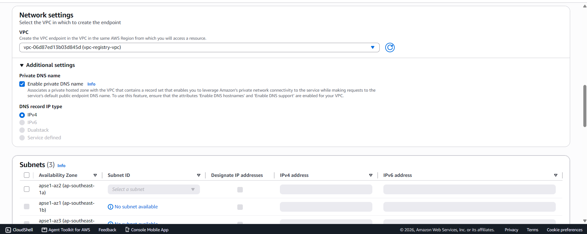


**SSM endpoint subnet selection**

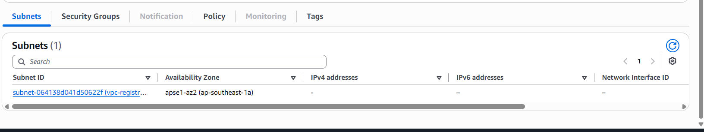


**Endpoint IP/subnet configuration**

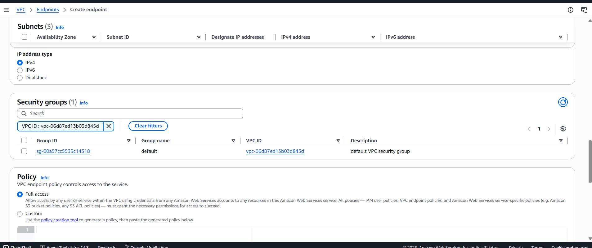


**Endpoint subnet selection list**

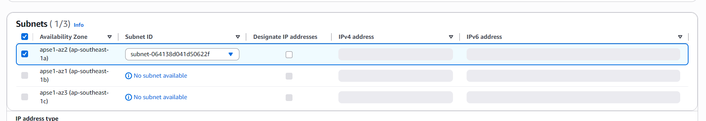


**Endpoint naming and tags**

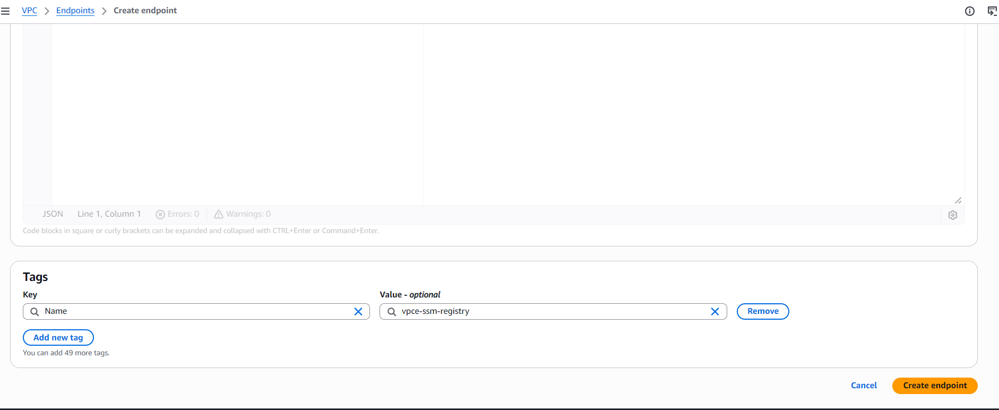


### Security group

Allow:

```text
Inbound:
TCP 443
Source:
10.1.0.0/16
10.2.0.0/16
```

Restrict the rule further if your actual consumer CIDRs are different.

## 6.3 DNS Requirement

An interface endpoint normally relies on DNS to resolve the service name to private endpoint IP addresses. AWS recommends enabling private DNS for interface endpoints where supported. citeturn1search1

For a cross-VPC design, verify DNS resolution from VPC-A and VPC-B. If the normal S3 hostname does not resolve to the Registry VPC endpoint, use the endpoint-specific S3 DNS name or implement the required Route 53 private DNS design.

Do not declare the test successful only because the endpoint status is `Available`.

### Console Evidence

> These screenshots document the corresponding console configuration or intermediate state.


**Private DNS setting**


## 6.4 Alternative: Gateway Endpoints in Each Consumer VPC

If the lab objective is only:

> “VPC-A and VPC-B access S3 privately”

and centralized S3 access through TGW is not required, create an S3 gateway endpoint directly in each consumer VPC.

For a gateway endpoint:

```text
VPC-A → S3 Gateway Endpoint → S3

VPC-B → S3 Gateway Endpoint → S3
```

Associate the endpoint with the private route tables. AWS automatically adds the S3 endpoint route to the selected route tables. citeturn1search3

This option is simpler and has no additional gateway endpoint charge, but it does not demonstrate S3 access through TGW.

---

# Chapter 7: Create the S3 Model Registry

The model registry is the S3 bucket that stores the approved model artifacts.

## 7.1 What You Will Build

Use a bucket structure such as:

```text
s3://<bucket-name>/
└── models/
    └── <model-name>/
        ├── config.json
        ├── model.safetensors
        ├── tokenizer.json
        └── tokenizer_config.json
```

The exact files depend on the model framework.

## 7.2 Create the Bucket

Open:

**AWS Console → S3 → Create bucket**

Use:

```text
Bucket name:
<globally-unique-bucket-name>

Region:
ap-southeast-1

Object Ownership:
ACLs disabled

Block Public Access:
Enable all public-access blocks

Bucket Versioning:
Enable if model rollback is required
```

Do not make the model bucket public.

### Console Evidence

> These screenshots document the corresponding console configuration or intermediate state.


**AWS console state during resource setup**

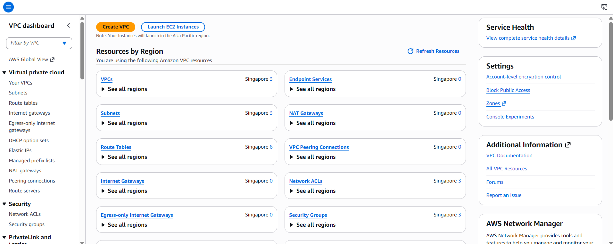


## 7.3 Think First: Why Store the Model in S3?

**Question:** Why not let production EC2 instances download the model directly from Hugging Face?

<details>
<summary>Click to review</summary>

The lab's security boundary requires production inference VPCs to operate without direct Internet access. The allowed environment performs the one-time external download, and S3 becomes the internal model distribution point.

</details>

---

# Chapter 8: One-Time Model Pull

The external model download occurs only from an environment where Internet access is allowed.

## 8.1 Download the Model

From the allowed environment:

```bash
python3 -m venv hf-download
source hf-download/bin/activate

pip install -U huggingface_hub
```

Authenticate if the selected model requires authentication.

Example:

```bash
huggingface-cli login
```

Download the selected model:

```bash
huggingface-cli download <MODEL_ID> \
  --local-dir ./model
```

Replace:

```text
<MODEL_ID>
```

with the model selected for the lab.

## 8.2 Inspect the Artifact

```bash
find ./model -maxdepth 2 -type f | sort
```

Check the model size:

```bash
du -sh ./model
```

### Prediction

Before uploading, predict:

**What should happen if the private VPC later tries to access Hugging Face directly after Internet access is removed?**

<details>
<summary>Click to verify</summary>

The download should fail because the production VPC does not have a permitted Internet path. The model must already exist in the private registry.

</details>

---

# Chapter 9: Upload Model Weights to S3

From the allowed environment:

```bash
aws s3 sync ./model \
  s3://<bucket-name>/models/<model-name>/
```

Verify:

```bash
aws s3 ls \
  s3://<bucket-name>/models/<model-name>/ \
  --recursive
```

Expected result:

```text
models/<model-name>/...
models/<model-name>/...
models/<model-name>/...
```

## 9.1 Optional Integrity Check

Generate a local file hash:

```bash
sha256sum ./model/<model-file>
```

Record the value in the lab notes.

After retrieval from S3:

```bash
sha256sum ./retrieved-model/<model-file>
```

Compare the hashes.

### Self-Assessment

- [ ] S3 bucket exists.
- [ ] Public access is blocked.
- [ ] Model artifacts exist in the bucket.
- [ ] The model path is documented.
- [ ] Model integrity can be checked.

---

# Chapter 10: Prepare Private Compute in VPC-A and VPC-B

Use EC2 instances in the private subnets.

Example:

```text
VPC-A
  subnet-01f7511607aeb0bfb
      |
      └── EC2 inference instance

VPC-B
  subnet-0f0a165bd457f714a
      |
      └── EC2 inference instance
```

The instances should not require a public IP address.

## 10.1 Accessing Private Instances

The screenshots show that Systems Manager endpoints were being configured in the Registry VPC:

```text
SSM:
vpce-0f891041cba9c24dd

SSM Messages:
vpce-054f19aa28c5f8ea0
```

AWS documents that `ssmmessages` is required for Session Manager communication when using the secure data channel. citeturn0search2turn0search4

If private EC2 instances in VPC-A/VPC-B also need Session Manager access without Internet, configure the required Systems Manager endpoints in those VPCs or use an approved centralized endpoint/DNS architecture.

### Console Evidence

> These screenshots document the corresponding console configuration or intermediate state.


**SSM endpoint details**

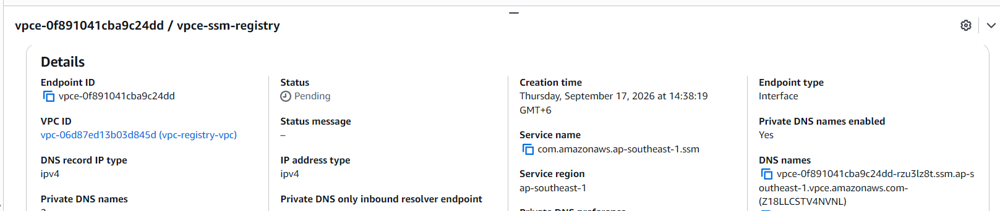


**SSM endpoint successfully created**

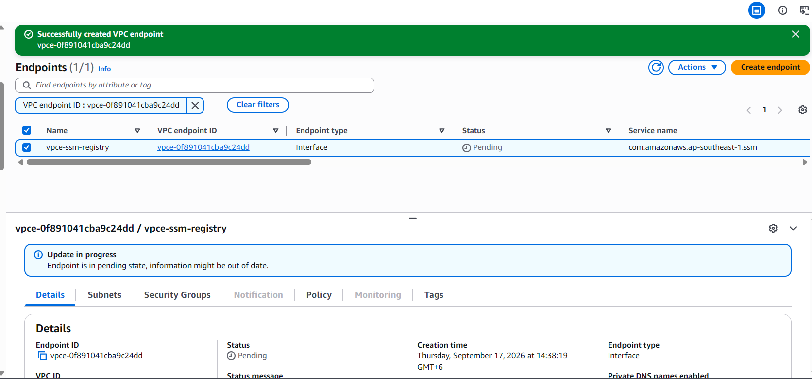


**SSM endpoint available**


**ssmmessages endpoint — pending state**

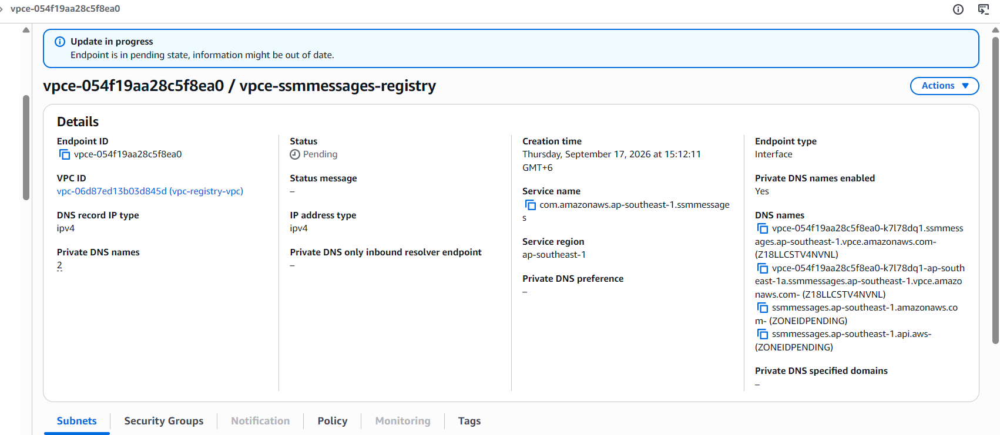


**SSM endpoint security-group inbound rule**


## 10.2 IAM Instance Role

Attach an EC2 instance role with the minimum required permissions.

At minimum, the instance needs permission to read the model objects from the bucket.

Example conceptual permission:

```json
{
  "Version": "2012-10-17",
  "Statement": [
    {
      "Effect": "Allow",
      "Action": [
        "s3:GetObject",
        "s3:ListBucket"
      ],
      "Resource": [
        "arn:aws:s3:::<bucket-name>",
        "arn:aws:s3:::<bucket-name>/models/*"
      ]
    }
  ]
}
```

For production, restrict permissions to the exact bucket and model prefix required.

---

# Chapter 11: Pull the Model from VPC-A

Connect to the private EC2 instance using the approved management path.

## 11.1 Verify Routing Before S3

Check the route table:

```bash
ip route
```

Check the instance's local address:

```bash
ip addr
```

Check DNS:

```bash
getent hosts <s3-endpoint-hostname>
```

Do not use `ping` as the only endpoint test. Interface VPC endpoints do not respond to ICMP ping. citeturn1search2

## 11.2 Pull the Model

Use the AWS CLI:

```bash
aws s3 sync \
  s3://<bucket-name>/models/<model-name>/ \
  ~/model/
```

Verify:

```bash
find ~/model -type f | sort
```

Check disk usage:

```bash
du -sh ~/model
```

### Predict

**Question:** If S3 retrieval works while the EC2 instance has no Internet route, what does that demonstrate?

<details>
<summary>Click to review</summary>

It demonstrates that the model request is reaching S3 through the configured private AWS networking path rather than through a public Internet route.

</details>

---

# Chapter 12: Pull the Model from VPC-B

Repeat the same verification from the VPC-B private instance.

```bash
aws s3 sync \
  s3://<bucket-name>/models/<model-name>/ \
  ~/model/
```

Verify:

```bash
find ~/model -type f | sort
```

The model files should match the VPC-A copy.

## 12.1 Verify Integrity

On VPC-A:

```bash
sha256sum ~/model/<model-file>
```

On VPC-B:

```bash
sha256sum ~/model/<model-file>
```

The hashes should match when the same artifact was downloaded.

---

# Chapter 13: Run Inference

Use the downloaded model locally on each private instance.

The exact inference code depends on the selected model.

Example Python structure:

```python
from pathlib import Path

MODEL_DIR = Path.home() / "model"

print("Model directory:", MODEL_DIR)
print("Model files:")
for path in sorted(MODEL_DIR.rglob("*")):
    if path.is_file():
        print(path)
```

Complete the inference code for the selected framework.

For a Hugging Face Transformers model, the structure is typically:

```python
from transformers import AutoTokenizer, AutoModel

MODEL_DIR = "./model"

tokenizer = AutoTokenizer.from_pretrained(MODEL_DIR)
model = AutoModel.from_pretrained(MODEL_DIR)

print("Model loaded successfully")
```

Use the model-specific inference pipeline appropriate for the selected architecture.

---

# Chapter 14: Air-Gap Verification

This is the most important verification chapter.

## 14.1 Verify No Default Internet Route

On VPC-A and VPC-B, inspect the private subnet route table.

A private subnet should not have:

```text
0.0.0.0/0 → Internet Gateway
```

or an unintended NAT path if the lab requires a strict no-Internet environment.

### Console Evidence

> These screenshots document the corresponding console configuration or intermediate state.


**VPC dashboard credential validation error**

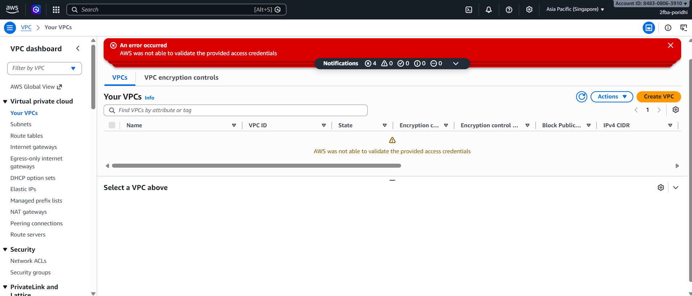


**AWS credential validation error**

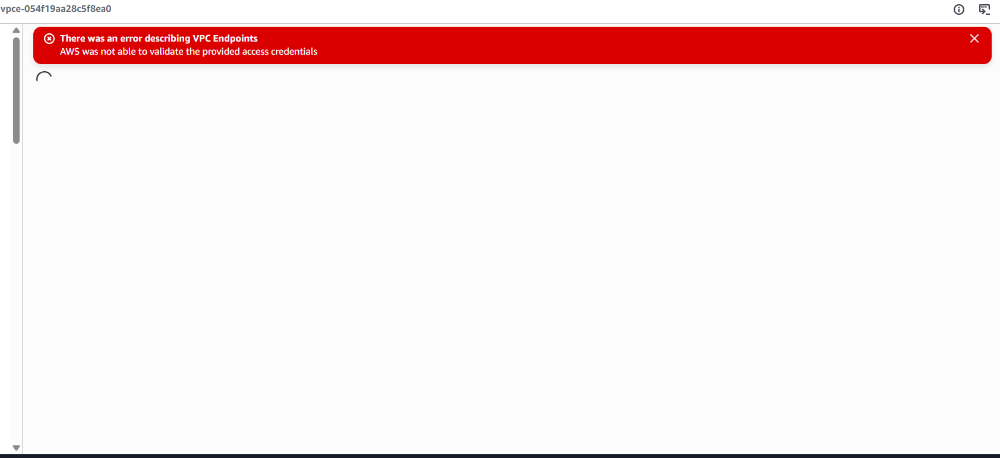


**IAM sign-in authentication failed**

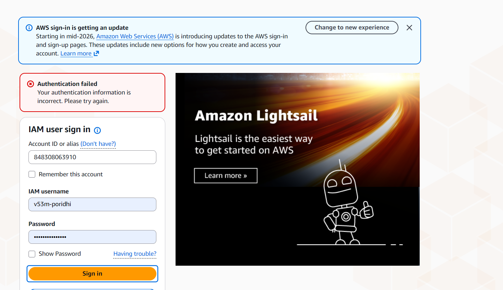


## 14.2 Verify S3 Access

Run:

```bash
aws s3 ls s3://<bucket-name>/models/<model-name>/
```

Then:

```bash
aws s3 cp \
  s3://<bucket-name>/models/<model-name>/<model-file> \
  /tmp/<model-file>
```

## 14.3 Deliberate Failure Experiment

Remove or temporarily block the private S3 path in a controlled lab environment.

Then retry:

```bash
aws s3 ls s3://<bucket-name>/models/<model-name>/
```

**Expected observation:** The request should fail.

Restore the private route/endpoint configuration after the experiment.

## 14.4 Why This Experiment Matters

A successful model pull alone does not prove that the traffic used the intended path. The negative test demonstrates that the model depends on the private registry path rather than an accidental Internet route.

### Self-Assessment

- [ ] No unintended Internet route exists.
- [ ] S3 retrieval works.
- [ ] Model loads locally.
- [ ] Inference succeeds.
- [ ] VPC-A succeeds.
- [ ] VPC-B succeeds.
- [ ] Blocking the private path causes retrieval to fail.

---

# Chapter 15: Troubleshooting

## Error: `Authentication failed`

**Observed screenshot message:**

```text
Authentication failed
Your authentication information is incorrect.
```

**Cause:** AWS console sign-in authentication failed.

**Solution:**

1. Do not recreate the VPCs.
2. Do not delete the Transit Gateway.
3. Sign out of AWS.
4. Open a new private/incognito browser session.
5. Confirm the account ID and IAM username.
6. Re-enter the password manually.
7. Confirm the AWS Region after signing in.

The supplied screenshot shows this sign-in error.

---

## Error: `AWS was not able to validate the provided access credentials`

**Observed during endpoint/VPC console access:**

```text
There was an error describing VPC Endpoints
AWS was not able to validate the provided access credentials
```

**Cause:** The current AWS console session or credentials could not be validated.

**Solution:**

1. Sign out.
2. Sign in again.
3. Verify the correct AWS account.
4. Verify the correct IAM user or role.
5. Refresh the VPC console.
6. Confirm the Region is `ap-southeast-1`.

This error does not by itself prove that the previously created AWS resources were deleted.

---

## Error: TGW attachment remains `Pending`

**Cause:** AWS is still creating the attachment or the configuration is not yet ready.

**Solution:**

Wait and refresh the attachment.

Expected final state:

```text
Available
```

Do not continue with final connectivity testing until the required attachments are available.

---

## Error: SSM endpoint remains `Pending`

The supplied screenshots show the `ssmmessages` endpoint while it was pending.

Check:

- VPC
- subnet
- security group
- endpoint service name
- endpoint status

For Session Manager, AWS documents the `ssmmessages` endpoint requirement. citeturn0search2turn0search4

---

## Error: S3 access fails through the TGW

First check the endpoint type.

If the Registry VPC contains:

```text
S3 Gateway Endpoint
```

the intended:

```text
VPC-A → TGW → Registry VPC → S3 Gateway Endpoint
```

path will not work because S3 gateway endpoints are not reachable through Transit Gateway. citeturn1search0turn1search3

Use an S3 interface endpoint for the centralized cross-VPC design.

---

## Error: DNS resolves to public S3 addresses

**Cause:** The consumer VPC is not resolving the S3 hostname to the intended private interface endpoint.

Check:

```bash
getent hosts s3.ap-southeast-1.amazonaws.com
```

Then verify the endpoint's DNS configuration and the cross-VPC DNS design.

AWS recommends private DNS for interface endpoints where supported. citeturn1search1

---

## Error: `AccessDenied` from S3

**Cause:** IAM permissions or bucket policy do not permit the operation.

Check:

```text
EC2 instance role
S3 bucket policy
S3 endpoint policy
Object path
```

Do not solve an IAM error by making the bucket public.

---

# Epilogue: The Complete System

The final architecture is:

```text
                     Allowed Internet Environment
                              |
                              | One-time model pull
                              v
                       Hugging Face
                              |
                              v
                    +------------------+
                    |   S3 Model       |
                    |   Registry       |
                    +--------+---------+
                             |
                    S3 Interface Endpoint
                             |
                     +-------+-------+
                     | Registry VPC  |
                     +-------+-------+
                             |
                     Transit Gateway
                    /        |        \
                   /         |         \
                  v          v          v
             VPC-A       VPC-B      Other VPCs
             Private     Private
             Subnet      Subnet
                |           |
              EC2         EC2
                |           |
             Model       Model
             Pull        Pull
                |           |
             Inference   Inference
```

## End-to-End Verification Sequence

Run the following sequence from the private compute environments.

### VPC-A

```bash
aws sts get-caller-identity

aws s3 ls s3://<bucket-name>/models/<model-name>/

aws s3 sync \
  s3://<bucket-name>/models/<model-name>/ \
  ~/model/

find ~/model -type f | sort
```

### VPC-B

```bash
aws sts get-caller-identity

aws s3 ls s3://<bucket-name>/models/<model-name>/

aws s3 sync \
  s3://<bucket-name>/models/<model-name>/ \
  ~/model/

find ~/model -type f | sort
```

### Final checks

```text
[ ] Model exists in S3
[ ] S3 bucket is private
[ ] TGW is Available
[ ] VPC-A attachment is Available
[ ] VPC-B attachment is Available
[ ] Registry attachment is Available
[ ] VPC-A route points to TGW
[ ] VPC-B route points to TGW
[ ] Registry route is configured
[ ] S3 private endpoint is configured
[ ] IAM allows model retrieval
[ ] VPC-A can pull the model
[ ] VPC-B can pull the model
[ ] Inference succeeds from VPC-A
[ ] Inference succeeds from VPC-B
[ ] No unintended Internet route exists
```

---

# The Principles

1. **Separate model acquisition from model serving** — Perform external downloads only from an allowed environment.
2. **Treat S3 as the model distribution layer** — Store approved model artifacts in a private bucket.
3. **Use the correct endpoint type** — S3 gateway endpoints are local to a VPC routing domain; centralized cross-VPC S3 access requires an interface endpoint. citeturn1search0
4. **Routing must exist on both sides** — VPC subnet routes and Transit Gateway routes must cooperate.
5. **Keep CIDRs non-overlapping** — Transit Gateway routing depends on unique destination networks. citeturn0search0
6. **Do not equate endpoint status with application connectivity** — An endpoint can be `Available` while DNS, IAM, routing, or security groups remain incorrect.
7. **Verify the negative path** — A true air-gap test should demonstrate that model retrieval fails when the private path is removed.
8. **Use least privilege** — Give inference instances access only to the model objects they require.

---

# Next Steps

After completing the base lab, extend the system with:

1. Model versioning in S3.
2. S3 Object Lock for immutable model artifacts.
3. KMS encryption for model weights.
4. S3 bucket policies restricted by VPC endpoint.
5. CloudTrail auditing for model downloads.
6. Model metadata stored alongside the weights.
7. Automated model promotion from staging to production.
8. Separate TGW route tables for isolated teams.
9. Private ECR for container images.
10. Private ML inference endpoints.
11. Automated integrity verification using SHA-256.
12. CI/CD-based model registration.

---

# Additional Resources

- AWS Transit Gateway VPC attachments: https://docs.aws.amazon.com/vpc/latest/tgw/tgw-vpc-attachments.html
- AWS Transit Gateway route tables: https://docs.aws.amazon.com/vpc/latest/tgw/tgw-route-tables.html
- Create a Transit Gateway VPC attachment: https://docs.aws.amazon.com/vpc/latest/tgw/create-vpc-attachment.html
- S3 gateway endpoints: https://docs.aws.amazon.com/vpc/latest/privatelink/vpc-endpoints-s3.html
- AWS PrivateLink for Amazon S3: https://docs.aws.amazon.com/AmazonS3/latest/userguide/privatelink-interface-endpoints.html
- Interface VPC endpoints: https://docs.aws.amazon.com/vpc/latest/privatelink/interface-endpoints.html
- Systems Manager VPC endpoints: https://docs.aws.amazon.com/systems-manager/latest/userguide/setup-create-vpc.html

---


# Screenshot Index

All 39 supplied screenshots are embedded at the relevant lab steps above.

| # | Screenshot file |
|---:|---|
| 1 | `01_route_table_destination_cidr_dropdown.png` |
| 2 | `02_vpc_b_private_route_table.png` |
| 3 | `03_vpc_b_tgw_attachment_details.png` |
| 4 | `04_ssm_endpoint_security_group_rule.png` |
| 5 | `05_lab4_architecture_diagram.png` |
| 6 | `06_ssm_endpoint_details.png` |
| 7 | `07_registry_vpc_subnet_configuration.png` |
| 8 | `08_registry_private_route_table_updated.png` |
| 9 | `09_create_vpc_endpoint_page.png` |
| 10 | `10_route_tables_list.png` |
| 11 | `11_vpc_a_tgw_attachment_details.png` |
| 12 | `12_transit_gateway_creation_settings.png` |
| 13 | `13_vpc_endpoint_private_dns_setting.png` |
| 14 | `14_ssm_endpoint_subnet_selection.png` |
| 15 | `15_vpc_a_earlier_configuration.png` |
| 16 | `16_registry_tgw_attachment_pending.png` |
| 17 | `17_vpc_b_tgw_attachment_available.png` |
| 18 | `18_vpc_a_current_details.png` |
| 19 | `19_aws_service_endpoint_selection.png` |
| 20 | `20_create_transit_gateway_form.png` |
| 21 | `21_transit_gateway_details.png` |
| 22 | `22_ssm_endpoint_vpc_selection.png` |
| 23 | `23_vpc_a_private_route_table.png` |
| 24 | `24_vpc_a_tgw_attachment_pending.png` |
| 25 | `25_endpoint_ip_subnet_configuration.png` |
| 26 | `26_endpoint_subnet_selection_list.png` |
| 27 | `27_vpc_b_current_details.png` |
| 28 | `28_route_tables_list_overview.png` |
| 29 | `29_ssmmessages_endpoint_pending.png` |
| 30 | `30_ssm_endpoint_successfully_created.png` |
| 31 | `31_aws_console_resource_setup_state.png` |
| 32 | `32_aws_credential_validation_error.png` |
| 33 | `33_registry_private_subnet_details.png` |
| 34 | `34_vpc_dashboard_credential_error.png` |
| 35 | `35_endpoint_naming_and_tags.png` |
| 36 | `36_registry_vpc_subnets_list.png` |
| 37 | `37_ssm_endpoint_available.png` |
| 38 | `38_transit_gateway_list.png` |
| 39 | `39_iam_signin_authentication_failed.png` |
