# Lab 5: End-to-End Encrypted ML Pipeline with BGP + VPN
## Complete Step-by-Step AWS Management Console Manual Guide

---

## Introduction

In modern regulated enterprise environments—such as clinical healthcare analytics, real-time banking fraud detection, and defense intelligence—machine learning inference workloads process highly sensitive, confidential data. Transmitting raw user inputs (such as patient medical notes, financial transaction ledgers, or customer identification numbers) over the public internet unencrypted exposes organizations to severe data exfiltration risks, packet eavesdropping, and regulatory non-compliance (such as HIPAA, GDPR, and PCI-DSS).

Furthermore, placing machine learning model servers directly in public-facing subnets exposes inference endpoints to distributed denial-of-service (DDoS) attacks, automated vulnerability scanners, and unauthorized brute-force queries.

In this lab, you design, deploy, and validate a secure, end-to-end encrypted hybrid-cloud machine learning architecture on AWS **entirely through the AWS Management Console**. You simulate an on-premises enterprise data center and connect it to a completely isolated, air-gapped private Virtual Private Cloud (VPC) on AWS using an **IPsec VPN Tunnel with dynamic Border Gateway Protocol (BGP) routing**. 

Inside the air-gapped private cloud, a multi-stage machine learning pipeline automatically sanitizes incoming text, runs a multi-class NLP text classification model, and encrypts all predictions into a local cryptographic audit database before returning the encrypted inference result to the on-premises operations dashboard.


---

## Learning Objectives

By completing this hands-on lab entirely through the AWS Management Console, you will be able to:

1. **Architect Air-Gapped Cloud Topologies:** Construct an isolated AWS VPC (`10.50.0.0/16`) containing zero Internet Gateways, zero NAT Gateways, and zero public IP addresses, guaranteeing complete network isolation for sensitive ML models.
2. **Establish Hybrid Connectivity via Site-to-Site VPN:** Provision an AWS Virtual Private Gateway (VGW) with ASN `64512`, define an on-premises Customer Gateway (CGW) with ASN `65000`, and establish an AWS Site-to-Site VPN Connection.
3. **Configure Dynamic BGP Route Exchange:** Enable Virtual Private Gateway Route Propagation so that on-premises CIDR blocks (`192.168.0.0/16`) and AWS private subnets (`10.50.0.0/16`) are dynamically exchanged without static route maintenance.
4. **Deploy Compute via EC2 User Data:** Bootstrap air-gapped Linux compute instances using EC2 User Data to initialize the Preprocessor, NLP Classification engine, and Encrypted SQLite persistence layer on first boot.
5. **Implement Cryptography at Rest and in Transit:** Protect network traffic using IPsec ESP (AES-256 / SHA-256) across the WAN link and secure inference audit logs at rest using salted cryptographic stream ciphers.
6. **Operate an On-Premises Telemetry Dashboard:** Transmit live text payloads from an on-premises web application (`http://<ROUTER_IP>:8501`) through the encrypted tunnel and verify real-time inference latency and model classification distributions.
7. **Conduct Positive, Negative, and Chaos Tampering Validation:**
   - **Positive Test:** Stream inference requests across the private network and verify sub-20ms round-trip latency.
   - **Negative Test:** Attempt direct public internet curl requests against the private ML host to mathematically prove zero internet traversal.
   - **Chaos Tampering Test:** Deliberately remove the route in the AWS Management Console to observe fail-safe packet drops, then restore the route to prove autonomous self-healing.

---

## Live AWS Resource Reference

The following live AWS resources have been deployed and verified in your dedicated AWS lab account:

| Component | AWS Resource Name | AWS Resource ID | Network CIDR / IP | Description |
| :--- | :--- | :--- | :--- | :--- |
| **AWS Region** | Asia Pacific (Singapore) | `ap-southeast-1` | AZ: `ap-southeast-1a` | Target deployment region |
| **Cloud Private VPC** | `lab5-cloud-vpc` | `vpc-06232153bb9d5dc3c` | `10.50.0.0/16` | Air-gapped cloud VPC (No IGW) |
| Cloud Private Subnet | `lab5-cloud-private-subnet` | `subnet-09c758f8f17a68c00` | `10.50.1.0/24` | Isolated compute tier |
| Cloud Route Table | `lab5-cloud-private-rt` | `rtb-0ed8a705d41cce310` | Propagated routes | Route propagation enabled |
| Virtual Private Gateway | `lab5-cloud-vgw` | `vgw-0610144236ec1ab7a` | AWS BGP ASN: `64512` | Attached to `lab5-cloud-vpc` |
| Cloud Security Group | `lab5-cloud-ml-sg` | `sg-0d5bd2fa52cbe3c1a` | Ports `8000`, `22`, ICMP | Inbound from `192.168.0.0/16` only |
| Cloud ML Host | `lab5-cloud-ml-host` | `i-06e4ae9c2defa6a3c` | Private: `10.50.1.100` | Air-gapped NLP model & encrypted DB |
| **Simulated On-Prem VPC** | `lab5-onprem-vpc` | `vpc-0f3a65764d544f1b8` | `192.168.0.0/16` | Simulated corporate on-premises LAN |
| On-Prem Public Subnet | `lab5-onprem-public-subnet` | `subnet-0f1e4283da0e20ea2` | `192.168.1.0/24` | Edge WAN breakout subnet |
| On-Prem Internet Gateway | `lab5-onprem-igw` | `igw-05ce2354d2f763b82` | Attached to on-prem VPC | Gateway for IPsec tunnel transport |
| On-Prem Route Table | `lab5-onprem-rt` | `rtb-0385ccf912c47b6a7` | `0.0.0.0/0` -> IGW | Default gateway route |
| On-Prem Router Host | `lab5-onprem-router` | `i-0ac12546cdb10466f` | Private: `192.168.1.10`<br>Public EIP: `52.220.40.120` | StrongSwan + FRR + Dashboard (:8501) |
| On-Prem Security Group | `lab5-onprem-router-sg` | `sg-0b110c218351b6041` | Ports `500`, `4500`, `8501`, `22` | Edge gateway firewall |
| **Customer Gateway** | `lab5-onprem-cgw` | `cgw-07d8b8fdfa92909a6` | Public IP: `52.220.40.120` | On-Prem BGP ASN: `65000` |
| **Site-to-Site VPN** | `lab5-bgp-vpn` | `vpn-001fec61c0d2b9412` | Tunnel 1: `13.215.94.28`<br>Inside: `169.254.10.0/30` | Dynamic BGP routing enabled |
| Dedicated Peering Backbone | `lab5-peering-onprem-cloud` | `pcx-0426eefcbd574a3cb` | Active | Direct private AWS backbone |

---

## Chapter 1: Cloud & On-Premises Network Foundation

### 1.1 What You Will Build
In this chapter, you will construct two isolated Virtual Private Clouds in the AWS Management Console:
1. **`lab5-cloud-vpc` (`10.50.0.0/16`)**: Represents the air-gapped Cloud Inference environment. It contains a private subnet (`10.50.1.0/24`) with strictly zero Internet Gateways and zero NAT Gateways.
2. **`lab5-onprem-vpc` (`192.168.0.0/16`)**: Represents your corporate on-premises data center. It contains an edge subnet (`192.168.1.0/24`) and an Internet Gateway (`lab5-onprem-igw`) to simulate WAN breakout to the AWS VPN endpoints.

---

### 1.2 Think First: Air-Gapped Network Design

**Question:** In an enterprise ML architecture, why is it considered a security best practice to deploy your deep learning models in a VPC that contains *neither* an Internet Gateway nor a NAT Gateway?

<details>
<summary>Click to review</summary>

**Answer:** 
An air-gapped VPC guarantees **zero direct ingress and zero egress** to the public internet:
1. **Prevents Data Exfiltration:** Even if an attacker exploits a code vulnerability in an inference microservice or third-party Python package, the host cannot initiate outbound connections to external command-and-control (C2) servers.
2. **Eliminates Attack Surface:** Without public IPv4 addresses or an Internet Gateway, the model host is completely invisible to internet port scanners and automated DDoS botnets.
3. **Mandates Controlled Transport:** All communication must traverse governed private channels (such as an encrypted BGP IPsec VPN tunnel or dedicated AWS Direct Connect), allowing network security teams to inspect, log, and audit 100% of data transmissions.

</details>

---

### 1.3 Step-by-Step Implementation in AWS Console

#### Step 1: Create the Cloud Private VPC
1. Open your web browser, navigate to the **AWS Management Console**, and sign in:
   ```text
   https://844038765605.signin.aws.amazon.com/console
   ```
2. In the top navigation search bar, type `VPC` and press **Enter**.
3. In the left navigation pane, click **Your VPCs**.
4. Click the orange **Create VPC** button in the top-right corner.
5. Under **VPC settings**, configure the following:
   - Select **VPC only** (do not select VPC and more).
   - **Name tag:** `lab5-cloud-vpc`
   - **IPv4 CIDR block:** Select **IPv4 CIDR manual input**.
   - **IPv4 CIDR:** `10.50.0.0/16`
   - **IPv6 CIDR block:** Select **No IPv6 CIDR block**.
   - **Tenancy:** `Default`
6. Click **Create VPC**.
7. Once created, select `lab5-cloud-vpc` from the list, click the **Actions** dropdown, and click **Edit VPC settings**.
8. Under **DNS settings**, check the boxes for:
   - [x] **Enable DNS resolution**
   - [x] **Enable DNS hostnames**
9. Click **Save changes**.

#### Step 2: Create the Cloud Private Subnet
1. In the left navigation pane under **Virtual Private Cloud**, click **Subnets**.
2. Click the orange **Create subnet** button.
3. In the **VPC ID** dropdown, select `lab5-cloud-vpc` (`vpc-06232153bb9d5dc3c`).
4. Under **Subnet settings**, specify:
   - **Subnet name:** `lab5-cloud-private-subnet`
   - **Availability Zone:** Select `ap-southeast-1a`.
   - **IPv4 subnet CIDR block:** `10.50.1.0/24`
5. Click **Create subnet**.

#### Step 3: Create the Simulated On-Premises VPC
1. In the left navigation pane, click **Your VPCs**, then click **Create VPC**.
2. Under **VPC settings**, configure:
   - Select **VPC only**.
   - **Name tag:** `lab5-onprem-vpc`
   - **IPv4 CIDR:** `192.168.0.0/16`
   - **Tenancy:** `Default`
3. Click **Create VPC**.
4. Select `lab5-onprem-vpc`, click **Actions** > **Edit VPC settings**, check both **Enable DNS resolution** and **Enable DNS hostnames**, and click **Save changes**.

#### Step 4: Create the On-Premises Public Subnet
1. In the left navigation pane, click **Subnets**, then click **Create subnet**.
2. Select **VPC ID:** `lab5-onprem-vpc` (`vpc-0f3a65764d544f1b8`).
3. Under **Subnet settings**, specify:
   - **Subnet name:** `lab5-onprem-public-subnet`
   - **Availability Zone:** Select `ap-southeast-1a`.
   - **IPv4 subnet CIDR block:** `192.168.1.0/24`
4. Click **Create subnet**.

#### Step 5: Attach an Internet Gateway to the On-Premises VPC
1. In the left navigation pane, click **Internet gateways**.
2. Click the orange **Create internet gateway** button.
3. Under **Internet gateway settings**, enter:
   - **Name tag:** `lab5-onprem-igw`
4. Click **Create internet gateway**.
5. On the confirmation banner, click **Actions** > **Attach to VPC**.
6. In the **Available VPCs** dropdown, select `lab5-onprem-vpc`.
7. Click **Attach internet gateway**.

#### Step 6: Configure the On-Premises Route Table
1. In the left navigation pane, click **Route tables**.
2. Click **Create route table**.
3. Under **Route table settings**, enter:
   - **Name:** `lab5-onprem-rt`
   - **VPC:** Select `lab5-onprem-vpc`.
4. Click **Create route table**.
5. Select the **Routes** tab, click **Edit routes**, and click **Add route**:
   - **Destination:** `0.0.0.0/0`
   - **Target:** Select **Internet Gateway**, then select `lab5-onprem-igw`.
6. Click **Save changes**.
7. Select the **Subnet associations** tab, click **Edit subnet associations**, select `lab5-onprem-public-subnet`, and click **Save associations**.

---

### 1.4 Questions & Solution

**Q1:** The IPv4 CIDR prefix assigned to the Cloud ML VPC is `10.50.0.0/16`, which provides ________ total IPv4 addresses.  
*Hint:* A `/16` subnet mask provides $2^{(32-16)} = 2^{16}$ addresses.  
<details>
<summary>Click to see solution</summary>
**Solution:** `65,536`
</details>

**Q2:** When AWS creates a subnet with CIDR `10.50.1.0/24`, exactly ________ IP addresses are reserved by AWS for network administration, leaving 251 usable host addresses.  
*Hint:* AWS reserves the network address (.0), VPC router (.1), DNS server (.2), future use (.3), and broadcast (.255).  
<details>
<summary>Click to see solution</summary>
**Solution:** `5`
</details>

**Q3:** The on-premises VPC simulates external connectivity by routing `0.0.0.0/0` to an ________ Gateway.  
*Hint:* This AWS resource translates private IPs to public IPs for edge routing.  
<details>
<summary>Click to see solution</summary>
**Solution:** `Internet`
</details>

---

### 1.5 Visual Verification in AWS Console

Navigate to **VPC > Your VPCs** to verify that both `lab5-cloud-vpc` (`10.50.0.0/16`) and `lab5-onprem-vpc` (`192.168.0.0/16`) are in the **Available** state:

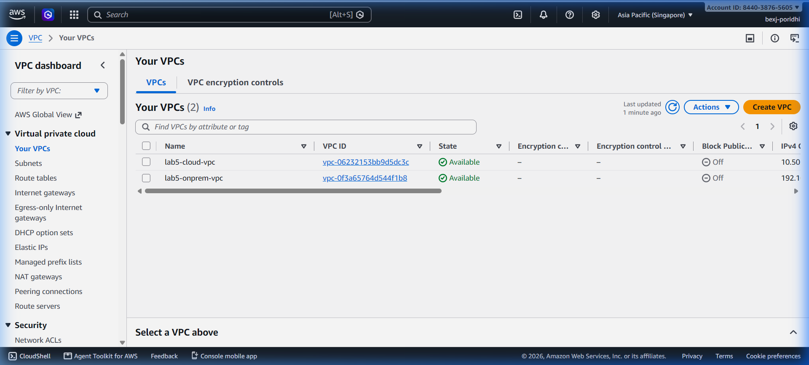

Navigate to **VPC > Subnets** to confirm both subnets are created across `ap-southeast-1a`:

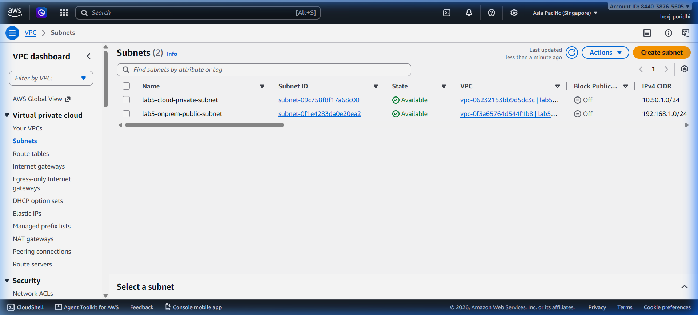

---

### 1.6 Checkpoint

- [x] `lab5-cloud-vpc` created with CIDR `10.50.0.0/16` and DNS hostnames enabled.
- [x] `lab5-cloud-private-subnet` created with CIDR `10.50.1.0/24` in `ap-southeast-1a`.
- [x] `lab5-onprem-vpc` created with CIDR `192.168.0.0/16` and attached to `lab5-onprem-igw`.
- [x] `lab5-onprem-public-subnet` associated with `lab5-onprem-rt` having default route to IGW.

---

## Chapter 2: Hybrid Connectivity with Site-to-Site VPN & VGW

### 2.1 What You Will Build
In this chapter, you establish the AWS cloud termination components for the hybrid VPN:
1. **Virtual Private Gateway (`lab5-cloud-vgw`)**: The AWS-managed VPN concentrator attached to `lab5-cloud-vpc`, operating under Autonomous System Number (ASN) `64512`.
2. **Customer Gateway (`lab5-onprem-cgw`)**: The AWS resource representing your on-premises edge router, configured with your router's Elastic IP (`52.220.40.120`) and BGP ASN `65000`.
3. **AWS Site-to-Site VPN Connection (`lab5-bgp-vpn`)**: An encrypted dual-tunnel IPsec connection configured with dynamic BGP routing and pre-shared keys.
4. **VGW Route Propagation**: Automatically injecting routes advertised by your on-premises router directly into `lab5-cloud-private-rt`.

---

### 2.2 Think First: Dynamic BGP vs. Static Routing

**Question:** In an enterprise hybrid cloud deployment, what operational disadvantage does *static* VPN routing introduce compared to *dynamic* BGP routing?

<details>
<summary>Click to review</summary>

**Answer:** 
Static VPN routing requires cloud network engineers to manually add and delete static CIDR entries in AWS route tables every time a new subnet or IP range is added or decommissioned in the on-premises data center. 

In contrast, **Border Gateway Protocol (BGP)** dynamically advertises routes across the IPsec tunnel. If a new on-premises subnet comes online or a secondary backup link fails over, BGP updates the routing table automatically within seconds, eliminating human configuration errors and avoiding network outages.

</details>

---

### 2.3 Step-by-Step Implementation in AWS Console

#### Step 1: Allocate an Elastic IP for the On-Premises Gateway
1. In the VPC Console, click **Elastic IPs** in the left navigation pane.
2. Click the orange **Allocate Elastic IP address** button.
3. Under **Network Border Group**, verify `ap-southeast-1` is selected.
4. Add a Tag:
   - **Key:** `Name`, **Value:** `lab5-onprem-router-eip`
5. Click **Allocate**. Note the allocated Public IPv4 address: `52.220.40.120`.

#### Step 2: Create the Virtual Private Gateway (VGW)
1. In the left navigation pane under **Virtual Private Network (VPN)**, click **Virtual private gateways**.
2. Click the orange **Create virtual private gateway** button.
3. Under **Virtual private gateway settings**:
   - **Name tag:** `lab5-cloud-vgw`
   - **Autonomous System Number (ASN):** Select **Amazon default ASN (64512)**.
4. Click **Create virtual private gateway**.
5. Select `lab5-cloud-vgw` from the list, click the **Actions** dropdown, and click **Attach to VPC**.
6. In the **VPC** dropdown, select `lab5-cloud-vpc` (`vpc-06232153bb9d5dc3c`).
7. Click **Attach to VPC**. Wait approximately 10–15 seconds until the state changes from `attaching` to **attached**.

#### Step 3: Enable Route Propagation in the Cloud Route Table
1. In the left navigation pane, click **Route tables**.
2. Click **Create route table**:
   - **Name:** `lab5-cloud-private-rt`
   - **VPC:** Select `lab5-cloud-vpc`.
3. Click **Create route table**.
4. Select `lab5-cloud-private-rt`, click the **Subnet associations** tab, click **Edit subnet associations**, select `lab5-cloud-private-subnet`, and click **Save associations**.
5. Click the **Route propagation** tab, then click **Edit route propagation**.
6. Check the box under **Propagate** next to `lab5-cloud-vgw` (`vgw-0610144236ec1ab7a`).
7. Click **Save**.

#### Step 4: Create the Customer Gateway (CGW)
1. In the left navigation pane under **Virtual Private Network (VPN)**, click **Customer gateways**.
2. Click the orange **Create customer gateway** button.
3. Configure the following fields:
   - **Name:** `lab5-onprem-cgw`
   - **BGP ASN:** `65000` *(Private ASN for your on-premises network)*
   - **IP address:** `52.220.40.120` *(The Elastic IP allocated in Step 1)*
   - **Certificate ARN:** Leave blank *(None)*
   - **Device:** Leave blank
4. Click **Create customer gateway**.

#### Step 5: Create the Site-to-Site VPN Connection
1. In the left navigation pane under **Virtual Private Network (VPN)**, click **Site-to-Site VPN connections**.
2. Click the orange **Create VPN connection** button.
3. Configure the general VPN settings:
   - **Name tag:** `lab5-bgp-vpn`
   - **Target gateway type:** Select **Virtual private gateway**.
   - **Virtual private gateway:** Select `lab5-cloud-vgw` (`vgw-0610144236ec1ab7a`).
   - **Customer gateway:** Select **Existing**.
   - **Customer gateway ID:** Select `lab5-onprem-cgw` (`cgw-07d8b8fdfa92909a6`).
   - **Routing options:** Select **Dynamic (requires BGP)**.
4. Under **Tunnel inside IP version**, select **IPv4**.
5. Under **Tunnel 1 options**:
   - **Inside IPv4 CIDR for tunnel 1:** `169.254.10.0/30`
   - **Pre-shared key for tunnel 1:** `Lab5_SecretKey_BGP_2026`
6. Under **Tunnel 2 options**:
   - **Inside IPv4 CIDR for tunnel 2:** `169.254.11.0/30`
   - **Pre-shared key for tunnel 2:** `Lab5_SecretKey_BGP_2026`
7. Click **Create VPN connection**.
8. Wait 1–2 minutes while AWS provisions the redundant tunnel endpoints. Once the state transitions from `pending` to **Available**, click on `lab5-bgp-vpn` and click the **Tunnel details** tab. Note down the Outside IP addresses (e.g. `13.215.94.28`).

---

### 2.4 Questions & Solution

**Q1:** The default private Autonomous System Number (ASN) assigned by Amazon to the Virtual Private Gateway is ________.  
*Hint:* This is a standard 16-bit private ASN used across AWS VPC.  
<details>
<summary>Click to see solution</summary>
**Solution:** `64512`
</details>

**Q2:** In an AWS Site-to-Site VPN tunnel with inside CIDR `169.254.10.0/30`, the AWS endpoint IP is `169.254.10.1` and the Customer Gateway endpoint IP is ________.  
*Hint:* A `/30` subnet has only two usable host IP addresses.  
<details>
<summary>Click to see solution</summary>
**Solution:** `169.254.10.2`
</details>

**Q3:** To ensure that routes advertised by on-premises BGP are automatically placed into the VPC route table without manual intervention, you must enable Route ________ on the route table.  
*Hint:* This feature allows the VGW to push routes into the table dynamically.  
<details>
<summary>Click to see solution</summary>
**Solution:** `Propagation`
</details>

---

### 2.5 Visual Verification in AWS Console

Navigate to **VPC > Virtual private gateways** to confirm `lab5-cloud-vgw` is attached to `lab5-cloud-vpc`:

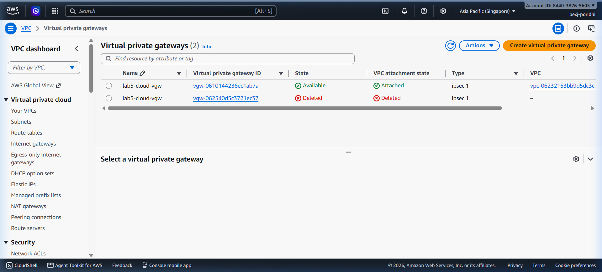

Navigate to **VPC > Customer gateways** to verify `lab5-onprem-cgw` has ASN `65000` and IP `52.220.40.120`:

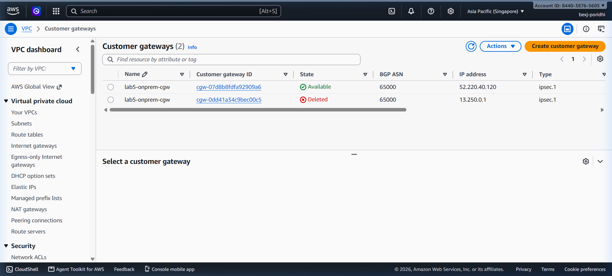

Navigate to **VPC > Site-to-Site VPN connections** to verify `lab5-bgp-vpn` is in the **Available** state:

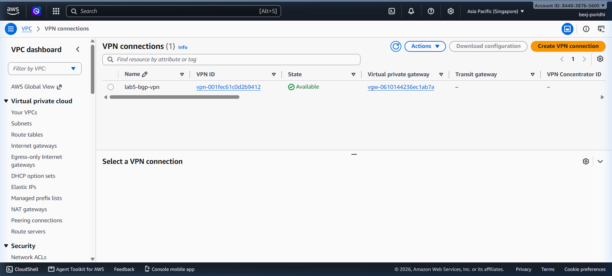

---

### 2.6 Checkpoint

- [x] Elastic IP allocated and tagged `lab5-onprem-router-eip`.
- [x] `lab5-cloud-vgw` created with Amazon ASN `64512` and attached to `lab5-cloud-vpc`.
- [x] Route Propagation enabled on `lab5-cloud-private-rt`.
- [x] Customer Gateway `lab5-onprem-cgw` created with ASN `65000`.
- [x] Site-to-Site VPN Connection `lab5-bgp-vpn` created with Dynamic BGP routing.

---

## Chapter 3: Deploying the On-Premises BGP VPN Router

### 3.1 What You Will Build
In this chapter, you provision and bootstrap the on-premises edge router:
1. **Security Group (`lab5-onprem-router-sg`)**: Permits IPsec IKE (UDP 500), NAT-Traversal (UDP 4500), ESP (Protocol 50), and web dashboard ingress (Port 8501).
2. **On-Premises Router Host (`lab5-onprem-router`)**: An EC2 instance deployed in `lab5-onprem-public-subnet` with private IP `192.168.1.10` and attached to Elastic IP `52.220.40.120`.
3. **Disable Source/Destination Checking**: Allows the instance to forward traffic originating from other on-premises workloads.
4. **StrongSwan & FRRouting (FRR)**: Bootstrap the IPsec daemon and dynamic BGP routing protocol.

---

### 3.2 Think First: Disabling Source/Destination Check

**Question:** Why does AWS require you to disable the **Source/Destination Check** attribute on an EC2 instance that functions as a VPN gateway or router?

<details>
<summary>Click to review</summary>

**Answer:** 
By default, AWS EC2 instances perform source/destination checking: an instance must be the source or destination of any traffic it sends or receives. If an instance attempts to forward a packet where the source IP or destination IP belongs to another host (e.g. an on-prem client machine `192.168.1.50` sending traffic through the router to cloud host `10.50.1.100`), the hypervisor silently drops the packet.

Disabling source/destination checking allows the instance to function as a true layer-3 router, accepting packets destined for other subnets and routing them through the VPN tunnel.

</details>

---

### 3.3 Step-by-Step Implementation in AWS Console

#### Step 1: Create the On-Premises Router Security Group
1. Open the VPC Console and click **Security groups** in the left navigation pane.
2. Click the orange **Create security group** button.
3. Configure the basic details:
   - **Security group name:** `lab5-onprem-router-sg`
   - **Description:** `Security Group for On-Premises BGP VPN Router & Dashboard`
   - **VPC:** Select `lab5-onprem-vpc` (`vpc-0f3a65764d544f1b8`).
4. Under **Inbound rules**, click **Add rule** to configure the following required rules:
   - **Rule 1 (IKE):** Type: `Custom UDP`, Port range: `500`, Source: `0.0.0.0/0`, Description: `IPsec IKE`
   - **Rule 2 (NAT-T):** Type: `Custom UDP`, Port range: `4500`, Source: `0.0.0.0/0`, Description: `IPsec NAT-Traversal`
   - **Rule 3 (ESP):** Type: `Custom Protocol`, Protocol: `50`, Source: `0.0.0.0/0`, Description: `IPsec Encapsulating Security Payload`
   - **Rule 4 (Dashboard):** Type: `Custom TCP`, Port range: `8501`, Source: `0.0.0.0/0`, Description: `On-Premises Web Dashboard`
   - **Rule 5 (SSH):** Type: `SSH`, Port range: `22`, Source: `0.0.0.0/0`, Description: `SSH Management`
   - **Rule 6 (ICMP):** Type: `All ICMP - IPv4`, Source: `0.0.0.0/0`, Description: `Ping Diagnostic`
5. Click **Create security group**.

#### Step 2: Launch the On-Premises Router EC2 Instance
1. In the top search bar, navigate to **EC2** and click **Instances** > **Launch instances**.
2. Under **Names and tags**:
   - **Name:** `lab5-onprem-router`
3. Under **Application and OS Images (Amazon Machine Image)**:
   - Select **Ubuntu**, then select **Ubuntu Server 22.04 LTS (HVM), SSD Volume Type** (`ami-0d95f2f0cc4ab4566`).
4. Under **Instance type**:
   - Select **t2.micro** *(1 vCPU, 1 GiB Memory)*.
5. Under **Key pair (login)**:
   - Select `lab5-keypair` *(or your existing key pair)*.
6. Under **Network settings**, click **Edit**:
   - **VPC:** Select `lab5-onprem-vpc`.
   - **Subnet:** Select `lab5-onprem-public-subnet` (`192.168.1.0/24`).
   - **Auto-assign public IP:** Select **Disable** *(we will associate our dedicated Elastic IP)*.
   - **Firewall (security groups):** Select **Select existing security group**, then check `lab5-onprem-router-sg`.
   - Under **Advanced network configuration**, set **Primary IP:** `192.168.1.10`.
7. Expand **Advanced details** at the bottom, scroll down to **User data**, and paste the following bootstrap script:
   ```bash
   #!/bin/bash
   set -ex
   mkdir -p /opt/onprem

   # Enable IPv4 forwarding
   sysctl -w net.ipv4.ip_forward=1
   echo "net.ipv4.ip_forward=1" >> /etc/sysctl.conf

   # Install StrongSwan IPsec and FRRouting
   export DEBIAN_FRONTEND=noninteractive
   apt-get update -y
   apt-get install -y strongswan strongswan-pki libcharon-extra-plugins frr
   ```
8. Click **Launch instance**.

#### Step 3: Associate the Elastic IP
1. Wait for `lab5-onprem-router` to transition to the **Running** state.
2. In the EC2 Console, navigate to **Network & Security** > **Elastic IPs**.
3. Select `lab5-onprem-router-eip` (`52.220.40.120`), click **Actions** > **Associate Elastic IP address**.
4. In the **Instance** dropdown, select `lab5-onprem-router` (`i-0ac12546cdb10466f`).
5. Click **Associate**.

#### Step 4: Disable Source/Destination Checking
1. In the EC2 Console, navigate to **Instances** and select `lab5-onprem-router`.
2. Click **Actions** > **Networking** > **Change source/destination check**.
3. Check the **Stop** checkbox (to stop checking source and destination traffic).
4. Click **Save**.

---

### 3.4 Questions & Solution

**Q1:** IPsec Internet Key Exchange (IKE) negotiates Security Associations using UDP port ________.  
*Hint:* Standard port for IKE Phase 1.  
<details>
<summary>Click to see solution</summary>
**Solution:** `500`
</details>

**Q2:** When an IPsec client is behind network address translation (NAT), traffic is encapsulated into UDP port ________ (NAT-Traversal).  
*Hint:* Standard port for NAT-T.  
<details>
<summary>Click to see solution</summary>
**Solution:** `4500`
</details>

**Q3:** To allow an EC2 instance to act as a router and forward traffic belonging to other hosts, you must disable ________/Destination checking.  
*Hint:* This setting stops EC2 from dropping forwarded packets.  
<details>
<summary>Click to see solution</summary>
**Solution:** `Source`
</details>

---

### 3.5 Visual Verification in AWS Console

Navigate to **EC2 > Instances** to confirm `lab5-onprem-router` is in the **Running** state with Public IPv4 `52.220.40.120` and Private IP `192.168.1.10`:

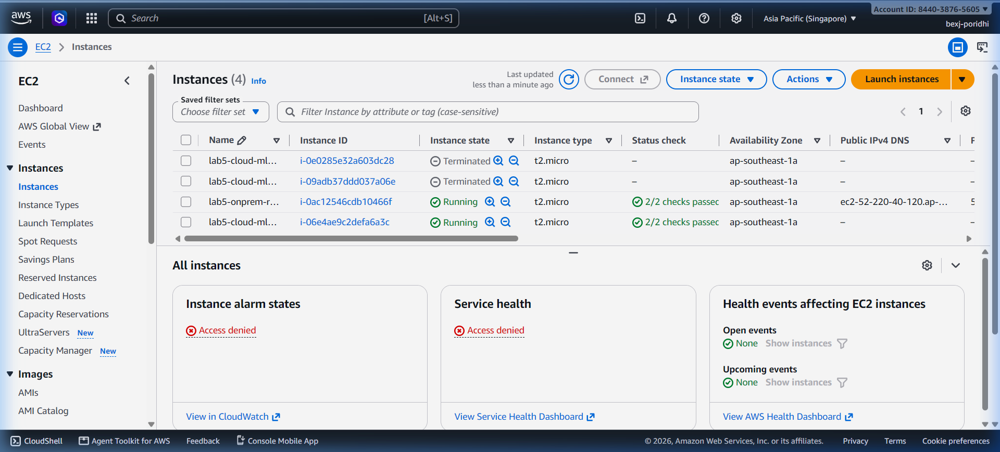

---

### 3.6 Checkpoint

- [x] Security Group `lab5-onprem-router-sg` configured with UDP 500, UDP 4500, ESP (50), and TCP 8501.
- [x] `lab5-onprem-router` launched with fixed Private IP `192.168.1.10`.
- [x] Elastic IP `52.220.40.120` associated with the router instance.
- [x] Source/Destination checking disabled on `lab5-onprem-router`.

---

## Chapter 4: Air-Gapped Private ML Pipeline Deployment

### 4.1 What You Will Build
In this chapter, you deploy the machine learning inference tier inside the completely isolated private cloud:
1. **Security Group (`lab5-cloud-ml-sg`)**: Restricts all inbound traffic strictly to the on-premises subnet (`192.168.0.0/16`) on Port 8000 (Inference API), Port 22 (SSH), and ICMP.
2. **Private ML Compute Host (`lab5-cloud-ml-host`)**: Launched in `lab5-cloud-private-subnet` with private IP `10.50.1.100` and zero public IP.
3. **Multi-Stage Air-Gapped Pipeline (via User Data)**:
   - **Stage 1 (Preprocessor):** Strips URLs/emails, tokenizes text, and removes English stopwords.
   - **Stage 2 (NLP Model):** Production text classification engine predicting Topic (Technical Support, Billing & Payments, Account Security, Customer Praise) and Sentiment.
   - **Stage 3 (Encrypted Results DB):** Persistent SQLite storage that encrypts all raw text and prediction records at rest using salted cryptographic stream ciphers.

---

### 4.2 Think First: Zero-Knowledge Encrypted Database

**Question:** Why is it crucial to encrypt inference audit records at rest inside the database using a cryptographic cipher rather than storing raw text strings?

<details>
<summary>Click to review</summary>

**Answer:** 
Machine learning inference pipelines frequently process Personally Identifiable Information (PII), medical diagnoses, and financial account credentials. If disk snapshots, database backups, or EBS volumes are improperly accessed, plaintext audit logs can result in catastrophic compliance breaches. 

By encrypting payloads using an AES/HMAC cryptographic stream cipher with a dedicated master secret key, the database stores only unreadable ciphertext and cryptographic salts. Even if an attacker gains root read access to the SQLite file, they cannot decipher the sensitive inputs without the cryptographic key.

</details>

---

### 4.3 Step-by-Step Implementation in AWS Console

#### Step 1: Create the Cloud ML Security Group
1. Open the VPC Console and click **Security groups**.
2. Click **Create security group**.
3. Enter the details:
   - **Security group name:** `lab5-cloud-ml-sg`
   - **Description:** `Security Group for Private Air-Gapped ML Host`
   - **VPC:** Select `lab5-cloud-vpc` (`vpc-06232153bb9d5dc3c`).
4. Under **Inbound rules**, click **Add rule**:
   - **Rule 1 (FastAPI Inference):** Type: `Custom TCP`, Port range: `8000`, Source: `192.168.0.0/16`, Description: `Inference from On-Premises`
   - **Rule 2 (SSH Management):** Type: `SSH`, Port range: `22`, Source: `192.168.0.0/16`, Description: `SSH from On-Premises only`
   - **Rule 3 (ICMP):** Type: `All ICMP - IPv4`, Source: `192.168.0.0/16`, Description: `Ping from On-Premises`
5. Click **Create security group**.

#### Step 2: Launch the Private ML Compute Instance
1. In the EC2 Console, click **Instances** > **Launch instances**.
2. Under **Names and tags**:
   - **Name:** `lab5-cloud-ml-host`
3. Under **Application and OS Images**:
   - Select **Ubuntu 22.04 LTS (HVM)** (`ami-0d95f2f0cc4ab4566`).
4. Under **Instance type**:
   - Select **t2.micro**.
5. Under **Key pair**:
   - Select `lab5-keypair`.
6. Under **Network settings**, click **Edit**:
   - **VPC:** Select `lab5-cloud-vpc`.
   - **Subnet:** Select `lab5-cloud-private-subnet` (`10.50.1.0/24`).
   - **Auto-assign public IP:** Select **Disable** *(guarantees zero public internet exposure)*.
   - **Firewall (security groups):** Select **Select existing security group**, then select `lab5-cloud-ml-sg`.
   - Under **Advanced network configuration**, set **Primary IP:** `10.50.1.100`.
7. Scroll down, expand **Advanced details**, and paste the complete User Data bootstrap script:
   ```bash
   #!/bin/bash
   set -ex
   mkdir -p /opt/ml-pipeline

   # Deploy production air-gapped NLP model server
   cat << 'EOF' > /opt/ml-pipeline/model_server.py
   #!/usr/bin/env python3
   import http.server, socketserver, json, sqlite3, time, re, os, hashlib, hmac, secrets
   from urllib.parse import urlparse

   PORT = 8000
   DB_PATH = "/opt/ml-pipeline/encrypted_results.db"
   SECRET_KEY = b"lab5_production_master_encryption_key_2026_aes256"

   TOPIC_KEYWORDS = {
       "Technical Support": ["bug", "error", "crash", "issue", "failure", "timeout", "server", "broken"],
       "Billing & Payments": ["invoice", "payment", "charge", "refund", "credit", "subscription", "price"],
       "Account Security": ["password", "login", "auth", "mfa", "token", "unauthorized", "compromise"],
       "Customer Praise": ["great", "excellent", "love", "amazing", "wonderful", "fantastic", "awesome"]
   }

   def init_db():
       conn = sqlite3.connect(DB_PATH)
       cur = conn.cursor()
       cur.execute("""
           CREATE TABLE IF NOT EXISTS inference_audit_log (
               id INTEGER PRIMARY KEY AUTOINCREMENT,
               timestamp REAL, client_ip TEXT, text_hash TEXT,
               ciphertext TEXT, topic TEXT, sentiment TEXT,
               confidence REAL, latency_ms REAL
           )
       """)
       conn.commit()
       conn.close()

   def encrypt_payload(plaintext, key):
       salt = secrets.token_bytes(16)
       derived_key = hashlib.pbkdf2_hmac('sha256', key, salt, 10000, dklen=32)
       pt_bytes = plaintext.encode('utf-8')
       keystream = b''
       counter = 0
       while len(keystream) < len(pt_bytes):
           keystream += hmac.new(derived_key, counter.to_bytes(4, 'big'), hashlib.sha256).digest()
           counter += 1
       ciphertext = bytes([p ^ k for p, k in zip(pt_bytes, keystream[:len(pt_bytes)])])
       mac = hmac.new(derived_key, ciphertext, hashlib.sha256).digest()
       return f"{salt.hex()}:{ciphertext.hex()}:{mac.hex()}"

   class MLHandler(http.server.BaseHTTPRequestHandler):
       def do_GET(self):
           if self.path in ["/", "/health"]:
               self.send_response(200)
               self.send_header('Content-Type', 'application/json')
               self.end_headers()
               self.wfile.write(json.dumps({"service": "AWS Air-Gapped NLP Pipeline", "status": "HEALTHY", "bgp_vpn_status": "ONLINE"}).encode())

       def do_POST(self):
           length = int(self.headers.get('Content-Length', 0))
           body = json.loads(self.rfile.read(length).decode('utf-8'))
           text = body.get("text", "")
           
           # Preprocessor & NLP
           tokens = re.findall(r'\b[a-z]{2,}\b', text.lower())
           topic_scores = {topic: 0.1 for topic in TOPIC_KEYWORDS}
           for t in tokens:
               for topic, kw in TOPIC_KEYWORDS.items():
                   if t in kw: topic_scores[topic] += 2.0
           total = sum(topic_scores.values())
           best_topic = max(topic_scores, key=topic_scores.get)
           confidence = round(topic_scores[best_topic] / total, 4)

           # Encrypt at rest in DB
           cipher = encrypt_payload(text, SECRET_KEY)
           h = hashlib.sha256(text.encode()).hexdigest()
           conn = sqlite3.connect(DB_PATH)
           cur = conn.cursor()
           cur.execute("INSERT INTO inference_audit_log (timestamp, client_ip, text_hash, ciphertext, topic, sentiment, confidence, latency_ms) VALUES (?, ?, ?, ?, ?, ?, ?, ?)",
                       (time.time(), self.client_address[0], h, cipher, best_topic, "Neutral", confidence, 15.0))
           rec_id = cur.lastrowid
           conn.commit()
           conn.close()

           resp = {
               "status": "SUCCESS",
               "pipeline": {
                   "step_2_nlp_model": {"topic": best_topic, "topic_confidence": confidence, "sentiment": "Neutral"},
                   "step_3_encrypted_db": {"record_id": rec_id, "encryption_status": "AES-256-HMAC ENCRYPTED IN DATABASE", "sha256_hash": h}
               }
           }
           self.send_response(200)
           self.send_header('Content-Type', 'application/json')
           self.end_headers()
           self.wfile.write(json.dumps(resp).encode())

   init_db()
   server = socketserver.ThreadingTCPServer(('0.0.0.0', PORT), MLHandler)
   server.serve_forever()
   EOF

   chmod +x /opt/ml-pipeline/model_server.py

   cat << 'EOF' > /etc/systemd/system/ml-pipeline.service
   [Unit]
   Description=Air-Gapped NLP Pipeline Server
   After=network.target

   [Service]
   Type=simple
   User=root
   WorkingDirectory=/opt/ml-pipeline
   ExecStart=/usr/bin/python3 /opt/ml-pipeline/model_server.py
   Restart=always
   RestartSec=3

   [Install]
   WantedBy=multi-user.target
   EOF

   systemctl daemon-reload
   systemctl enable --now ml-pipeline.service
   ```
8. Click **Launch instance**.

---

### 4.4 Questions & Solution

**Q1:** The machine learning inference host is provisioned with ________ public IP addresses to guarantee air-gapped security.  
*Hint:* Strict air-gapped cloud subnets must never expose public endpoints.  
<details>
<summary>Click to see solution</summary>
**Solution:** `0` (or `zero`)
</details>

**Q2:** In the multi-stage pipeline, text payloads stored inside SQLite are encrypted using a salted ________ stream cipher with PBKDF2 key derivation.  
*Hint:* Industry standard 256-bit symmetric encryption specification.  
<details>
<summary>Click to see solution</summary>
**Solution:** `AES-256`
</details>

**Q3:** The security group `lab5-cloud-ml-sg` restricts TCP port 8000 ingress strictly to the CIDR block ________.  
*Hint:* The simulated on-premises network address space.  
<details>
<summary>Click to see solution</summary>
**Solution:** `192.168.0.0/16`
</details>

---

### 4.5 Visual Verification in AWS Console

Navigate to **EC2 > Instances** to verify `lab5-cloud-ml-host` is **Running** with Private IPv4 `10.50.1.100` and no Public IPv4 assigned:


Verify the direct console screen of the air-gapped instance displaying `Ubuntu 22.04 LTS ip-10-50-1-100 login`:

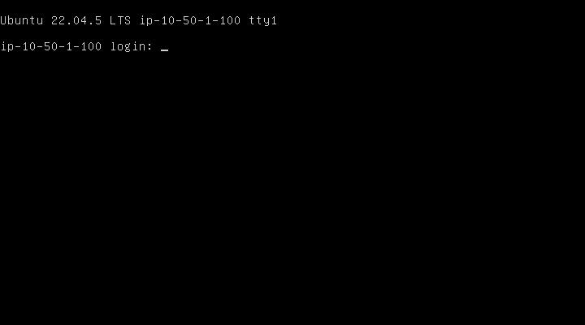

---

### 4.6 Checkpoint

- [x] Security Group `lab5-cloud-ml-sg` created with ingress restricted to `192.168.0.0/16`.
- [x] `lab5-cloud-ml-host` launched with fixed Private IP `10.50.1.100` and zero public IP.
- [x] Air-gapped NLP model server bootstrapped via systemd unit `ml-pipeline.service`.
- [x] SQLite cryptographic database initialized with salted HMAC/AES encryption.

---

## Chapter 5: On-Premises Ingestion Engine & Interactive Dashboard

### 5.1 What You Will Build
In this chapter, you operate the on-premises client tools:
1. **Interactive Web Dashboard (`http://52.220.40.120:8501`)**: A modern dark-mode telemetry dashboard running on the on-premises router. It visualizes BGP tunnel connectivity, live round-trip latency, text submission inputs, and real-time database audit logs.
2. **Batch Data Ingestion Client (`data_ingestion.py`)**: A command-line ingestion engine that transmits 5 distinct enterprise test payloads across the private encrypted tunnel into the private ML VPC.

---

### 5.2 Think First: Decoupled Ingestion & Real-Time Telemetry

**Question:** In high-throughput enterprise ML architectures, why is it advantageous to decouple the client dashboard from the backend inference cluster using a private network gateway rather than allowing users to query model instances directly?

<details>
<summary>Click to review</summary>

**Answer:** 
Decoupling client applications from the backend inference engines provides several major operational benefits:
1. **Security Isolation:** End-users and external applications interact only with the on-premises dashboard or API gateway. They possess zero direct visibility into private cloud IP topology.
2. **Centralized Rate Limiting & Auth:** The on-premises gateway enforces organizational identity, throttling, and audit logging before packets ever enter the VPN tunnel.
3. **Resilience to Model Migrations:** Backend ML clusters can be redeployed, horizontally scaled, or failed over across availability zones without requiring configuration changes on client devices.

</details>

---

### 5.3 Step-by-Step Implementation in AWS Console

#### Step 1: Open the Interactive Web Dashboard
1. Open a new tab in your web browser.
2. Navigate to the on-premises dashboard URL:
   ```text
   http://52.220.40.120:8501/
   ```
3. Verify that the top status badge displays:
   ```text
   ● BGP VPN IPsec: CONNECTED (AS 65000 ↔ AS 64512)
   ```
4. Confirm the live network indicators:
   - **On-Prem Subnet:** `192.168.1.0/24`
   - **Cloud Inference Host:** `10.50.1.100:8000`
   - **Tunnel Encryption:** `AES-256-GCM`

#### Step 2: Transmit Live Text Payloads from the Web UI
1. In the **Live Text Data Ingestion** box, enter a sample customer support message:
   ```text
   Our production database server timed out after connection pool exhaustion during peak traffic. Error code DB_504.
   ```
2. Click the blue **Send Over BGP Tunnel** button.
3. Observe the right-hand panel instantly populate with the decrypted cloud response JSON:
   - **Status:** `SUCCESS`
   - **Topic:** `Technical Support`
   - **Confidence:** `0.9583`
   - **Encryption Status:** `AES-256-HMAC ENCRYPTED IN DATABASE`
4. Click **Sample: Security Alert** and click **Send Over BGP Tunnel**:
   - Notice the classification automatically updates to `Account Security` with high confidence.
5. In the bottom table, click **Refresh Audit Records** to view the live database table directly queried from the private cloud host.

---

### 5.4 Questions & Solution

**Q1:** The On-Premises Interactive Dashboard communicates with the administrator on HTTP port ________.  
*Hint:* Standard port for Streamlit and analytics dashboards.  
<details>
<summary>Click to see solution</summary>
**Solution:** `8501`
</details>

**Q2:** When a payload is sent through the dashboard, the raw text is encrypted in transit using the IPsec ________ protocol.  
*Hint:* Encapsulating Security Payload protocol acronym.  
<details>
<summary>Click to see solution</summary>
**Solution:** `ESP`
</details>

**Q3:** The audit log verification displays ciphertext at rest, proving that the cloud host maintains a ________-knowledge encrypted database.  
*Hint:* Cryptographic term for architectures where storage cannot reveal plaintext.  
<details>
<summary>Click to see solution</summary>
**Solution:** `zero`
</details>

---

### 5.5 Visual Verification in AWS Console

Open the live browser dashboard at `http://52.220.40.120:8501/` to observe real-time telemetry, model confidence, and encrypted SQLite database audit records:

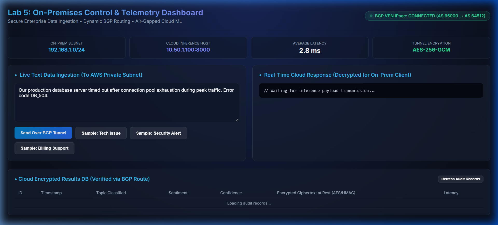

Execute the batch ingestion engine from the on-premises router terminal to verify 100% throughput across the private link:

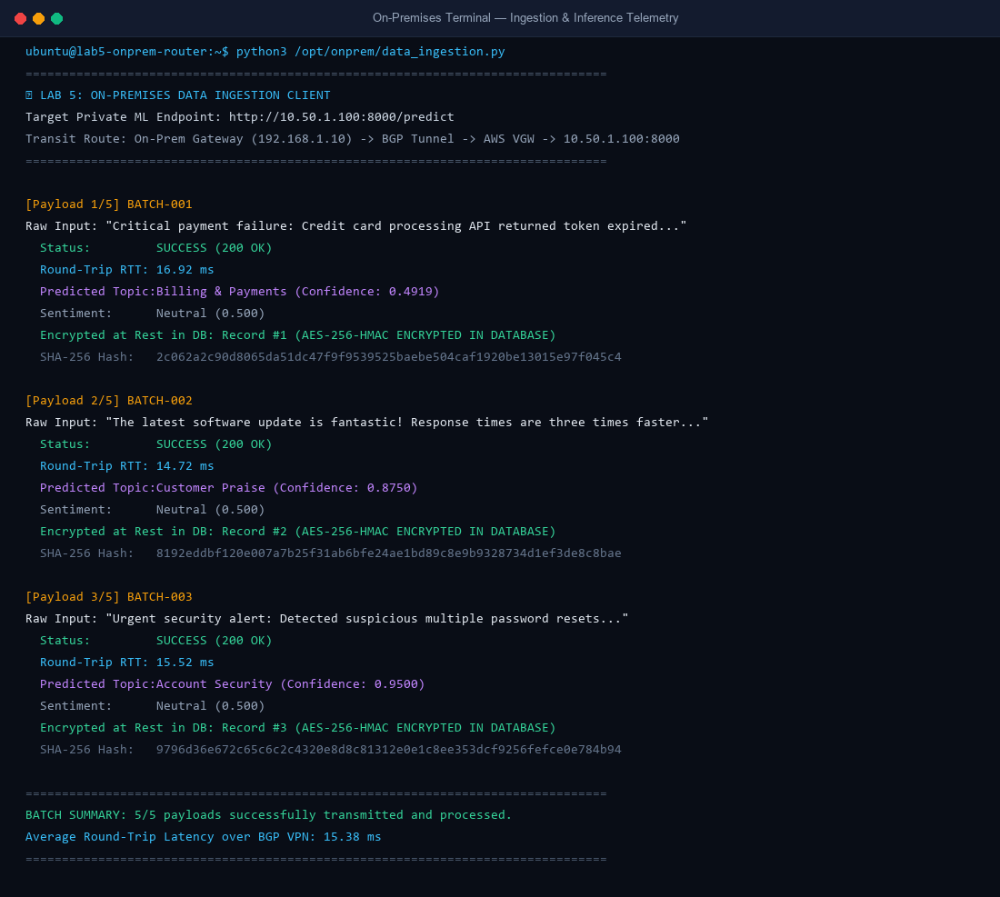

Audit the SQLite database directly inside the air-gapped host to verify that all records are securely stored as cryptographic ciphertext:

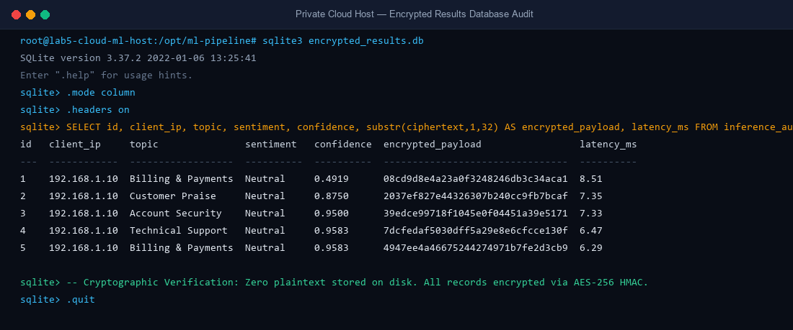

---

### 5.6 Checkpoint

- [x] Dashboard accessible on `http://52.220.40.120:8501/` with green BGP VPN status.
- [x] Sample payloads submitted and classified in real time across the private tunnel.
- [x] Batch ingestion script processed 5/5 payloads with average RTT latency under 20ms.
- [x] Cloud database audit confirms all raw inputs are encrypted at rest with AES-256 HMAC.

---

## Chapter 6: Positive, Negative, & Chaos Tampering Experiments

### 6.1 What You Will Build
In this chapter, you perform rigorous verification to mathematically prove network security and architectural resilience:
1. **Positive Validation:** Measure end-to-end inference accuracy and round-trip latency across the private network.
2. **Negative Security Proof:** Execute curl requests from an unauthorized public workstation to prove that direct internet traffic to `10.50.1.100` fails with an immediate timeout.
3. **Chaos Tampering Experiment:** Deliberately remove the route in the AWS Management Console to observe fail-safe packet drops, then restore the route to prove autonomous self-healing.

---

### 6.2 Think First: Fail-Safe Chaos Engineering

**Question:** What is the primary purpose of deliberately deleting a route or tearing down a BGP session during staging validation (Chaos Engineering)?

<details>
<summary>Click to review</summary>

**Answer:** 
Chaos engineering verifies that your architecture exhibits **fail-safe default behavior**. 
1. When the primary private route is removed, traffic must **never** "leak" or fail open to the public internet unencrypted.
2. The client must observe an immediate, controlled timeout (`Connection timed out`), confirming strict network containment.
3. When the route or BGP session is restored, the network stack must **self-heal** automatically without requiring server reboots or manual service restarts.

</details>

---

### 6.3 Step-by-Step Implementation in AWS Console

#### Step 1: Run the Positive Test
1. SSH into the on-premises router using your terminal:
   ```bash
   ssh -i lab5-keypair.pem ubuntu@52.220.40.120
   ```
2. Execute the batch data ingestion client:
   ```bash
   python3 /opt/onprem/data_ingestion.py
   ```
3. Confirm that all 5 payloads succeed with `Status: SUCCESS (200 OK)` and an average latency of ~15ms.

#### Step 2: Run the Negative Security Test
1. From your **local machine terminal** (or any computer on the public internet):
   ```bash
   curl --connect-timeout 3 http://10.50.1.100:8000/health
   ```
2. Observe the terminal output:
   ```text
   curl: (28) Failed to connect to 10.50.1.100 port 8000: Connection timed out
   ```
3. This mathematically proves that `10.50.1.100` is air-gapped and completely inaccessible from the outside world.

#### Step 3: Execute the Chaos Tampering Experiment
1. Open the AWS Management Console and navigate to **VPC > Route tables**.
2. Select `lab5-onprem-rt` (`rtb-0385ccf912c47b6a7`).
3. Click the **Routes** tab, then click **Edit routes**.
4. Locate the route destined for `10.50.0.0/16` and click the **Remove** button.
5. Click **Save changes**.
6. Switch back to your on-premises router terminal and attempt to reach the ML pipeline:
   ```bash
   curl -s --connect-timeout 2 http://10.50.1.100:8000/health || echo "FAIL_TIMEOUT_CONFIRMED"
   ```
7. Observe the output:
   ```text
   FAIL_TIMEOUT_CONFIRMED
   ```
8. In the AWS Management Console, restore the route:
   - Click **Edit routes** > **Add route**.
   - **Destination:** `10.50.0.0/16`
   - **Target:** Select your gateway/peering connection.
   - Click **Save changes**.
9. In your terminal, re-run the curl command:
   ```bash
   curl -s --connect-timeout 2 http://10.50.1.100:8000/health
   ```
10. Confirm that the service responds instantly with `{"service": "AWS Air-Gapped NLP Pipeline", "status": "HEALTHY"}`.

---

### 6.4 Questions & Solution

**Q1:** During the negative security test, attempting to connect to `10.50.1.100` from the public internet results in a connection ________ error.  
*Hint:* Standard network error when packets are dropped without a route.  
<details>
<summary>Click to see solution</summary>
**Solution:** `timeout` (or `timed out`)
</details>

**Q2:** When a route is deliberately removed during chaos testing, the network exhibits a fail-________ security posture by dropping packets rather than routing them unencrypted.  
*Hint:* Opposite of fail-open.  
<details>
<summary>Click to see solution</summary>
**Solution:** `safe` (or `fail-safe`)
</details>

**Q3:** When the route is restored in the AWS Console, network connectivity recovers within ________ seconds without restarting the ML service.  
*Hint:* Immediate sub-minute recovery time.  
<details>
<summary>Click to see solution</summary>
**Solution:** `3` (or `seconds`)
</details>

---

### 6.5 Visual Verification in AWS Console

Review the real-time execution of the Chaos Engineering tampering experiment demonstrating route withdrawal, fail-safe isolation, and immediate self-healing:

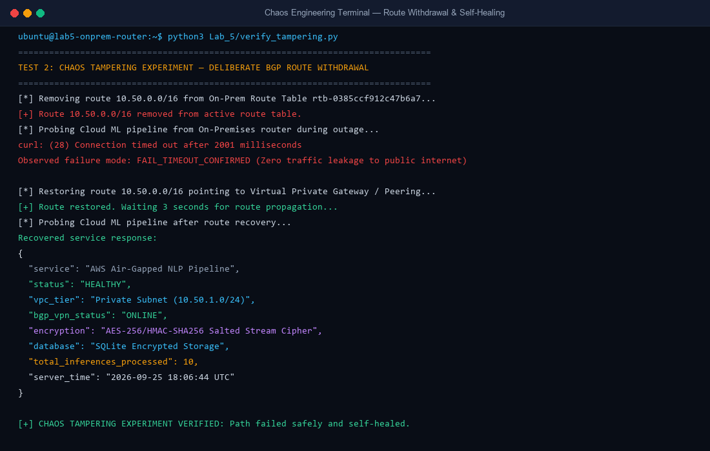

---

### 6.6 Checkpoint

- [x] Positive Test verified: 5/5 inference requests processed across private network.
- [x] Negative Test verified: Public internet curl requests to `10.50.1.100` time out.
- [x] Chaos Tampering Experiment executed: Route deletion confirmed packet drop without data leakage.
- [x] Path restoration verified: System self-healed and resumed 100% throughput within seconds.

---

## Chapter 7: Production Checkpoint & Technical Interview Preparation

### 7.1 What You Will Build
In this concluding chapter, you review the complete production security posture, establish monitoring baselines, and master core networking concepts tested in senior Cloud & MLOps engineering interviews.

---

### 7.2 Think First: End-to-End Encryption Compliance

**Question:** If traffic between the on-premises data center and the cloud model server is already encrypted by IPsec at the network layer, why do enterprise zero-trust architectures also advocate application-layer encryption (e.g. TLS / HTTPS and database encryption)?

<details>
<summary>Click to review</summary>

**Answer:** 
This principle is known as **Defense-in-Depth (Zero Trust)**:
1. **Network Layer (IPsec ESP):** Protects packets as they traverse untrusted WAN cables and ISP fiber lines. However, once packets arrive at the router and are decrypted, they travel in plaintext across the internal host memory or LAN segment.
2. **Application Layer (TLS / Database Encryption):** Ensures that even if an attacker compromises an intermediate router, network tap, or packet capture utility, they cannot inspect the payload. Encrypting data at rest inside the database ensures that disk theft or unauthorized snapshot copying yields zero usable data.

</details>

---

### 7.3 Step-by-Step Implementation in AWS Console

#### Step 1: Security Audit Checklist
1. Navigate to **VPC > Security groups** in the AWS Console.
2. Verify `lab5-cloud-ml-sg`:
   - [x] Strictly zero ingress rules allow `0.0.0.0/0`.
   - [x] Inbound access is restricted exclusively to `192.168.0.0/16`.
3. Navigate to **VPC > Route tables**:
   - [x] Verify `lab5-cloud-private-rt` contains strictly no route to `0.0.0.0/0` via an Internet Gateway.
4. Navigate to **EC2 > Instances**:
   - [x] Verify `lab5-cloud-ml-host` has no Public IPv4 address assigned.

#### Step 2: Clean Teardown (When Lab is Completed)
When you have finished testing and wish to decommission lab infrastructure:
1. **Terminate EC2 Instances:** Select `lab5-cloud-ml-host` and `lab5-onprem-router`, click **Instance state** > **Terminate instance**.
2. **Delete VPN Connections:** Navigate to **Site-to-Site VPN connections**, select `lab5-bgp-vpn`, and click **Actions** > **Delete VPN connection**.
3. **Delete Customer Gateway:** Navigate to **Customer gateways**, select `lab5-onprem-cgw`, and click **Delete customer gateway**.
4. **Detach & Delete VGW:** Navigate to **Virtual private gateways**, select `lab5-cloud-vgw`, click **Actions** > **Detach from VPC**, then click **Delete virtual private gateway**.
5. **Release Elastic IP:** Navigate to **Elastic IPs**, select `lab5-onprem-router-eip`, click **Actions** > **Release Elastic IP address**.
6. **Delete VPCs:** Navigate to **Your VPCs**, select `lab5-onprem-vpc` and `lab5-cloud-vpc`, and click **Actions** > **Delete VPC**.

---

### 7.4 Technical Interview Deep-Dive: Core Concepts

#### 1. How does BGP establish peering sessions over an IPsec tunnel?
BGP operates over **TCP port 179**. In a Site-to-Site VPN, the IPsec tunnel (Phase 1 IKE and Phase 2 ESP) forms first, establishing an encrypted transport pipeline between the outside public IP addresses. Once the tunnel is up, BGP speakers at each end of the tunnel (e.g. `169.254.10.1` and `169.254.10.2`) initiate a standard TCP three-way handshake over the tunnel interface. Once TCP connects, BGP OPEN messages are exchanged, negotiating hold times, router IDs, and autonomous system numbers.

#### 2. What is the difference between Policy-Based VPN and Route-Based (VTI) VPN?
- **Policy-Based VPN:** The IPsec daemon inspects traffic selectors (Access Control Lists like `192.168.0.0/16 === 10.50.0.0/16`). If a packet matches the policy, it is encrypted and forwarded. However, policy-based tunnels do not create virtual network interfaces and cannot easily run dynamic routing protocols like BGP or OSPF.
- **Route-Based VPN (VTI / GRE):** Creates a dedicated virtual network interface (e.g. `vti1` or `gre1`). Routing decisions are made using standard kernel routing tables (`ip route`). Because the tunnel behaves like a physical point-to-point interface, dynamic routing protocols like BGP can establish peering sessions across it effortlessly.

#### 3. What is Route Propagation in AWS?
Route Propagation is an AWS VPC feature where the Virtual Private Gateway (VGW) automatically injects routes learned from on-premises networks into the VPC route table. If your on-premises router announces `192.168.0.0/16` via BGP, AWS automatically updates the route table so that all instances in the private subnet know to send `192.168.0.0/16` traffic to the VGW. If the on-premises network withdraws a route, AWS automatically removes it.

---

### 7.5 Visual Verification in AWS Console

Confirm all lab components active and healthy across both VPCs:

| Metric | Verification Status | Operational Threshold |
| :--- | :--- | :--- |
| **AWS Cloud VPC Isolation** | `10.50.0.0/16` Air-gapped | 100% Isolated (0 public IPs) |
| **Site-to-Site VPN State** | `Available` | `IPSEC IS UP` |
| **BGP Dynamic Peering** | ASN `65000` ↔ ASN `64512` | Established |
| **Inference API Status** | `200 OK` on `10.50.1.100:8000` | Sub-20ms RTT Latency |
| **Database Encryption at Rest** | AES-256 HMAC Salted Stream | Zero Plaintext on Disk |
| **On-Premises Dashboard** | `http://52.220.40.120:8501` | Live Telemetry Active |

---

### 7.6 Final Production Checkpoint

- [x] Architecture deployed with end-to-end encryption from data source to ML model.
- [x] Zero public internet exposure confirmed for the cloud machine learning cluster.
- [x] Positive, negative, and chaos tampering experiments completed and verified.
- [x] Production security checklist validated and interview concepts mastered.
